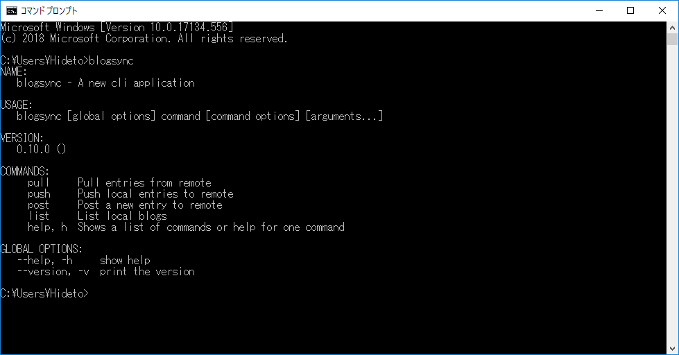
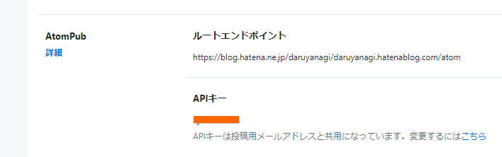
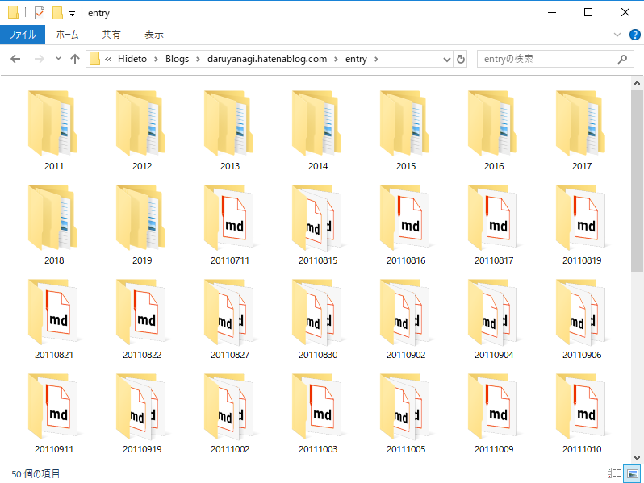
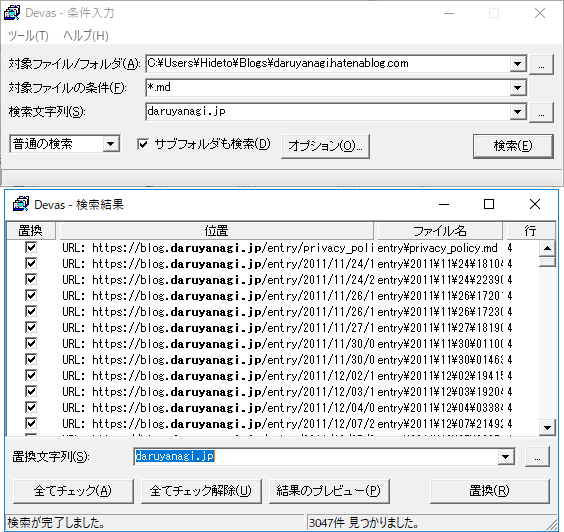
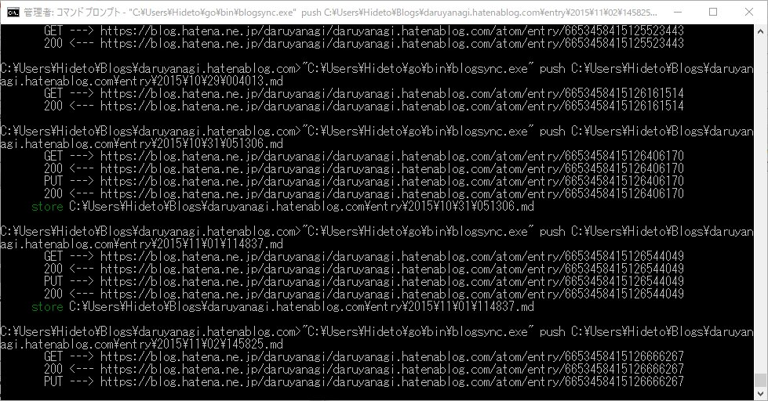
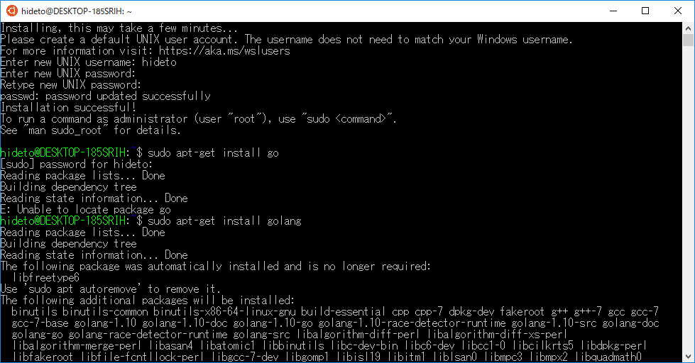

はてなブログを daruyanagi.jp から blog.daruyanagi.jp へ移した結果、古い記事でリンク切れが多発していた。以前は daruyanagi.jp に ASP.NET アプリを置いてリダイレクトしていたが、それも消してしまったのでアクセス不能なページができてしまっている。ついでに http:// になっているリンクを https:// に書き換えたい――なんてことを考えながら、

<blockquote class="twitter-tweet" data-partner="tweetdeck">
はてなブログ、置換機能ほしい……URL を一括で書き換えたりしたい（もうある？
&mdash; だるやなぎ に天使が舞い降りた！ (@daruyanagi) <a href="https://twitter.com/daruyanagi/status/1092296876005634048?ref_src=twsrc%5Etfw">February 4, 2019</a></blockquote>

などと Twitter でつぶやいていたら、某焼き鳥の人が

<blockquote class="twitter-tweet" data-conversation="none" data-cards="hidden" data-partner="tweetdeck">
はてブロ自体には痴漢機能なかったからローカルで痴漢したで  <a href="https://t.co/Ft6iqZGuid">https://t.co/Ft6iqZGuid</a>
&mdash; さくさん (@ch3cooh) <a href="https://twitter.com/ch3cooh/status/1092299878800093184?ref_src=twsrc%5Etfw">February 4, 2019</a></blockquote>

 と教えてくれたので、鳥もすなる blogsync というものを だるやなぎ もしてみんとてするなり。酢酸先生は Mac でやったみたいだが、うちは Windows でやってみる

<h3>Windows で blogsync を利用する</h3>

<iframe src="https://hatenablog-parts.com/embed?url=https%3A%2F%2Fgithub.com%2Fmotemen%2Fblogsync" title="motemen/blogsync" class="embed-card embed-webcard" scrolling="no" frameborder="0" style="display: block; width: 100%; height: 155px; max-width: 500px; margin: 10px 0px;"></iframe><cite class="hatena-citation"><a href="https://github.com/motemen/blogsync">github.com</a></cite>

blogsync ははてなブログの記事をローカルに保存したり、ローカルで編集した記事をはてなブログに投稿できるコマンドラインツール。CUI に慣れてないとちょっとめんどいかなって感じるかもしれないけれど、そんなに難しくはない。とりあえず Windows 向けの手順を手短におおざっぱに――

<h4>1. Chocolatey で Golang をインストールする</h4>

blogsync は Go 言語（Golang）で開発されているので、まず Golang の環境を作る。Windows の場合、パッケージ管理ツール Chocolatey でインストールするのが一番楽だと思う。

<iframe src="https://hatenablog-parts.com/embed?url=https%3A%2F%2Fchocolatey.org%2F" title="Chocolatey - The package manager for Windows" class="embed-card embed-webcard" scrolling="no" frameborder="0" style="display: block; width: 100%; height: 155px; max-width: 500px; margin: 10px 0px;"></iframe><cite class="hatena-citation"><a href="https://chocolatey.org/">chocolatey.org</a></cite>

まだインストールしていない人は、<a href="https://chocolatey.org/install">Installation</a> にあるワンライナーでサクッとインストールしよう。次に Cmd.exe を管理者権限で起動し、以下のコマンドを入力して、Golang をインストールする。

<pre class="code" data-lang="" data-unlink>choco install golang</pre>

<h4>2. Go Get コマンドで blogsync を GitHub からとってくる＆初期設定</h4>

ぶっちゃけ Go 言語はあまり知らんのだけど、Go Get という素敵ツールで blogsync のインストールができるらしい。

<pre class="code" data-lang="" data-unlink>go get github.com/motemen/blogsync</pre>
これで C:\Users\（ユーザー名）\go\bin に blogsync.exe がコピーされる。パスが通っているので、blogsync で呼び出せる（要 cmd の再起動、以後、C:\Users\（ユーザー名）は ~ と表記する）。

次に、設定ファイル（~\.config\blogsync\config.yaml）を記述する。うちの場合はこんな感じ。

<pre class="code" data-lang="" data-unlink>daruyanagi.hatenablog.com:
username: daruyanagi
password: ***
default:
local_root: C:\Users\Hideto\Blogs</pre>
API キーはブログの設定画面の［詳細設定］タブの下の方に書いてある。ひとつ注意しなければならないのは、<b>独自ドメインでブログを運用している場合</b>。うちは blog.daruyanagi.jp だが、この設定ファイルに記述すべきは独自ドメインを充てる前のドメイン daruyanagi.hatenablog.com となる（ここで躓いて、pull できたのに push できなかった）。元のドメインは、API キーの上に書いてあるルートエンドポイントを見ればわかる。

 

<h4>3. blogsync ではてなブログをダウンロード（pull）する</h4>

以下のコマンドですべての記事を取得。

<pre class="code" data-lang="" data-unlink>blogsync pull daruyanagi.hatenablog.com</pre>
C:\Users\Hideto\Blogs\daruyanagi.hatenablog.com 以下に記事が展開される。

 

<h4>4. 好みのツールでテキスト置換を行う</h4>

テキスト置換は好みのツールを使えばよい（コマンドが得意な人はコマンドでどうぞ）。うちは EmEditor がなぜかうまく動かなかったので、Devas というツールを利用した。

<iframe src="https://hatenablog-parts.com/embed?url=https%3A%2F%2Fforest.watch.impress.co.jp%2Flibrary%2Fsoftware%2Fdevas%2F" title="窓の杜" class="embed-card embed-webcard" scrolling="no" frameborder="0" style="display: block; width: 100%; height: 155px; max-width: 500px; margin: 10px 0px;"></iframe><cite class="hatena-citation"><a href="https://forest.watch.impress.co.jp/library/software/devas/">forest.watch.impress.co.jp</a></cite>

少々 UI は古臭いが、問題なく動く。

<h4>5. blogsync ではてなブログをアップロード（push）する</h4>

最後に、blogsync ではてなブログへ保存する。ほんとは変更したファイルだけ push すれば早いんだろうけど、めんどくさかったからザックリやった。

<pre class="code" data-lang="" data-unlink>cd C:\Users\Hideto\Blogs\daruyanagi.hatenablog.com
for /r %f in (*.md) do blogsync push %f</pre>
少し時間がかかるので（うちの場合 2,000 記事あったけど、10分弱ぐらいだったかなぁ？　忘れた）、お茶を飲みながら待つ。

<h3>蛇足</h3>

<blockquote>

ひとつ注意しなければならないのは、<b>独自ドメインでブログを運用している場合</b>。うちは blog.daruyanagi.jp だが、この設定ファイルに記述すべきは独自ドメインを充てる前のドメイン daruyanagi.hatenablog.com となる。ここを間違えると、pull できるが push できない。

</blockquote>

blogsync の存在は以前から知ってたけど、ここで躓いて「Windows には対応してないのかな？」と思っていた。カッとなって WSL でも blogsync の環境を作ったが（当初はこっちで記事を書くつもりだった）、問題にぶち当たったので、「どうも設定を書き間違えてるんじゃないか」と気付けた。結局、Windows 10 でも WSL/Ubuntu でも問題なく動作したので、好みの方でやればいいと思う。

ちなみに、WSL でのセットアップは Choco を入れずに済む分、Windows 環境より簡単。find、grep、sed が使えるなら、WSL の方が楽かもね（適当に sudo してね）。

<pre class="code" data-lang="" data-unlink>apt-get update
apt-get install golang
go get github.com/motemen/blogsync
mkdir -p ~/.config/blogsync/
vim ~/.config/blogsync/config.yaml
~/go/bin/blogsync pull blog.daruyanagi.jp</pre>

<h3>蛇足2</h3>

「はてなブログ一括置換ツール」という便利なサービスがあるっぽいので（知らなかった！）、こっちを使うのもありか。ただし、API キーを見ず知らずの人に預けなきゃいけない。

<iframe src="https://hatenablog-parts.com/embed?url=https%3A%2F%2Fspiderwebs.tokyo%2Fcustomize-tool%2Freplace-login.php" title="はてなブログ一括置換ツール" class="embed-card embed-webcard" scrolling="no" frameborder="0" style="display: block; width: 100%; height: 155px; max-width: 500px; margin: 10px 0px;"></iframe><cite class="hatena-citation"><a href="https://spiderwebs.tokyo/customize-tool/replace-login.php">spiderwebs.tokyo</a></cite> 

<h3>追伸（2019/02/05）</h3>

<blockquote class="twitter-tweet" data-lang="HASH(0x103bd1b8)">
訴訟 <a href="https://t.co/E1XzqNcu70">pic.twitter.com/E1XzqNcu70</a>
&mdash; しばやん (@shibayan) <a href="https://twitter.com/shibayan/status/1092379761546997760?ref_src=twsrc%5Etfw">February 4, 2019</a></blockquote>

クソわろたｗ

