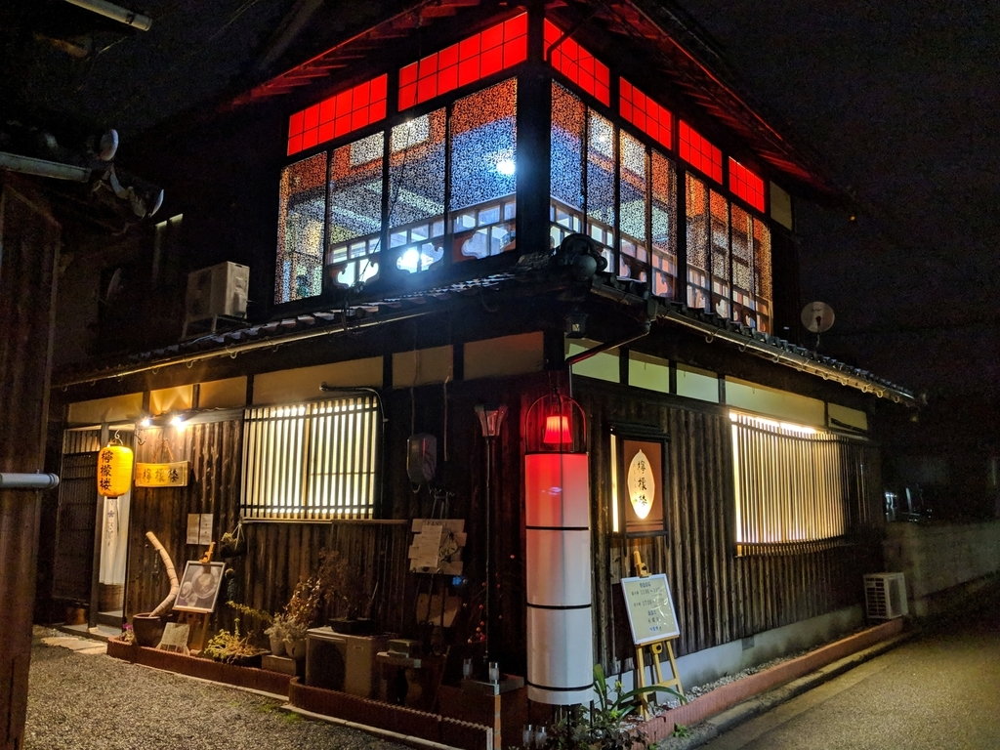
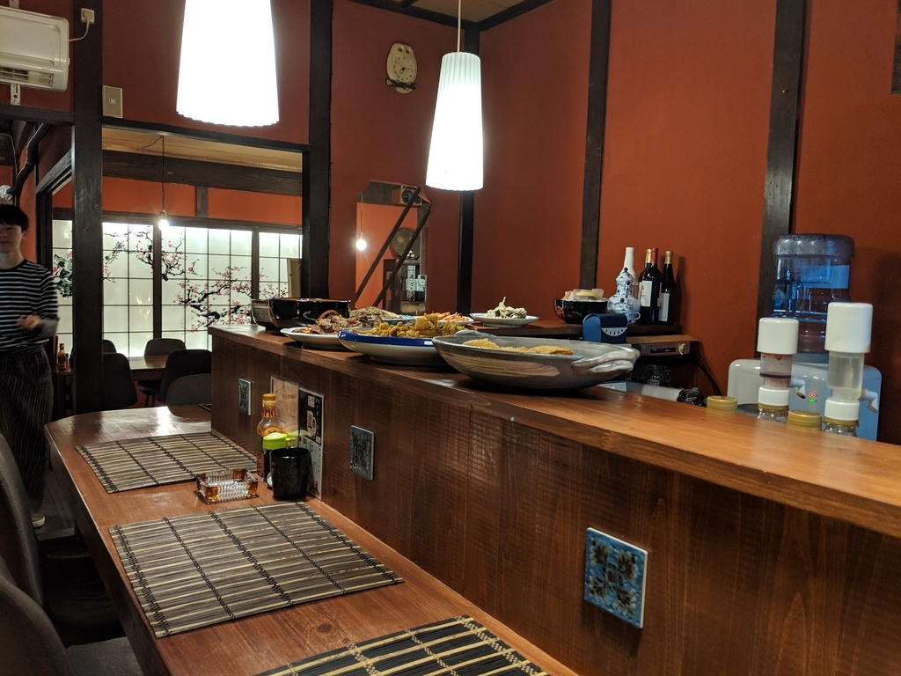
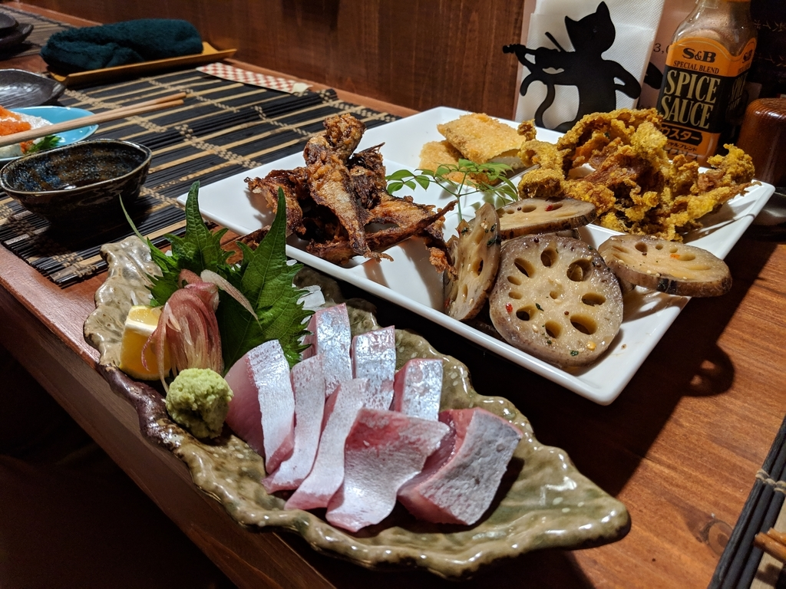
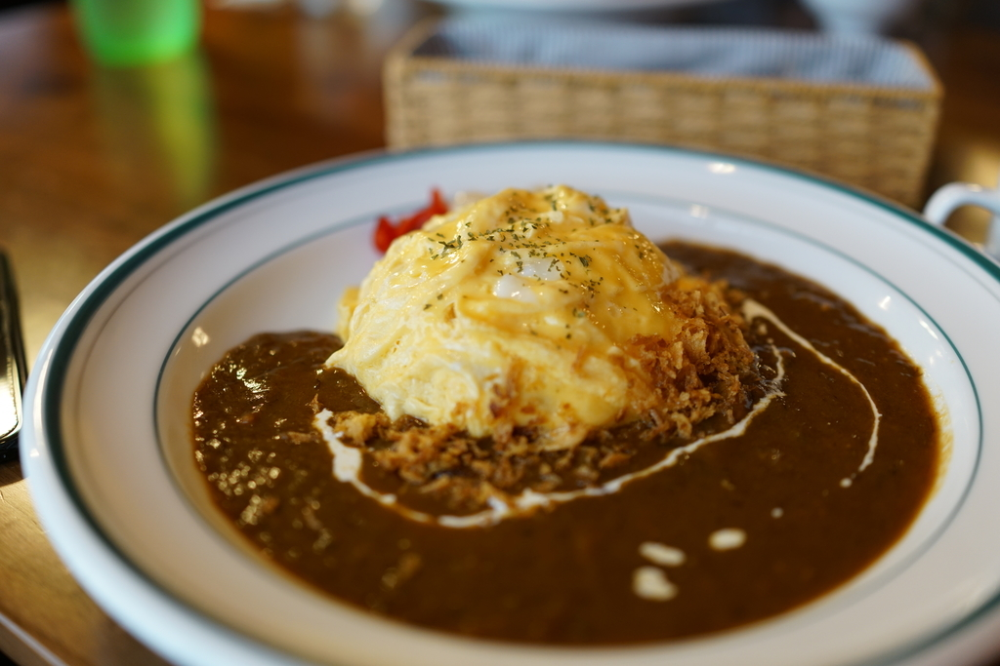

金曜日は、三津まで飲みに行った。地元の R 君と、檸檬楼というお店を訪ねる。

このお店は古民家をリフォームしたのだそうで、なかなか味のあるたたずまいになっている。遊郭風？なのだろうか、室内は赤色を基調にオシャレにまとまっている。マスターはいかにも風流な感じの人だ。

とりあえず一番安いコースに飲み放題2時間を足して、適当にその日のメニューを追加してみた。このコースではおばんざいを2種類選べるので、2人で4種類。分け合えっこすれば結構楽しめる。この日は奢ってもらっちゃったのでなんぼしたのかは知らないけど、個人的には結構気に入ったかもしれない。

ちなみに、お店の名前の由来は、梶井基次郎の『檸檬』からとってるのだとか。行きつけの居酒屋の紹介だったこともあり、いろいろお店のことを聞けた。

<iframe src="https://hatenablog-parts.com/embed?url=https%3A%2F%2Ftabelog.com%2Fehime%2FA3801%2FA380101%2F38012521%2F" title="檸檬楼 (三津/カフェ)" class="embed-card embed-webcard" scrolling="no" frameborder="0" style="display: block; width: 100%; height: 155px; max-width: 500px; margin: 10px 0px;"></iframe><cite class="hatena-citation"><a href="https://tabelog.com/ehime/A3801/A380101/38012521/">tabelog.com</a></cite> 

<h3>おまけ</h3>

実はここ、ランチもやっていて、カレーがなかなかおいし。近場の人は是非どうぞ。

