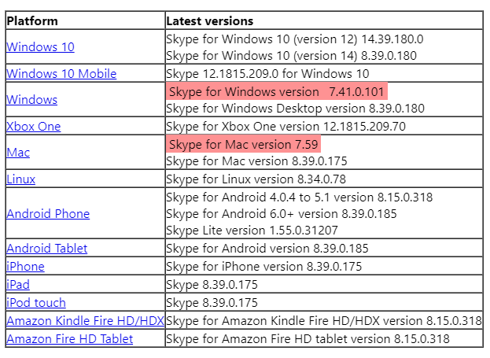

 

<ul>
<li>Skype for Windows version 7.41.0.101</li>
<li>Skype for Mac version 7.59</li>
</ul>
の両バージョンが Skype のリリースプラットフォームページから消えた。これで Skype 7（つまり Classic 版）は完全に終わり、Skype 8 へ移行することになる。

<iframe src="https://hatenablog-parts.com/embed?url=https%3A%2F%2Fsupport.skype.com%2Fen%2Ffaq%2FFA12041%2Fwhat-platforms-is-skype-available-on" title="What platforms is Skype available on? | Skype Support" class="embed-card embed-webcard" scrolling="no" frameborder="0" style="display: block; width: 100%; height: 155px; max-width: 500px; margin: 10px 0px;"></iframe><cite class="hatena-citation"><a href="https://support.skype.com/en/faq/FA12041/what-platforms-is-skype-available-on">support.skype.com</a></cite>

あまり評判は良くないけど、個人的に Skype 8 は悪くないと思ってる。ユーザーインターフェイスはウェブ、モバイル、デスクトップで共通化されているし、旧バージョンのすべての機能を網羅しているわけではないが、先進的な機能<a href="#f-ee72a0c8" name="fn-ee72a0c8" title="ライブキャプション、動画チャットの背景ぼかし、絵文字ピッカーなどなど">*1</a>が積極的に導入されている。できれば LINE なんかやめてしまいたいのだけど<a href="#f-4ae58897" name="fn-4ae58897" title="Slack を使ってる人はそのまま Slack を使ってりゃいい">*2</a>、スタンプへの投資がある以上、なかなかむずかしいのだろうな。LINE では地味に Markdown が使えたりするけど、Skype はダメみたいなところはまだあるし。

<iframe src="https://hatenablog-parts.com/embed?url=https%3A%2F%2Fforest.watch.impress.co.jp%2Fdocs%2Fnews%2F1170180.html" title="「Skype」v8.39がロールアウト ～コンパクトなサイドバーやGIFアニメの挿入機能を追加／Windows 10版ではチャットでシェアされたファイルの自動ダウンロード先を選択可能" class="embed-card embed-webcard" scrolling="no" frameborder="0" style="display: block; width: 100%; height: 155px; max-width: 500px; margin: 10px 0px;"></iframe><cite class="hatena-citation"><a href="https://forest.watch.impress.co.jp/docs/news/1170180.html">forest.watch.impress.co.jp</a></cite>

<a href="#fn-ee72a0c8" name="f-ee72a0c8" class="footnote-number">*1</a>:ライブキャプション、動画チャットの背景ぼかし、絵文字ピッカーなどなど

<a href="#fn-4ae58897" name="f-4ae58897" class="footnote-number">*2</a>:Slack を使ってる人はそのまま Slack を使ってりゃいい

