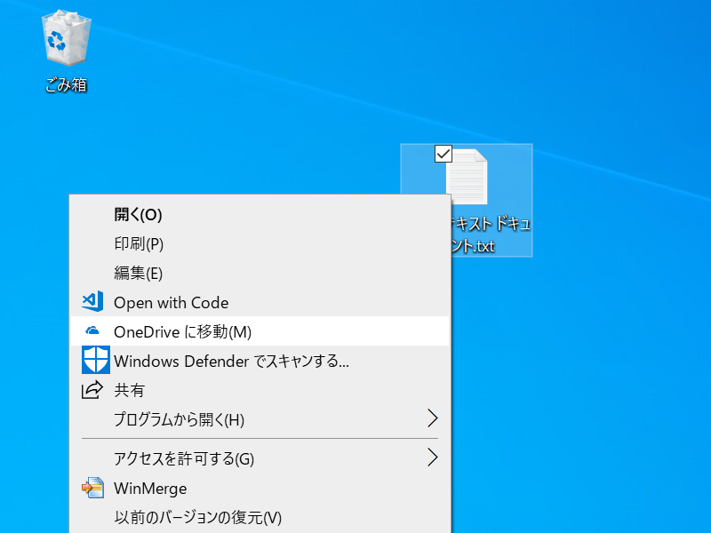
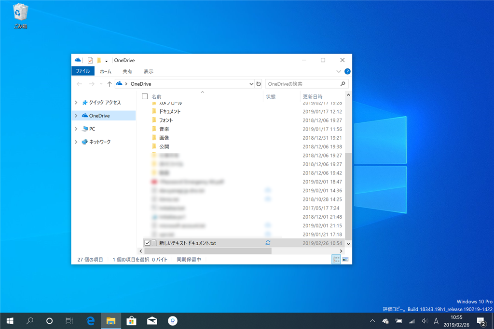

ファイルのコンテキストメニューに［OneDrive に移動］コマンドが追加された。実行するとファイルが OneDrive のルートフォルダーに移動し、「エクスプローラー」が起動する。

あんまり使わない気もするけど、あるに越したことはないって感じかな？

<blockquote cite="https://support.office.com/en-us/article/New-OneDrive-sync-client-release-notes-845dcf18-f921-435e-bf28-4e24b95e5fc0?ui=en-US&rs=en-US&ad=US&fromAR=1">

<b>Version 19.012.0121.0009 (Released February 22, 2019)</b> 

<ul>
<li>Bug fixes to improve reliability and performance of the client.</li>
<li>New features gradually rolling out to users:
<ul>
<li>Users can now use the "Move to OneDrive" context menu option to move files into their OneDrive folder.</li>
</ul></li>
</ul>
<cite><a href="https://support.office.com/en-us/article/New-OneDrive-sync-client-release-notes-845dcf18-f921-435e-bf28-4e24b95e5fc0?ui=en-US&rs=en-US&ad=US&fromAR=1">New OneDrive sync client release notes - Office Support</a></cite>
</blockquote>

あと、先月末、地味に v18 → v19 へメジャーバージョンアップしてるけど、機能的にはあまり変わってなさそう。2019年リリースってだけか。

