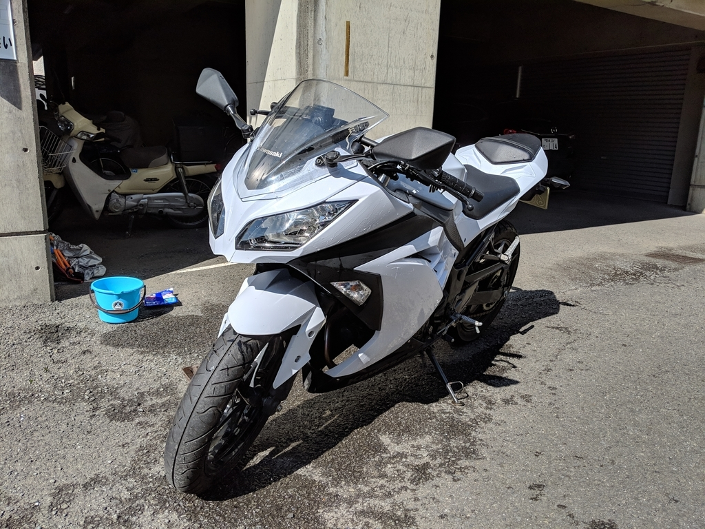
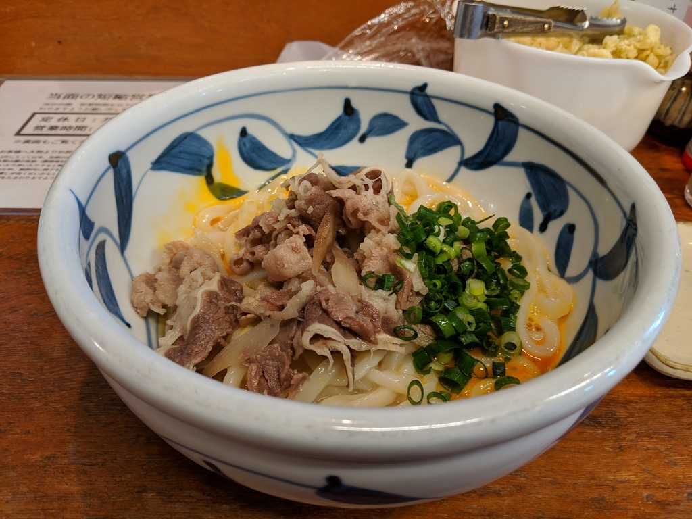

土曜日は2月とは思えない陽気だった。前日、S 先生と大街道にできた串カツ屋さんを攻めたのに、スッキリと7時に目が覚めたので、バイクを洗って、どこぞにでかけることにした。別にどこでもよかったのだけど、「じゃらん」で愛南町に安い宿を見つけたので、とりあえずそこがゴール。

で、松山を出る前、ついでに「踊るうどん永木」に寄った。長い旅に出るのだから、まずは腹ごしらえなのだ。

<iframe src="https://hatenablog-parts.com/embed?url=https%3A%2F%2Ftabelog.com%2Fehime%2FA3801%2FA380101%2F38000210%2F" title="踊るうどん永木 (山西/うどん)" class="embed-card embed-webcard" scrolling="no" frameborder="0" style="display: block; width: 100%; height: 155px; max-width: 500px; margin: 10px 0px;"></iframe><cite class="hatena-citation"><a href="https://tabelog.com/ehime/A3801/A380101/38000210/">tabelog.com</a></cite>

最近ご無沙汰していたけど、大将が腰痛から一応の復帰を果たしたみたいなので（実は先週覗いてみたのだけど、臨時休業だった）。縮退営業中だったので噂の「とり天うどん」はやっていなかったので、いつもの「肉玉ぶっかけうどん（ヒヤあつ）」を頼んだ。猫舌なので、ヒヤあつが好き。

相変わらず、おいしかった。

んで、もう一つの目的である PayPay 初決済にも挑戦。やり方をまったく予習せず、ぶっつけ本番で臨んだのだけど、（1）レジのところにある QR コードを読み取る → （2）支払金額をアプリに入れる だけで簡単に支払うことができた。<i>なぜか大将に 1,000 円増しで請求されそうになったけどな（バイトのおばちゃんも悪乗りしてくるし！！）。</i>あと、割とどうでもいいけど、決済完了のときに ﾍﾟｲﾍﾟｲ!! っていうのがちょっとかわいいと思った。

「QR コード決済なんぞ、めんどいだけでしょ」って思ってたんだけど、実際やってみると割かしいけるな、現金よりはいいな（銀行口座からお財布にチャージするより楽）って思った。店舗の手数料が安い（タダなんだっけ？）らしいし、これは結構広まるかもしれないなぁ。

ほんとは「近所で PayPay 使えるんだぜー、都会だぜー」ってのを Impress Watch の「キャッシュレス百景」の記事に盛り込みたかったのだけど……まぁ、PayPay 童貞を捨てられて満足。腰のお加減で都合はつかなかったけど、体に気を付けてのんびり頑張ってほしい。

<iframe src="https://hatenablog-parts.com/embed?url=https%3A%2F%2Fblog.daruyanagi.jp%2Fentry%2F2019%2F02%2F19%2F191203" title="Impress Watch の「キャッシュレス百景」に寄稿しました - だるろぐ" class="embed-card embed-blogcard" scrolling="no" frameborder="0" style="display: block; width: 100%; height: 190px; max-width: 500px; margin: 10px 0px;"></iframe><cite class="hatena-citation"><a href="https://blog.daruyanagi.jp/entry/2019/02/19/191203">blog.daruyanagi.jp</a></cite>

