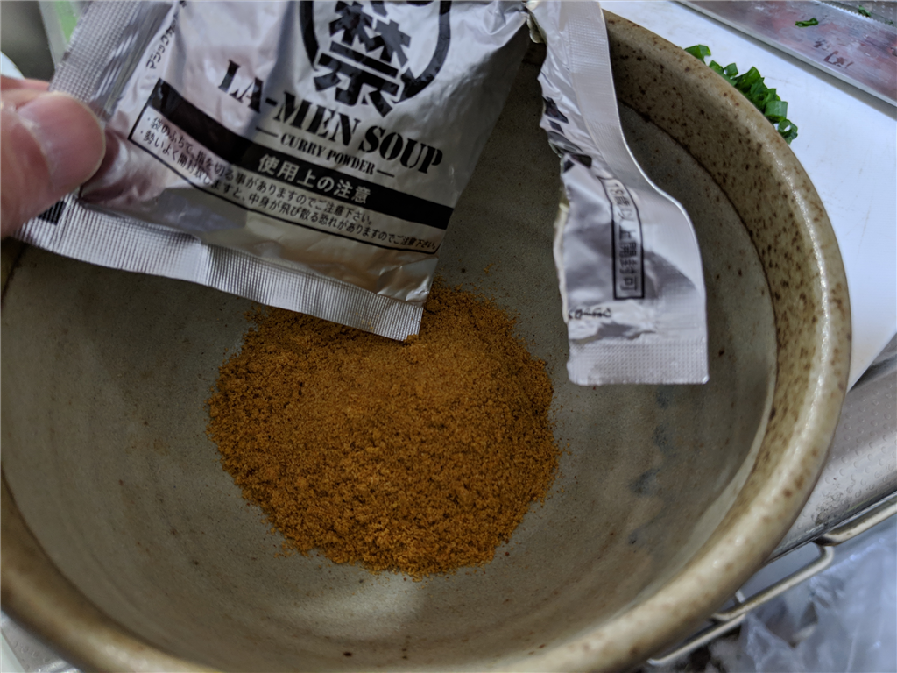
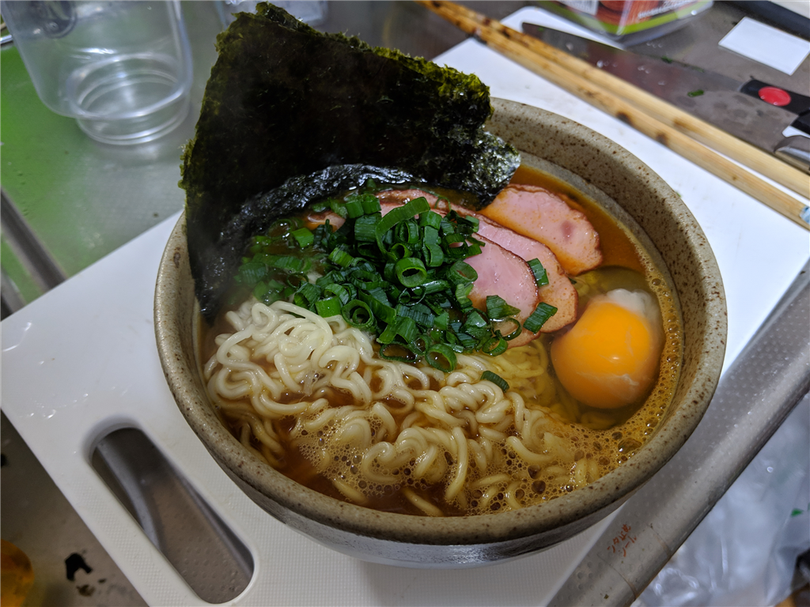

S 氏（仮名）が18禁ラーメンを送り付け、早く食べろと脅すので、しぶしぶ食べてみた。

<blockquote class="twitter-tweet" data-lang="HASH(0xdf515c0)">
てかはよ 18 禁ラーメン食べろや
&mdash; しばやん (@shibayan) <a href="https://twitter.com/shibayan/status/1099827381735321600?ref_src=twsrc%5Etfw">February 25, 2019</a></blockquote>

ラーメンを制作するにあたり、ネギ、タマゴ、チャーシューを購入。せめておいしく食べられるように、準備を万端に整えた。

麺をゆでる間に、スープの素をどんぶりへ投入する。この段階ですでに<b>目が痛い</b>。あと、袋に残った粉をだすために角を少し叩いたのだが、粉が舞って口や目に入り、<b>咳き込んだ</b>。これを商品企画した奴は、<b>マジで頭おかしい</b>と思う。人間の食うものだとは思えない。

麺がゆがけたので、ザルに落として水を切る。ティファールのケトルからどんぶりにお湯を注ぎ、スープを作る。麺をそれに泳がせ、具を適当にトッピングした。

見た目は美味しそうに見えなくもないが、なんせ<b>匂いがヤバい</b>。鼻がチクチクする。念のためもう一度言うけど、これを商品企画した奴は、<b>マジで頭おかしい</b>と思う。

一口食べてみたが、案の定、辛かった。18禁シリーズは依然、カレーを送ってもらって食べたことがあった。あの時は冷ご飯にかけて食べたので、一応完食できた。しかし、ラーメンのスープは熱い。辛味でおかしくなった舌を、スープの熱が直撃する。口の中から鼻腔に辛み成分の混じった湯気が逆流し、悶絶。口に含んだ麺をどんぶりに吐き出してしまった。

二口目は、チャーシューと交互に食べた。それでもかなりキツい。少しは味がまろやかになるかと思い、卵の黄身をつぶして混ぜてみたり、麺をノリに巻いて食べてみたりしたが、どうにもこうにもいかぬ。三口目になって、ようやく悟った。――これは人類が食べてよいものではない。何回もしつこいようだけど、これを商品企画した奴は、<b>マジで頭おかしい</b>と思う。辛すぎて味がわからんせいか、ぶっちゃけマズい。辛味以外の味がしない。

自分はおかんに「メシは残さずに食え」と育てられたし、日頃、出されたものを残すことはめったにない。でも、これは申し訳ないけど、スープは流しに、麺は燃えるごみの袋に入れた。結局、麺を三口のほかは、トッピングした具材しか食べられなかった。

その日はずっと、脂汗を流しながら、おなかに枕を抱えて過ごした。あまり食べなかったせいか、おなかを下すところまではいかなかったけど、ずっとキリキリして辛かった。ほんとうにこれを商品企画した奴は、<b>マジで頭おかしい</b>と思う。

<a href="http://www.amazon.co.jp/exec/obidos/ASIN/B010IRFJMS/bestylesnet-22/">18禁カレーラーメン</a>
<ul><li>出版社/メーカー: 磯山商事</li><li>メディア: その他</li><li><a href="http://d.hatena.ne.jp/asin/B010IRFJMS/bestylesnet-22" target="_blank">この商品を含むブログを見る</a></li></ul>

今後、これが贈られてきたら問答無用で返送（着払い）する。

