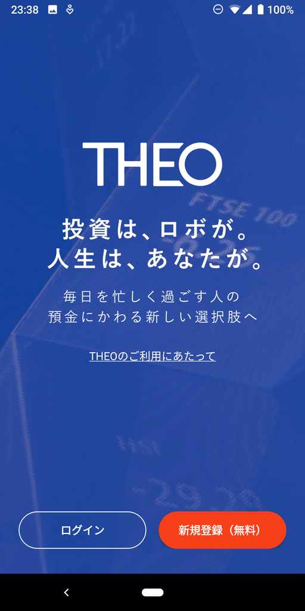
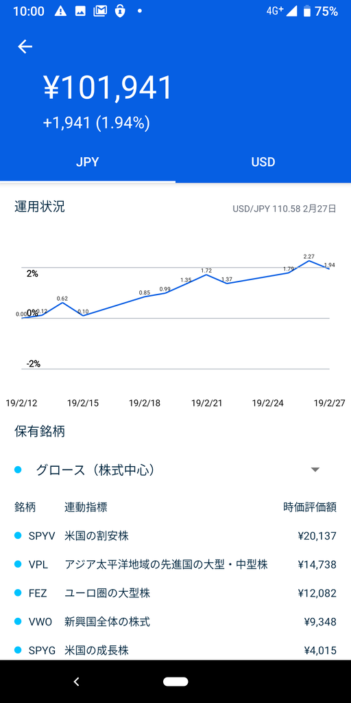
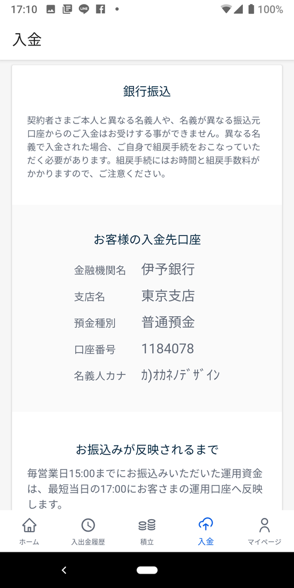

<iframe src="https://hatenablog-parts.com/embed?url=https%3A%2F%2Ftheo.blue%2F" title="ロボアドバイザーで、おまかせ資産運用 | THEO[テオ]" class="embed-card embed-webcard" scrolling="no" frameborder="0" style="display: block; width: 100%; height: 155px; max-width: 500px; margin: 10px 0px;"></iframe><cite class="hatena-citation"><a href="https://theo.blue/">theo.blue</a></cite>

余ったお金を勝手に運用してくれるという THEO をはじめました。いや、おカネは余ってないんだけどね……伊予銀行の口座残高をみることのできる「Money Manager」というアプリ経由でこのサービスを知って、何となく登録してしまった。

<ul>
<li>割とモダンな感じの専用アプリがある</li>
<li>毎月の積み立て額を Web でサクッと変えられる</li>
<li>すぐやめられそう（← 大事</li>
</ul>
あたりがなんとなくいいかな、と。「忙しい人でもオッケー！」なのが売りみたいだけど、経済学部だったのに「ポートフォリオ、なにそれ？」みたいなアホ（←）や、「対面で買うの怖いよぉ……」という<a href="https://www.google.com/search?q=みゃーねえ">&#x307F;&#x3083;&#x30FC;&#x306D;&#x3048;</a>みたいな人にもいいな。

<figure class="figure-image figure-image-fotolife" title="それなりにモダンな感じ"> <figcaption>それなりにモダンな感じ</figcaption></figure>

アカウントを作って、クイック入金でおカネを渡せばすぐに運用が開始されるのもカンタン……だったはずなんだけど、ちょっと手間取った。

まず、伊予銀行は振込料がタダで済むだけで、クイック入金には対応していなかった。普通に振り込む必要があるし、反映にもちょっと時間がかかる。軽く提携しているだけなんだな。

次に、振り込みの際は THEO の口座番号（？なんか固有の数字）を振込名義人欄の末尾に加えないといけないのだが、これを忘れてしまった。これは完全に自分のミスなのだが……これ、Web には確かに書いてあるけど、自分がやったときはアプリには案内がなかったんだよね（今は改修済みだと思う）。アプリで振込先確認しながら、PC のブラウザーでぽちぽちやっていたのだけど（※伊予銀行のオンラインバンクで）、つい名義人をイジるの忘れてしまった。

<figure class="figure-image figure-image-fotolife" title="今はちゃんと修正されてる気がする"><figcaption>今はちゃんと修正されてる気がする</figcaption></figure>

あとさ、振込名義の末尾に番号を～とかいうのだって、ボタン一発でよしなにしてほしい。これは THEO だけのせいじゃないと思うけど、振込ボタンを押したら、振込先の銀行、支店、口座番号その他もろもろは自動でセットしてほしいものよ。ネット銀行系では割と普通でやってくれると思う。こんな作業、人間さまにやらせることじゃないよ。

幸い、数日してあっちから「このおカネってお前が振り込んだやつ？」っていう確認がきたんだけど、THEO のWeb、モバイルアプリには運営とプライベートメッセージでやり取りする機能はないみたいで、フツーにメールで連絡がきた。しかも、すぐ返信したのに、数日後もう一回、確認の連絡がきた（前回のメールもコピーして返事を送り返した）。このあたりで<b>「この会社、大丈夫かなぁ」</b>という疑念がわいてきたんだが……今回は自分のミスもあるし、そこは大目に見ようと思った。ガワはモダンだけど、中はちぐはぐなところあるなぁ……この会社。

<figure class="figure-image figure-image-fotolife" title="先月末の状態"><figcaption>先月末の状態</figcaption></figure>

とりあえず1カ月弱やったけど、今のところ +2% ちょい儲けてるので、気をよくして毎月の積み立ても 1万 → 5万に増やした（増やしてくれさえすれば文句ないのよ！）。このままお金をブリブリ増やして、さっさとアーリーリタイヤしたいですね。

