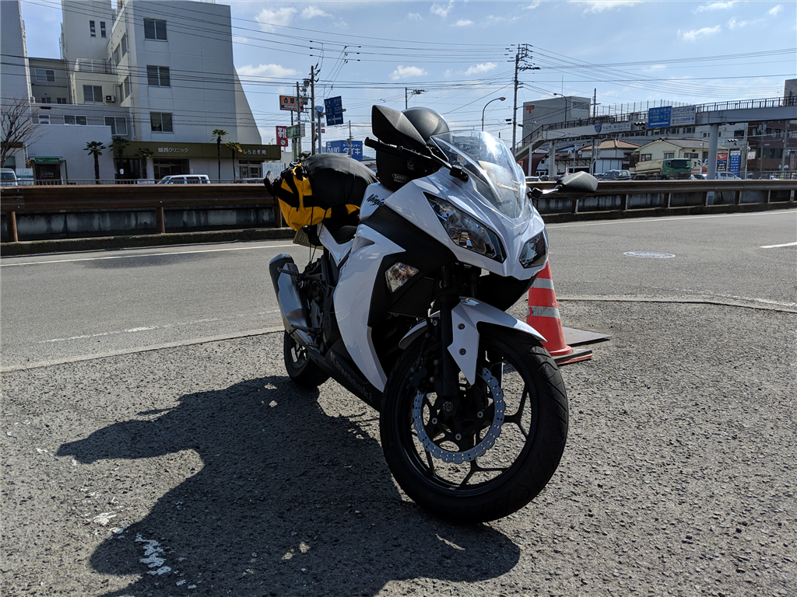
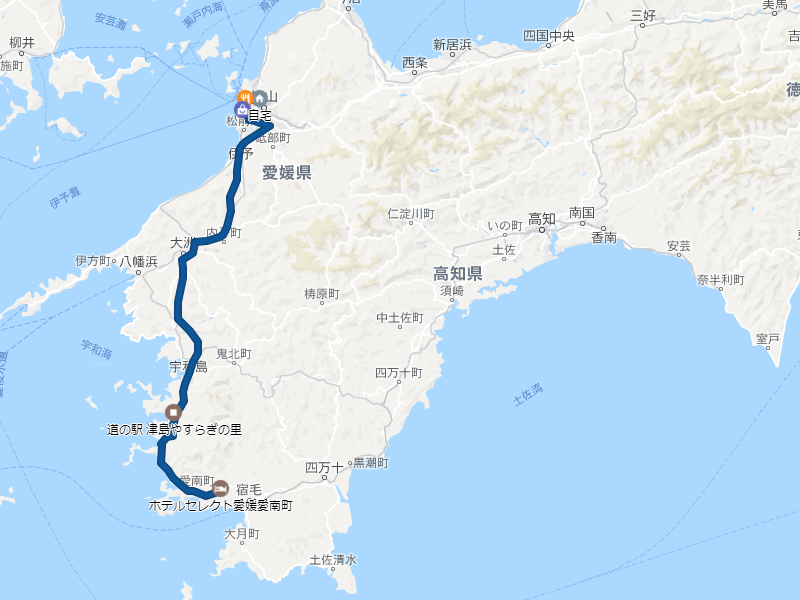
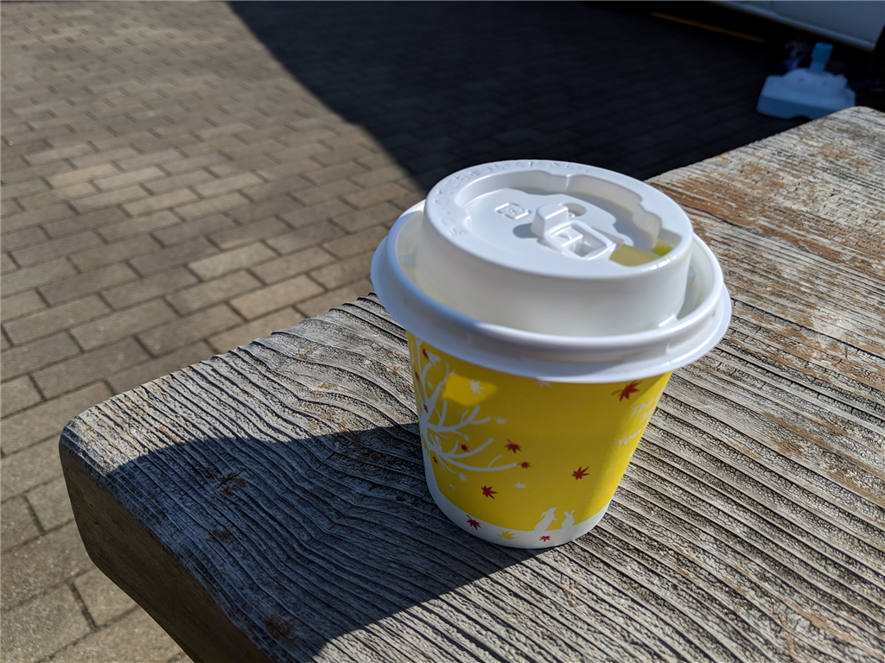
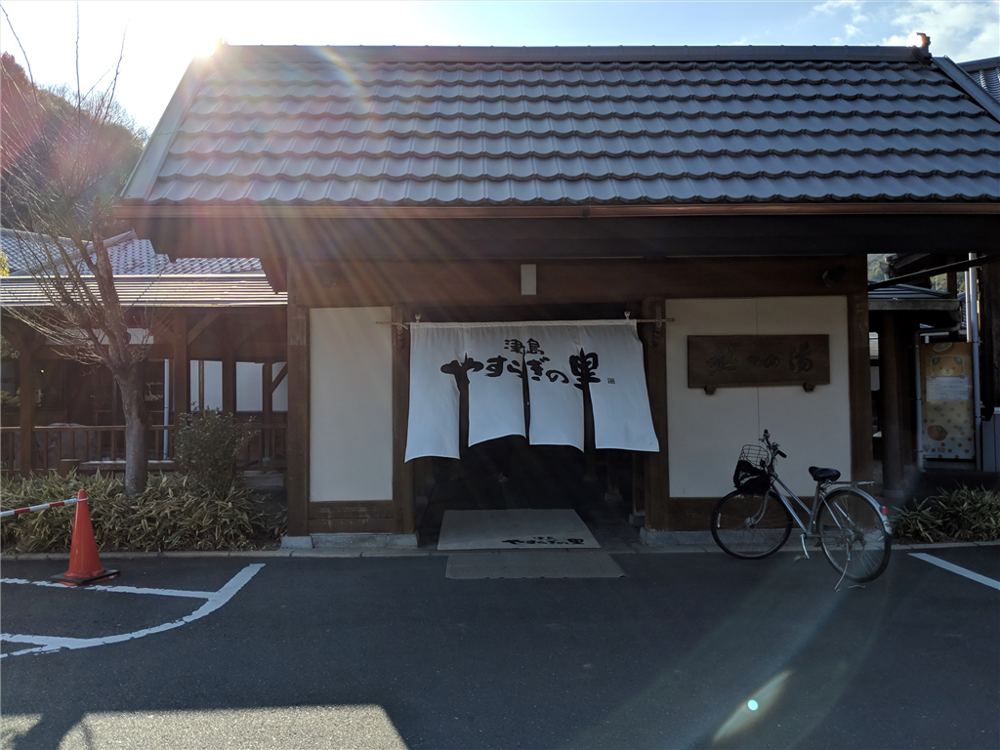
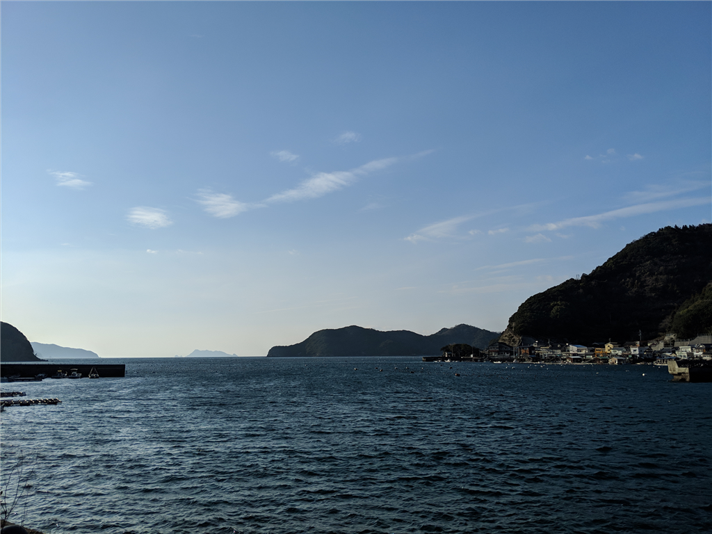
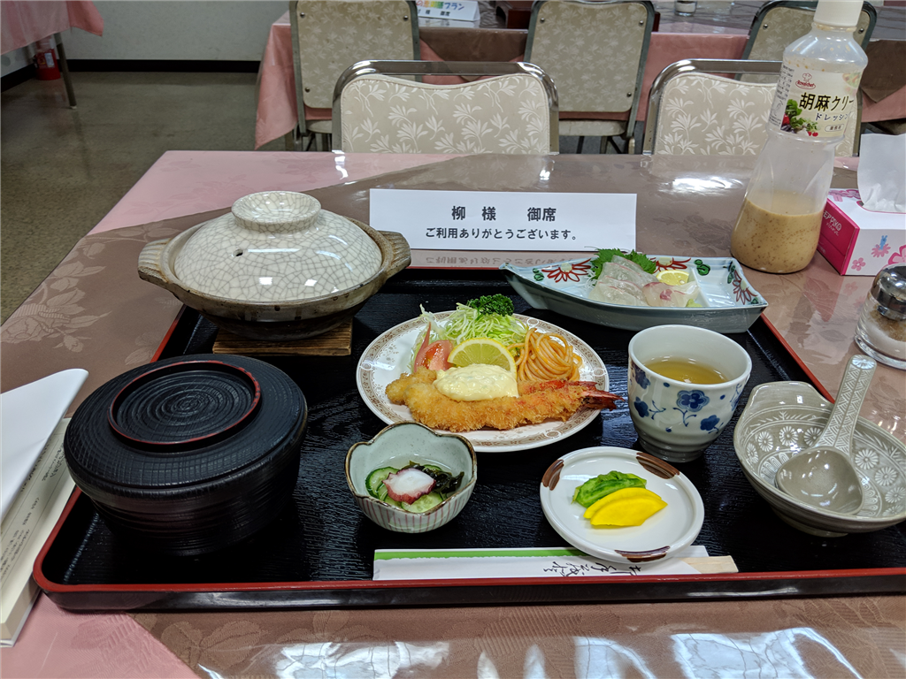

無事、踊るうどん永木で PayPay 童貞を捨てた僕は、意気揚々、バイクにまたがって南へ向かった。

<iframe src="https://hatenablog-parts.com/embed?url=https%3A%2F%2Fblog.daruyanagi.jp%2Fentry%2F2019%2F02%2F26%2F163932" title="2月23日：踊るうどん永木で PayPay 童貞を捨ててきた - だるろぐ" class="embed-card embed-blogcard" scrolling="no" frameborder="0" style="display: block; width: 100%; height: 190px; max-width: 500px; margin: 10px 0px;"></iframe><cite class="hatena-citation"><a href="https://blog.daruyanagi.jp/entry/2019/02/26/163932">blog.daruyanagi.jp</a></cite>

途中、セルフのガソリンスタンドを探すのに手間取ってしないをウロウロする羽目になったけど、街を抜けてからは快適なツーリング……のはずだったけど、松山道が超寒かった。市内は暖かかったので、比較的軽装備（シャツ＋革ジャン）で出かけたのだが、山の中を走るせいか、気温がぐっと下がる。陽もあまりあまりささないので、大洲盆地に出るまではひたすら寒さに耐えるしかなかった。

ひたすら南下すること2時間、なんか温かいものを飲みたい……お尻も割れそうに痛い。とうとう耐え切れなくなり、宇和島道路（国道56号バイパス）を捨てて、道の駅にもぐりこんだ。

バイクを止めて、自動販売機コーナーに突進し、カップで緑茶を買って、ほっこりした。回転焼き屋さん（100円）もあったので食べたかったのだけど、ちょうど品切れで残念だった（300円のたこ焼きはあったのだけど、そこまで腹は減っていなかった……）。

ひとごこちついていろいろ見回ってみると、この道の駅「津山やすらぎの里」には温泉がついているらしい。天祐とはこのことだろう。

この施設は、津山の町の人が集まるコミュニティセンターのような役割も担っているのかな？　温水プールや会議場などの施設もあった。広い駐車場に結構たくさんのクルマがとまっていたのに、道の駅そのものにはあまり人がいなかったのは、こういうところにもぐりこんでいるからなのだな。温泉にも地元の人らしき人（もんもんがついたおっさんも！）が割といて、思い思いにくつろいでいた。温泉の泉質などはよく見なかったのだが、肌にぬめっとまとわりつく感じ。露天風呂やサウナも完備していて、なかなかよいところだった。

お風呂から上がった後はフルーツ牛乳をのみながら、広間でごろごろ。ここには最新式のマッサージ機もあって、たいへんよろしかった。なんか体型をスキャンして、いい感じにもみほぐしてくれるのだな。自分の家にもほしいわ……。

結局、温泉も含めて1.5時間ぐらいここで過ごした。体は芯まで温まり、割れ欠けたケツもふさがった。元気がわいてきたので、ここからは下道を走ることにした。

浦々を抜けて走る国道58号線は、なかなかよい眺めで、かなり気に入った。一眼レフを持ってくるのを忘れたのが惜しまれる。

<iframe src="https://hatenablog-parts.com/embed?url=https%3A%2F%2Ftravel.rakuten.co.jp%2FHOTEL%2F67356%2F67356_std.html" title="楽天トラベル: ホテルセレクト愛媛愛南町 設備・アメニティ・基本情報 " class="embed-card embed-webcard" scrolling="no" frameborder="0" style="display: block; width: 100%; height: 155px; max-width: 500px; margin: 10px 0px;"></iframe><cite class="hatena-citation"><a href="https://travel.rakuten.co.jp/HOTEL/67356/67356_std.html">travel.rakuten.co.jp</a></cite>

宿泊は「ホテルセレクト愛媛愛南町」というところを取っておいた。その日の朝起きて、安いところを検索したらたまたまヒットしたので。その日はなにかスポーツ少年団っぽい子たちが泊まりで遠征に来ていたのかな？　賑やかだったけれど、ちょっと離れた新館にダブルの部屋を取ってくれていたので、静かに過ごせた。

近所にご飯屋さんはなさそうだし、あってもバイクでいかなきゃだし、そしたらお酒は飲めないし、晩御飯込みにしたのは正解。夕食にちょっと一品足したけど、それでも朝昼込みで6,000円と格安だった。超豪華ってわけじゃないけど、給仕のおばさんも愛想がよく、楽しそうにお仕事をされていたのが印象的で、悪いところではないと思った。

