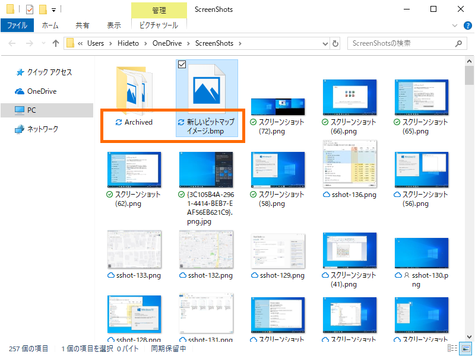
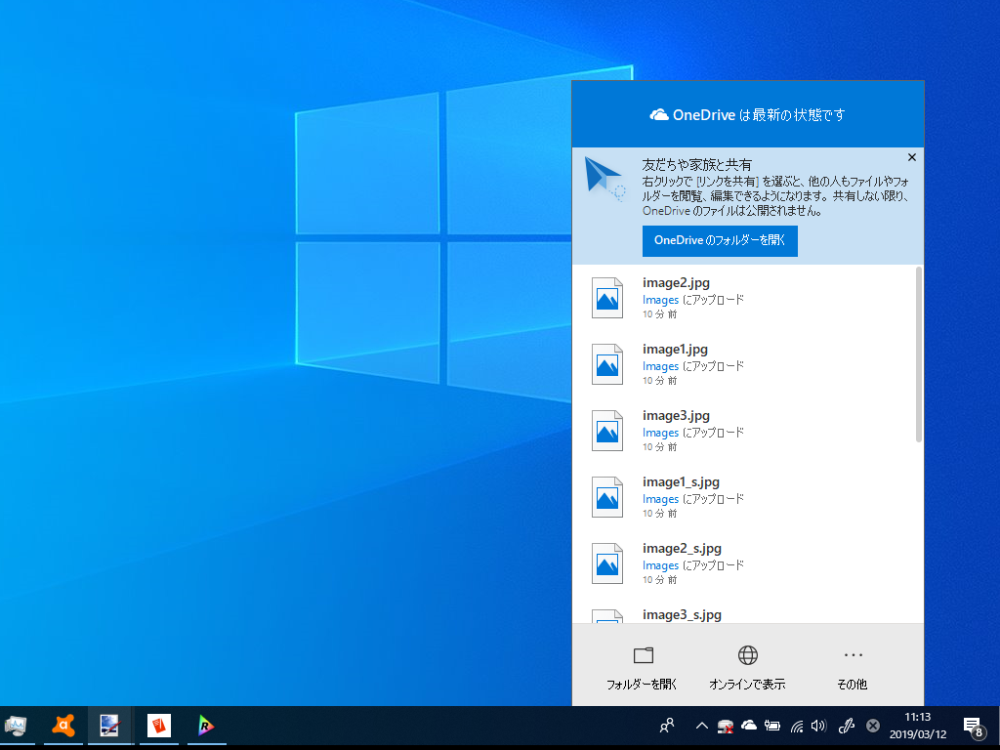

ここ最近、OneDrive をしばらく使っているとファイルが同期されなくなる問題に悩まされていた。当初は発生条件がわからず、困っていた。

<ul>
<li>OS の起動後、ある程度時間が経過すると発生するようだが、発生するまでに要する時間に一定性はない（経過時間ではなく、特定の操作がトリガーになってる？）</li>
<li>問題が発生した後も、他のフォルダーでは問題なく同期できたりする（OneDrive デスクトップクライアントそのものが落ちているわけではない）</li>
<li>同期の停止、再開をしても問題は解消しない</li>
<li>OS を再起動すると問題は解消される</li>
</ul>
ちなみに、ファイルが同期されなくなるとインジケーターアイコンは“同期中”のままになる。エクスプローラーのステータスバーには“同期保留中”と表示される。

OneDrive デスクトップクライアントでは変更が検出されない（よって、アップロードもダウンロードも行われない）。

数日、いろいろ試してみたが、どうやらファイルをリネームすると

<ul>
<li>リネームファイルのあるフォルダー</li>
<li>およびそのサブフォルダー</li>
</ul>
の変更が追跡されなくなるようだ。

うちの環境では特定のフォルダーをほかのユーザーと共有してファイルをやり取りしているが、その共有フォルダーで変更の追跡が行われなくなる≒同期が行われなくなると、先方と当方で異なるバージョンのファイルを見ていて話がかみ合わなくなったり、いろいろ弊害が多い。とりあえず「共有フォルダーではリネーム処理を行わない」という運用で回避している。

フィードバックはしたけれど、日本語が不自由で、Microsoft にちゃんと伝わっているかわからない。まぁ、自分以外にも報告者はいるだろうから、そのうち直るとは思う。手元のバージョンは以下の通り。

<blockquote cite="https://support.office.com/en-us/article/New-OneDrive-sync-client-release-notes-845dcf18-f921-435e-bf28-4e24b95e5fc0?ui=en-US&rs=en-US&ad=US&fromAR=1">

<b>Version 19.012.0121.0011 (Released March 1, 2019)</b> 
Bug fix to improve reliability of the client.

<cite><a href="https://support.office.com/en-us/article/New-OneDrive-sync-client-release-notes-845dcf18-f921-435e-bf28-4e24b95e5fc0?ui=en-US&rs=en-US&ad=US&fromAR=1">OneDrive release notes - Office Support</a></cite>
</blockquote>

<h3>2019/02/23 追記</h3>

直ってる気がする。

