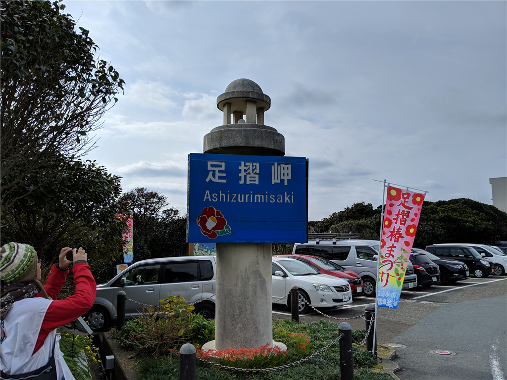
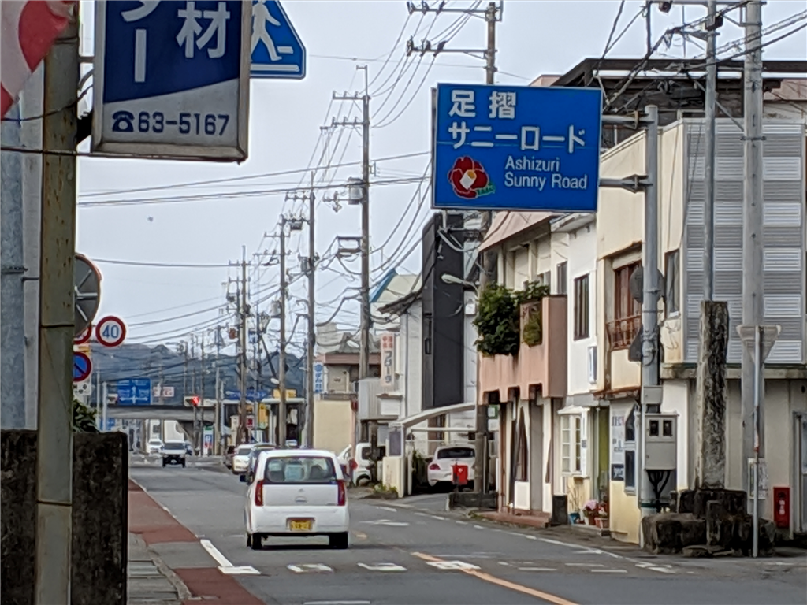
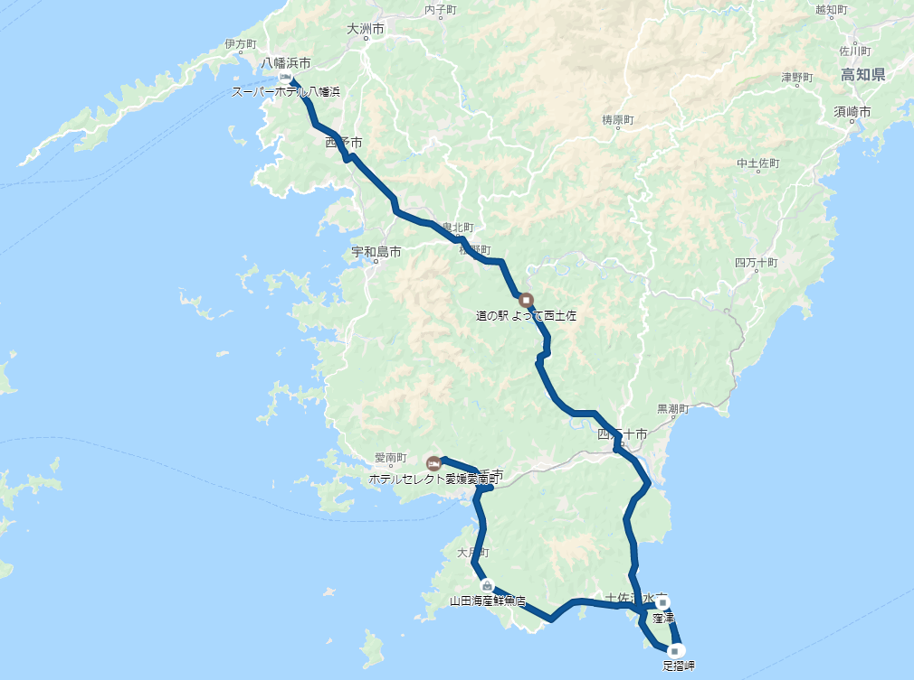
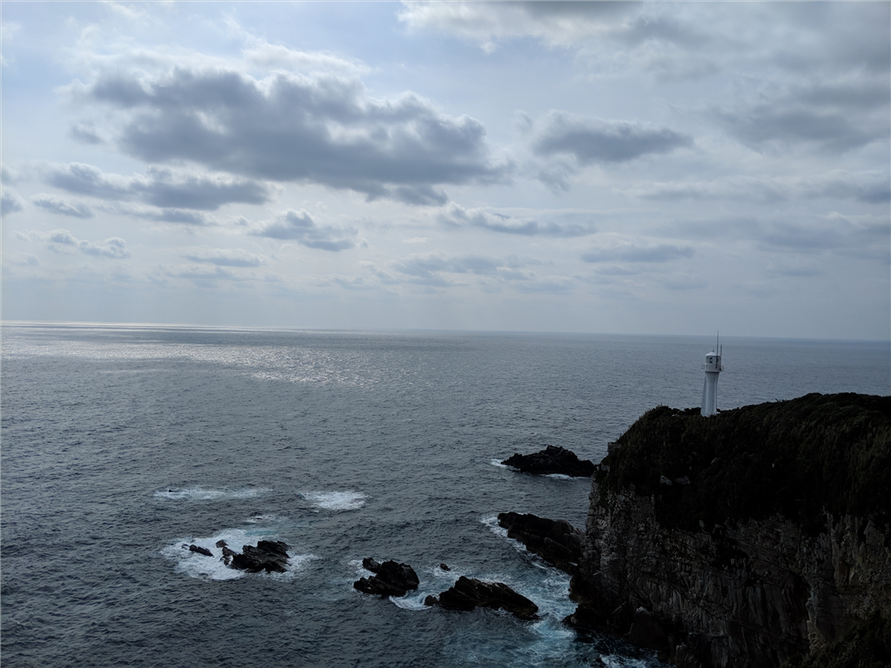
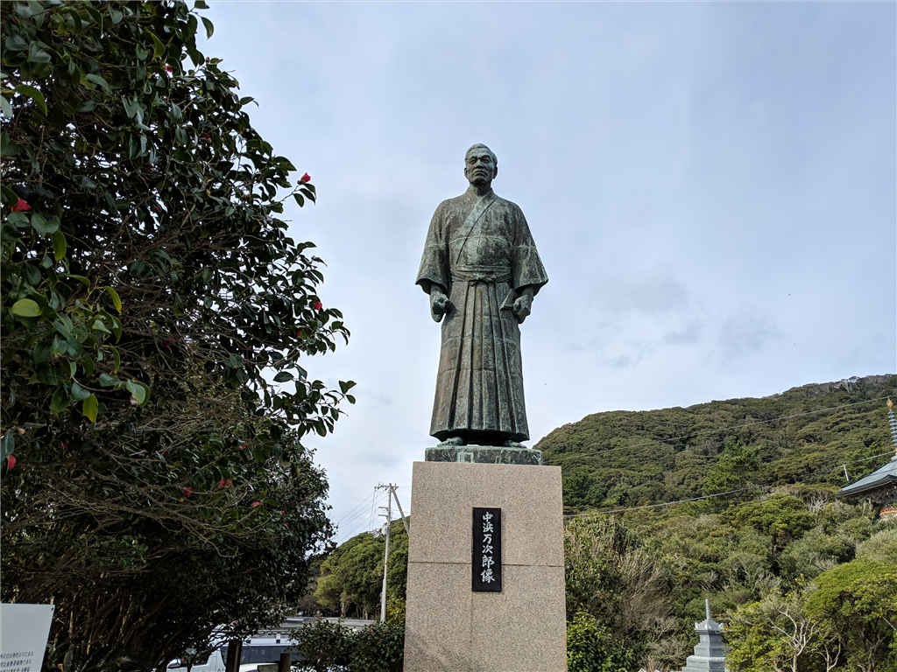
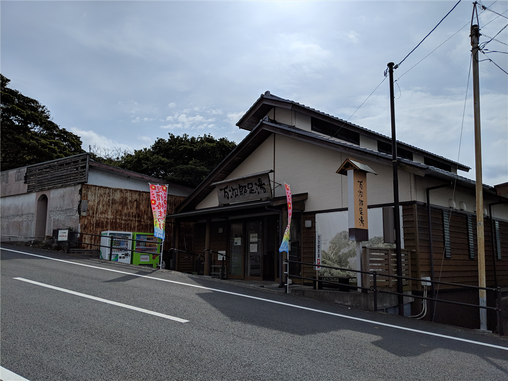
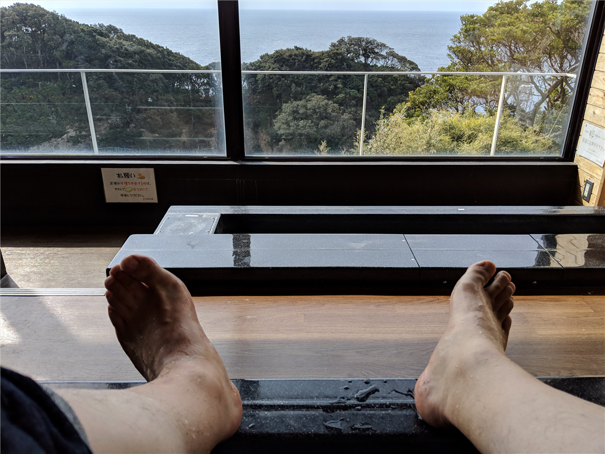
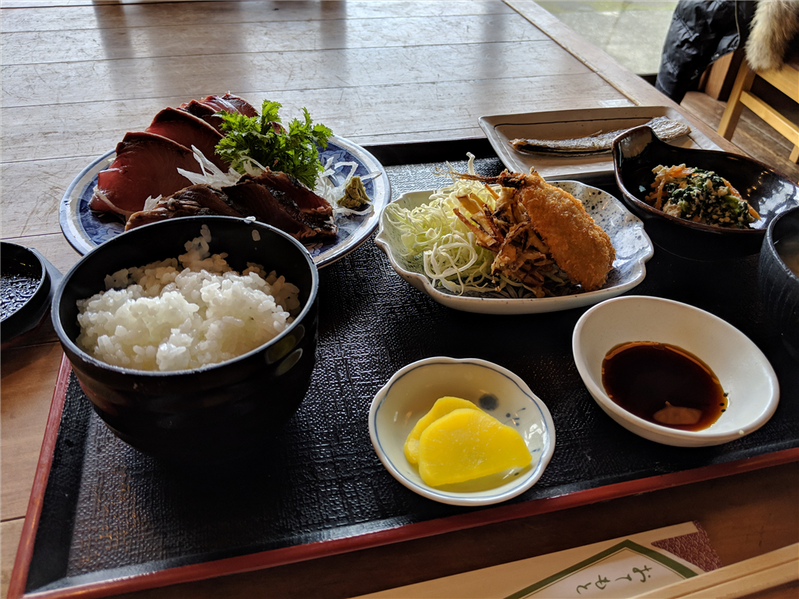
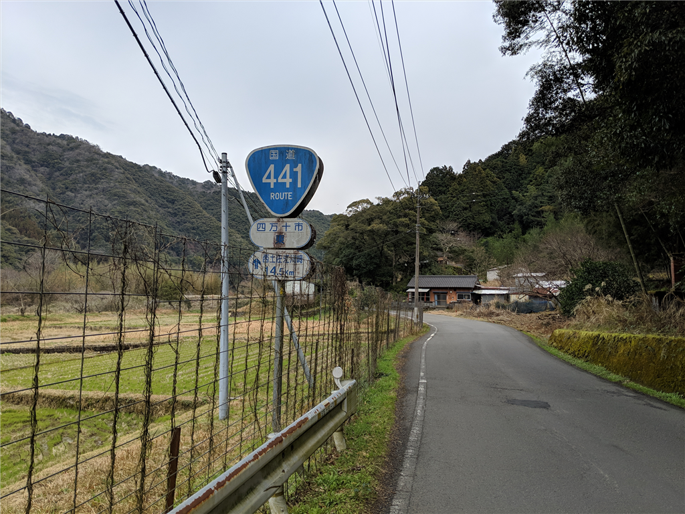
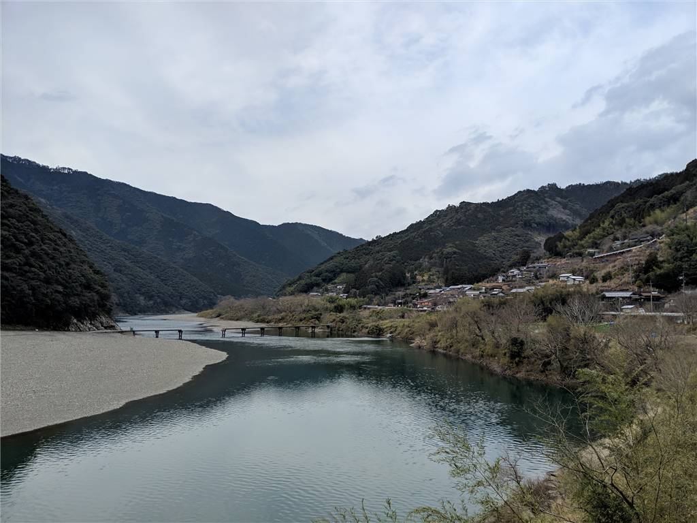

<iframe src="https://hatenablog-parts.com/embed?url=https%3A%2F%2Fblog.daruyanagi.jp%2Fentry%2F2019%2F03%2F10%2F143431" title="2月23日：松山市 ～ 宇和島市津山町 ～愛南町 - だるろぐ" class="embed-card embed-blogcard" scrolling="no" frameborder="0" style="display: block; width: 100%; height: 190px; max-width: 500px; margin: 10px 0px;"></iframe><cite class="hatena-citation"><a href="https://blog.daruyanagi.jp/entry/2019/03/10/143431">blog.daruyanagi.jp</a></cite>

愛南町で泊まった次の日。いかにもビジネスホテルな朝ごはん（満足！）で腹ごしらえをした僕は、さらに南へ向かいました。とりあえず、高知県に足跡つけてやるぜ！

高知県宿毛市へは、ものの15分程度で到着。ちょっと物足りないなーと思っていたところ、「足摺サニーロード」という看板が目につきました。足摺岬か……行ってみるのも悪くねえな。というわけで、予定にはないけどちょっくら足を延ばすことにしました。

高知の島々は愛媛と違って厳ついというか、迫力があるというか。愛媛は海にぽこぽこ島が浮いている感じですが、高知は荒波の中突き刺さっている感じ。

さぞ気性が荒い人が多いんだろうな、と思っていたのですが、交通マナーは割とよいというか、道を譲ってくれる軽トラックなんかもいて、こっちも自然とのんびりした感じで運転できました。意外だな？

11時前ごろ、足摺岬に到着。土佐清水って名前だけは聞いたことがあったのですが、ジョン万次郎の生地なんですね。圧倒的な万次郎推しで、町全体から万次郎ラブがあふれていました。

中でも一押しは、タダで入れる万次郎足湯。

ライディングブーツで岬の周りを散策して、ちょっぴり疲れた足に効く！　ガラス越しに眺められる景色も美しく、これがタダで堪能できるだなんて、とちょっと感動しちゃいました。

足摺岬は愛媛県の端っこ・佐田岬より栄えていて、民宿やホテルも多いようです。見どころも多そうだし、今度ゆっくり泊まってみてもいいかもしれない。ごはんもきっとおいしいだろうし。

お昼ご飯は、足摺岬から少し北に行ったところにある「大漁屋」さんでいただきました。刺身定食1,250円えんぐらいだったかな？　割と品数も多くて満足です。

<iframe src="https://hatenablog-parts.com/embed?url=https%3A%2F%2Ftabelog.com%2Fkochi%2FA3904%2FA390404%2F39002936%2F" title="海鮮館 大漁屋 (土佐清水市その他/魚介料理・海鮮料理)" class="embed-card embed-webcard" scrolling="no" frameborder="0" style="display: block; width: 100%; height: 155px; max-width: 500px; margin: 10px 0px;"></iframe><cite class="hatena-citation"><a href="https://tabelog.com/kochi/A3904/A390404/39002936/">tabelog.com</a></cite>

そのあとは四万十市を抜け、国道441号線を川沿いに北上しました。

ところどころすれ違い（こっちでは離合っていうの？）が厳しいとことがありますが、この道は結構気に入ったかも。

起伏もカーブもそれなりにあって、なにより渓流の眺めが素晴らしい。あまりクルマでは行きたくないな、と思いましたが、バイクではもう一回行ってもいいかも。

その日は無理すれば松山に帰れましたが、あまり頑張りすぎて事故っても嫌だし、適当にとった八幡浜の宿に泊まってお風呂でぬくぬくしました。たまたま以前、泊ったことのある宿と一緒のところだったｗ ついでなので、前回寄ったお寿司屋さんで夕ご飯を頂きました。おいしゅうございました。

<iframe src="https://hatenablog-parts.com/embed?url=https%3A%2F%2Fblog.daruyanagi.jp%2Fentry%2F2015%2F12%2F09%2F000000" title="バイクで愛媛の先っぽまで行ってきたった。 - だるろぐ" class="embed-card embed-blogcard" scrolling="no" frameborder="0" style="display: block; width: 100%; height: 190px; max-width: 500px; margin: 10px 0px;"></iframe><cite class="hatena-citation"><a href="https://blog.daruyanagi.jp/entry/2015/12/09/000000">blog.daruyanagi.jp</a></cite>

