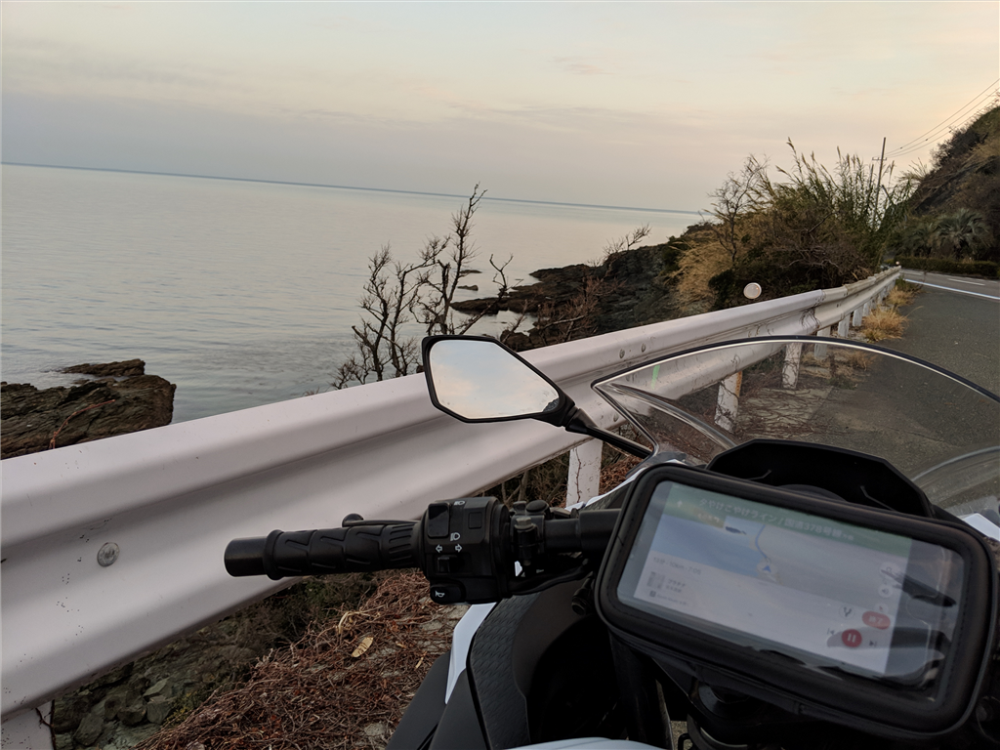
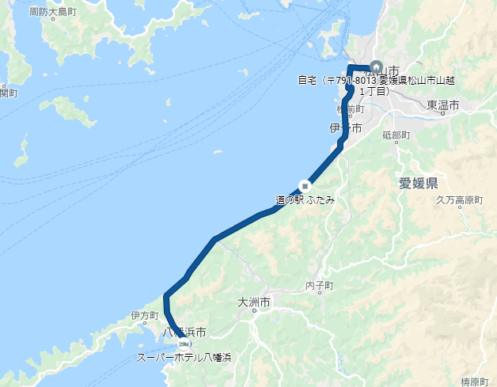
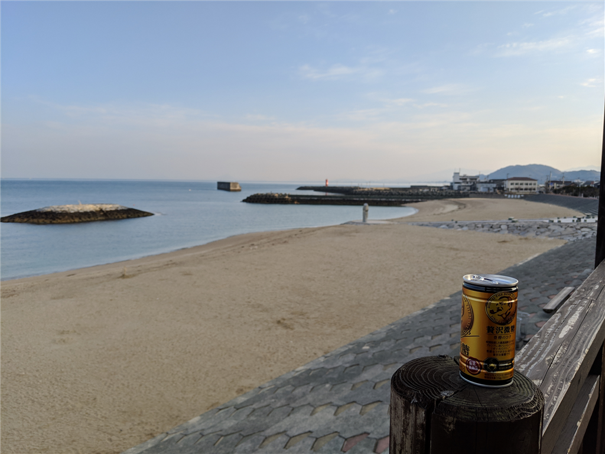
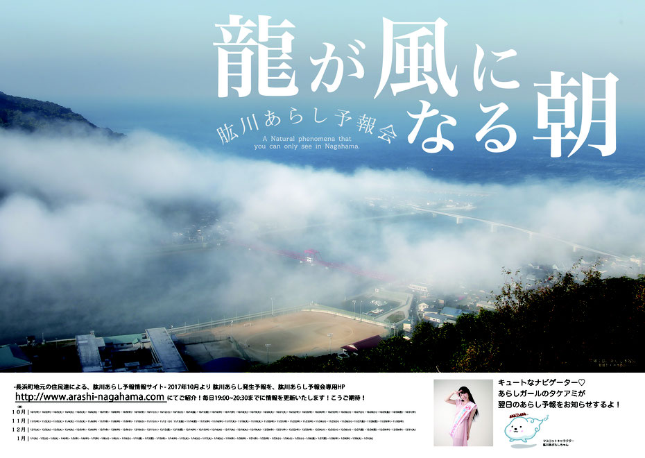

バイク旅行の3日目。

<iframe src="https://hatenablog-parts.com/embed?url=https%3A%2F%2Fblog.daruyanagi.jp%2Fentry%2F2019%2F03%2F24%2F174550" title="2月24日：足摺岬 - だるろぐ" class="embed-card embed-blogcard" scrolling="no" frameborder="0" style="display: block; width: 100%; height: 190px; max-width: 500px; margin: 10px 0px;"></iframe><cite class="hatena-citation"><a href="https://blog.daruyanagi.jp/entry/2019/03/24/174550">blog.daruyanagi.jp</a></cite>

とはいえ、前日に寿司食べて早く寝て、早朝、暗いうちに宿を出て、そのまま松山に帰っただけ……。

このルートは「夕やけこやけライン」と呼ばれているらしい。できれば朝日を拝みたいと思っていたけれど、西に向いていることもあり、本当は夕やけの方が美しいのだな。ちなみに、青春18きっぷのポスターで有名な下灘駅もこの通り沿いにある。ポスターに採用されているぐらいなのだから、景色については言わずもがな、大変美しい。

スマホの写真ではよくわからないが、道の駅「ふたみ」からは遠く、大都会・松山を望むことができる。ただし、この道の駅は恋人の聖地にもなっている。独身無職の中年おっさんが近づくと、高校生カップルのまぶしさに殺される恐れがあるため注意が必要だ。

あと、伊予長浜で「肱川あらし」っぽいものにも出会えた。

肱川の河口を霧が雪崩下りてくる感じ。その日の霧はそんなに大した規模ではなかったけれど、それでもなかなか幻想的だと思う。展望台もあるらしいから、そっちからも見てみたいもんだ。

<iframe src="https://hatenablog-parts.com/embed?url=https%3A%2F%2Fwww.arashi-nagahama.net%2F" title="肱川あらし予報会" class="embed-card embed-webcard" scrolling="no" frameborder="0" style="display: block; width: 100%; height: 155px; max-width: 500px; margin: 10px 0px;"></iframe><cite class="hatena-citation"><a href="https://www.arashi-nagahama.net/">www.arashi-nagahama.net</a></cite>

ちなみに、肱川あらしはいつ出るかわからないので予報サイトもある。

なにはともあれ、八幡浜から長浜に出る道も含め、このルートは大変気に入った。この前の S660 の納車のときもここを走ったが、なかなか良いものだと思う。

<iframe src="https://hatenablog-parts.com/embed?url=https%3A%2F%2Fblog.daruyanagi.jp%2Fentry%2F2019%2F03%2F27%2F001051" title="3月25日：S660 が納車されました - だるろぐ" class="embed-card embed-blogcard" scrolling="no" frameborder="0" style="display: block; width: 100%; height: 190px; max-width: 500px; margin: 10px 0px;"></iframe><cite class="hatena-citation"><a href="https://blog.daruyanagi.jp/entry/2019/03/27/001051">blog.daruyanagi.jp</a></cite>

