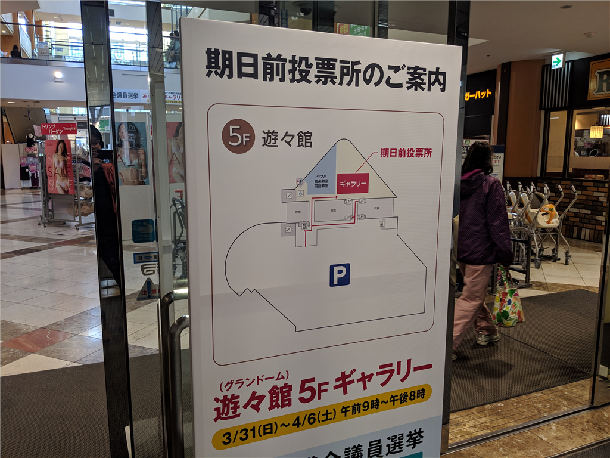
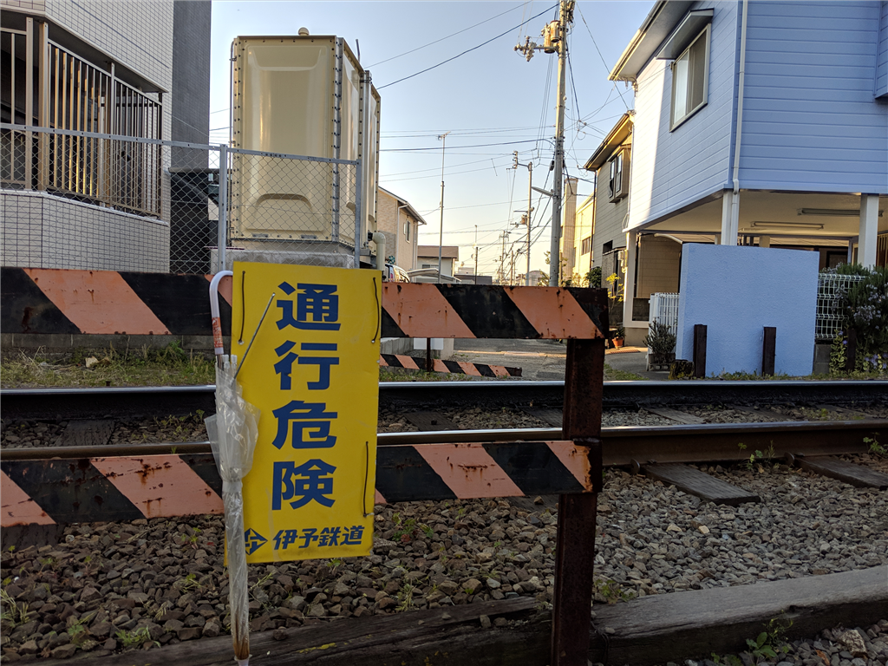

週末、松山にいない予定なので、今日は少し早めに仕事を切り上げて、県議選の事前投票に行ってきた。今週、外出たの初めてかもしれない。運動のため、フジグランまで歩いて行ったのだけど、太陽がまぶしかった。ところどころ桜が咲いていて、春だなって感じ。

<blockquote class="twitter-tweet" data-lang="HASH(0xdc95410)">
ベスポジ臭くね? ちょっと待機してみるわ、通報せんといてな <a href="https://t.co/Ro9Gs3zZZd">pic.twitter.com/Ro9Gs3zZZd</a>
&mdash; だるやなぎ@平成婚を諦めない (@daruyanagi) <a href="https://twitter.com/daruyanagi/status/1113352977752788992?ref_src=twsrc%5Etfw">April 3, 2019</a></blockquote>

途中、いい感じに桜が咲いているスポットを見つけたので（古町の駅のすぐそばだよ）、伊予鉄と一緒にバシャッと撮れないかなぁ、と思って少し陣取ってみた。

<blockquote class="twitter-tweet" data-lang="HASH(0xecff678)">
伊予鉄〜 <a href="https://t.co/68Jeb0MzHv">pic.twitter.com/68Jeb0MzHv</a>
&mdash; だるやなぎ@平成婚を諦めない (@daruyanagi) <a href="https://twitter.com/daruyanagi/status/1113353995542626307?ref_src=twsrc%5Etfw">April 3, 2019</a></blockquote>

不審者として通報される前に写真を撮ることができてうれしい。

今回の県議選は争点がよくわからないので、だれに投票していいか、だいぶ困った。とりあえず、原発ゼロとか言ってる人は除外――あんなもん、止めててもカネ食うんだから、動かしながら縮小の方法を模索すればいい。政党に入らない、入れない、オトナの事情で所属を名乗れない「無所属」にもいれない。政党には政治家個人の勝手を掣肘したり、党内で議論を重ねて政策を熟成させるといった役割がある。そういうものを軽視したヒトにはいれない。あと、変な党に所属している人にも入れない――などと候補を原点方式で絞って、あとは「名前の並び順的に一番不利そうな人」にいれた。ほら、投票先を書くときに名前の表を見るけど、右上とかって票が集中しそうじゃない？（最高裁のアレで右端に票が集まるのと一緒）　ああいうのちょっとかわいそうなので。

自宅に帰ることには、投票した政治家の名前を忘れてしまっていて、これでいいんだろうか（いや、よくない）などと思った。もうちょい勉強しないとだめだよな。反省。

