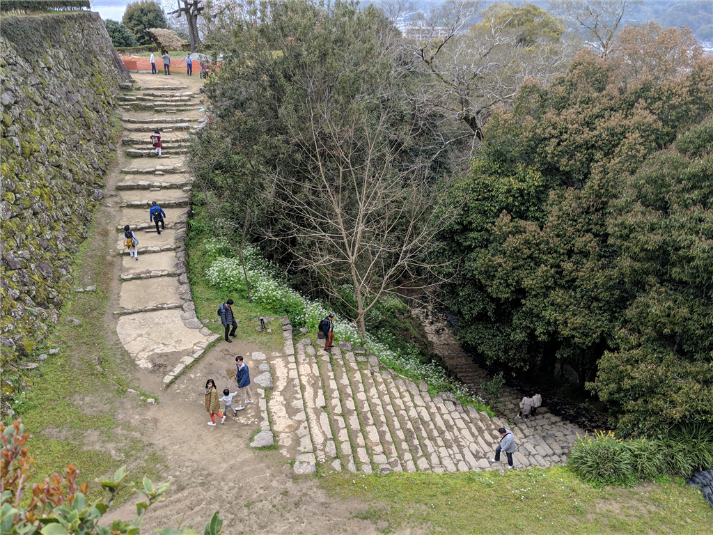

S660 が納車されて初めての週末、親父を連れて宇和島へ行ってきた。

海沿いを走り（めっちゃきもちいい）、まずは八幡浜で腹ごしらえ。ちゃんぽんで有名なロンドンにいってきた。

<blockquote class="twitter-tweet" data-lang="HASH(0xe841728)">
I&#39;m at ロンドン本館 in 八幡浜市, 愛媛県 <a href="https://t.co/cMP9pZTssm">https://t.co/cMP9pZTssm</a> <a href="https://t.co/0XUsCV33bE">pic.twitter.com/0XUsCV33bE</a>
&mdash; Beautiful Harmony やなぎ (@daruyanagi) <a href="https://twitter.com/daruyanagi/status/1111842558920048643?ref_src=twsrc%5Etfw">March 30, 2019</a></blockquote>

八幡浜は何回かきたことあるけど、ロンドンにきたのは初めてかもしれない。割と普通の洋食屋さんって感じ。

世に聞く八幡浜ちゃんぽんは……割と普通かな？　でも、変に気取ってないから毎日これでもイケるな。お値段も確か500円ぐらいだった。実はちゃんぽんよりも他のお客さんが食ってるメニューが気になってしまったので、今度行くときは違うものを頼んでみようと思う。

おなか一杯になったところで、再び南下。西予市を抜けて宇和島へ向かう。

宇和島城は相変わらずのぼるのがだるくて、翌日はふくらはぎが筋肉痛になってしまったが、頑張った甲斐はあって、桜が大変キレイだった。

前回きたときと違っていたのは、VR で 360 度写真が見れるようになっていたこと。Oculus Go だか何かが置いてあって、装着すると天守閣からの眺めを VR で体験できた。小さな女の子が割と喜んでいたのがほほえましい。もちろん、VR ヘッドセットはあまり子どもにはよろしくないので、長時間の利用を避けること、保護者同伴で利用することといった注意書きは書いてあった。ちゃんとしてる。

夕飯は、宇和島の町を散策して、適当な居酒屋でたべた。

きびなごおいしゅうございました。

<blockquote class="twitter-tweet" data-lang="HASH(0xe0e08f0)">
お通しいける、美味しいと思われ (@ 氏の家 in 宇和島市, 愛媛県) <a href="https://t.co/vRL5QcABbB">https://t.co/vRL5QcABbB</a>
&mdash; Beautiful Harmony やなぎ (@daruyanagi) <a href="https://twitter.com/daruyanagi/status/1111922421550989312?ref_src=twsrc%5Etfw">March 30, 2019</a></blockquote>

