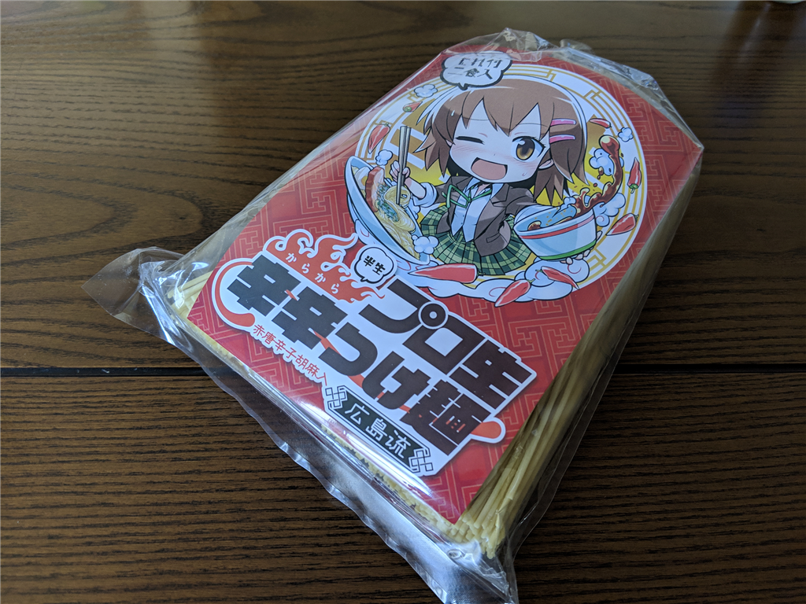
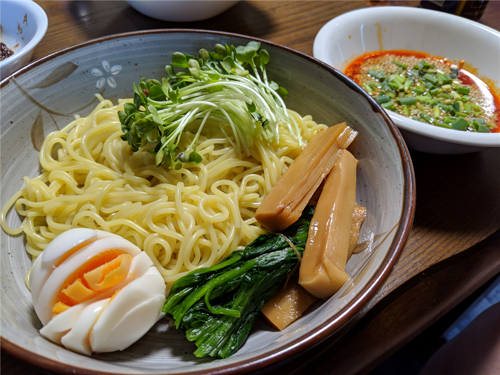
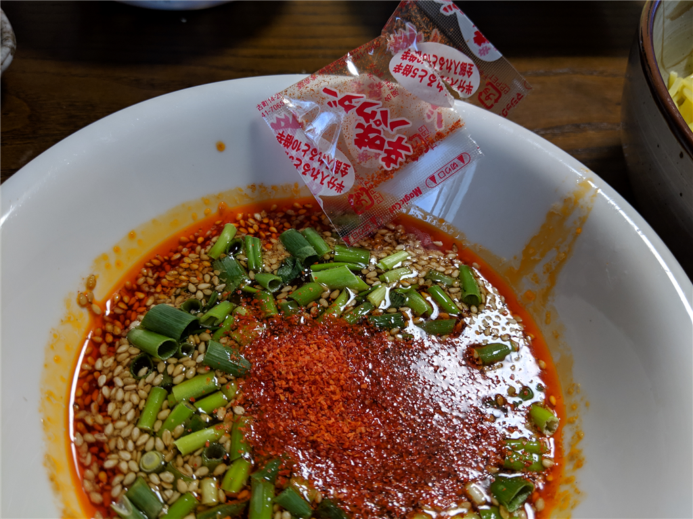

「プロ生 辛辛つけ麺 広島流 赤唐辛子胡麻入 2人前」が発売されたので、オンラインで注文。さっそく食べてみました。

<iframe src="https://hatenablog-parts.com/embed?url=https%3A%2F%2Fakiba-pc.watch.impress.co.jp%2Fdocs%2Fwakiba%2Ffind%2F1177418.html" title="プロ生ちゃんの「辛辛つけ麺」が店頭販売中、2人前で550円" class="embed-card embed-webcard" scrolling="no" frameborder="0" style="display: block; width: 100%; height: 155px; max-width: 500px; margin: 10px 0px;"></iframe><cite class="hatena-citation"><a href="https://akiba-pc.watch.impress.co.jp/docs/wakiba/find/1177418.html">akiba-pc.watch.impress.co.jp</a></cite>

ちなみに価格は550円（税込み 594円）。2人前入ってるのでそれほど高くはないですが、<b>送料が 1,080 円かかります</b>。オンラインで買うときはオリオスペックで水冷パーツかなにかも一緒に買うといいと思います！

<h3>内容</h3>

<blockquote>

パッケージには半生中華麺(110g)と具、たれがそれぞれ2人前分入っており、製造は業務用麺の製造・販売をしている<b>有限会社なか川</b>が担当しています。

</blockquote>

自分はよく知らなかったのですが、<b>辛辛つけ麺広島流</b>というのがベースのようですね（今度広島行ったら食ってみよう）。

<blockquote cite="https://www.nakagawaseimen.co.jp/tukemen.htm">

広島発祥のつけ麺として、人気の高い商品。

広島つけ麺の特徴は、ピリリと辛い赤だれです。この辛さと旨味が調和された絶品のたれに、じっくりと熟成させながら冷風乾燥させた半生中華麺をつけてお召し上がりください。

3～4分茹で、冷水で水洗いし、茹でキャベツ、チャーシューや湯ぬきした豚肉、鶏肉、もやし、ねぎ、ゆで卵などを盛り付けて、たれに添付してある胡麻を入れ、もっと辛さの欲しい方は添付の一味唐辛子を入れて召し上がって頂けば、一流店のつけ麺が味わえます。

<cite><a href="https://www.nakagawaseimen.co.jp/tukemen.htm">&#x8F9B;&#x8F9B;&#x3064;&#x3051;&#x9EBA;&#x5E83;&#x5CF6;&#x6D41;/&#x9EBA;&#x306E;&#x88FD;&#x9020;&#x8CA9;&#x58F2; &#x306A;&#x304B;&#x5DDD;</a></cite>
</blockquote>

調理は親父に任せました。チャーシューは別添えなのですが、素人にしてはまぁまぁおいしそうに見えます。麺の茹で加減はふつう。今回は冷製にせず、ザルで湯を切っただけです。

付属の辛い粉は……最初は辛さを調整しようかなって思ったのですが、めんどくさいので全部だばーっと入れてしまいました。

辛辛魚などで鍛えたせいか、全部入れてもそんなに辛くない感じ（翌日、お尻の穴が燃えるように痛くなることもない）。安心して食べられると思います。

お味の方は――確かに冷たい方がいいかな？　って感じですね。うまく表現できませんが、熱々をフーフーして食べたいっていうより、つるっと爽やかに食べたい感じです。食欲の減退した夏にはピッタリなんじゃないかな？　

もともと、ラーメンはつけ麺の方が好きです――ビールを飲むので、具をアテにできるのがいい。つけ汁が冷めるのはアレですが、もともと猫舌なので、あまりマイナスにならないんですよね。冷たいつけ麺なら、冷めるのがマイナスになることもない。

個人的には結構好きな味だし、送料の問題さえクリアできれば、夏にリピートしてもいいかなぁって思いました。

<h3>告知</h3>

プロ生ちゃんって何？　って思った方はこっちをチェック！　LT 枠はまだ募集中なので、ぜひ応募してくださいね（飛び入り歓迎

<iframe src="https://hatenablog-parts.com/embed?url=https%3A%2F%2Fblog.daruyanagi.jp%2Fentry%2F2019%2F03%2F23%2F130511" title="今年もプロ生愛媛が開催されます！ - だるろぐ" class="embed-card embed-blogcard" scrolling="no" frameborder="0" style="display: block; width: 100%; height: 190px; max-width: 500px; margin: 10px 0px;"></iframe><cite class="hatena-citation"><a href="https://blog.daruyanagi.jp/entry/2019/03/23/130511">blog.daruyanagi.jp</a></cite>

