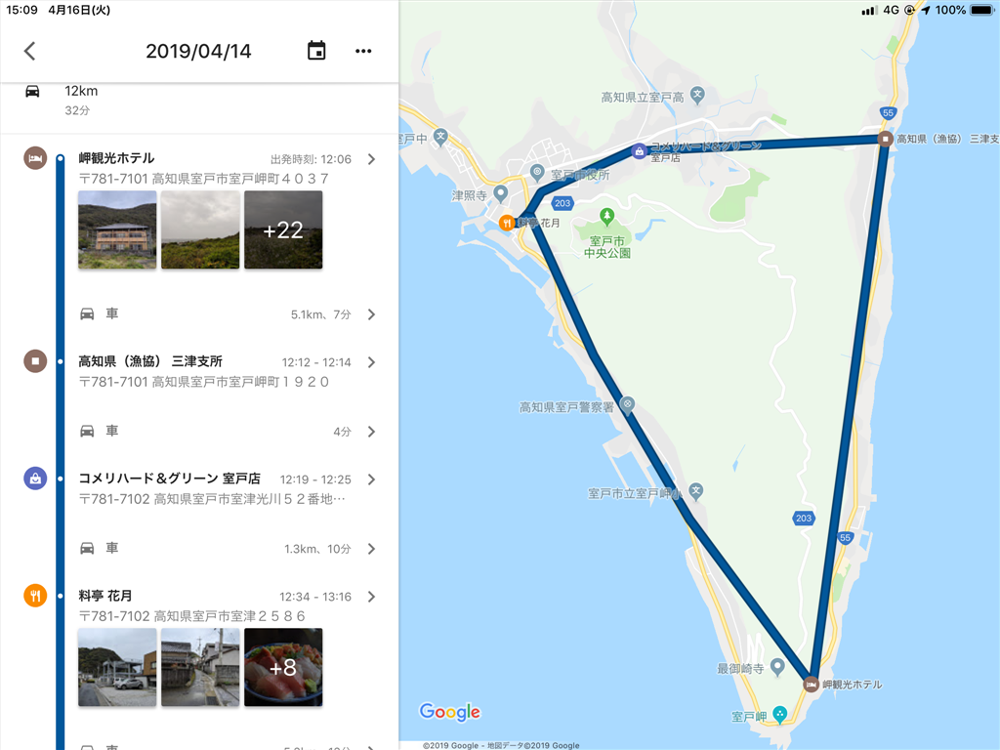
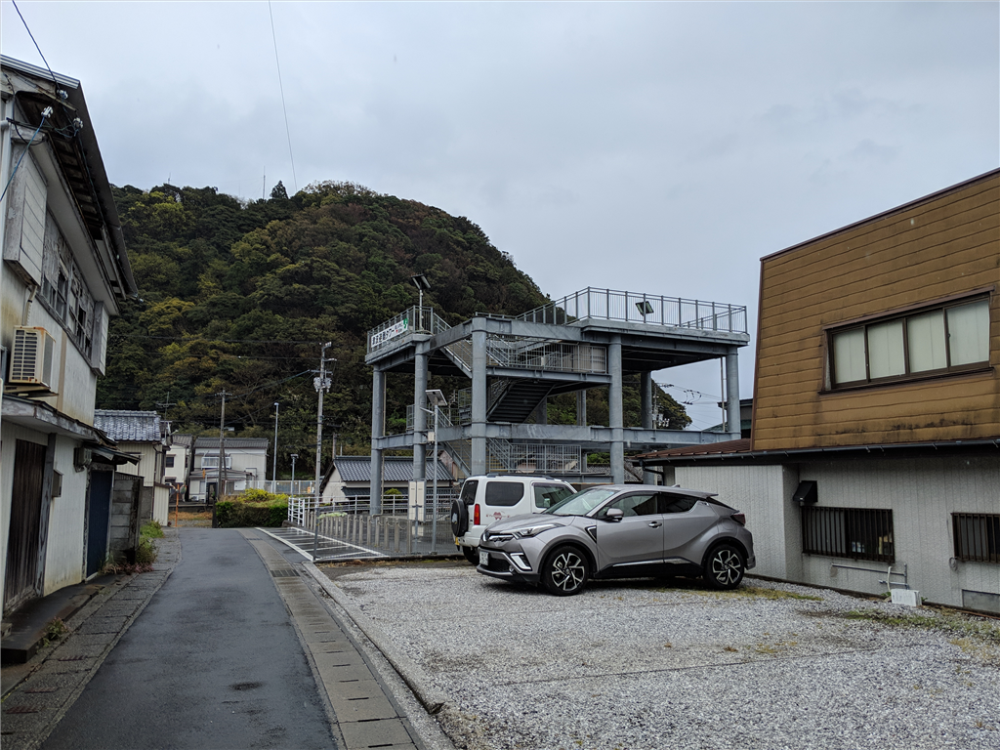
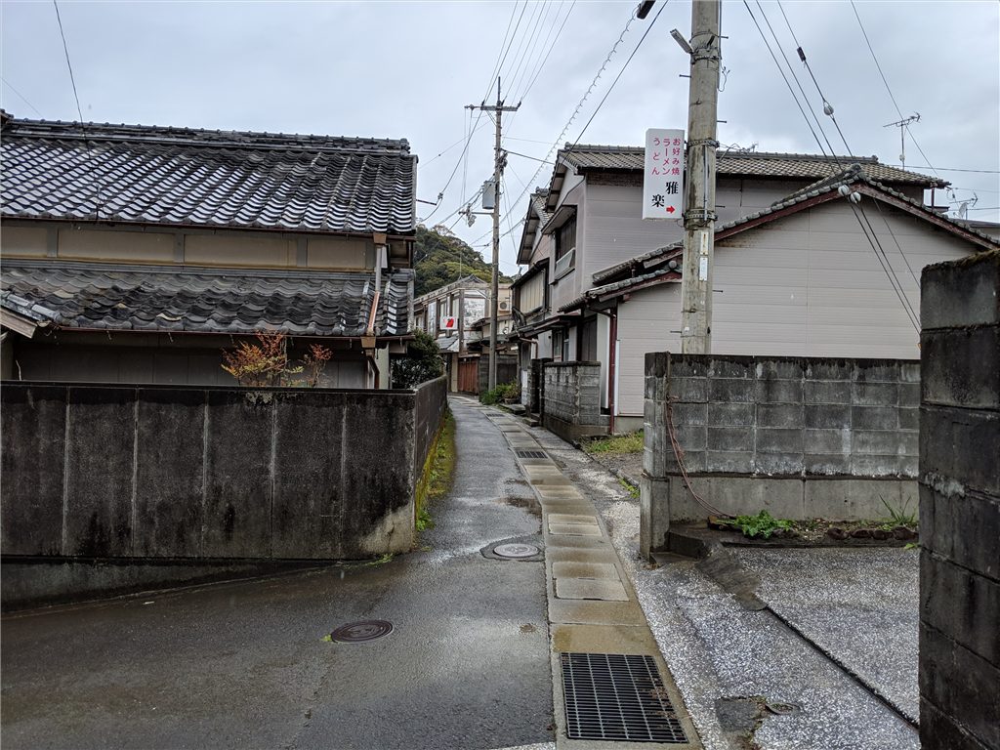
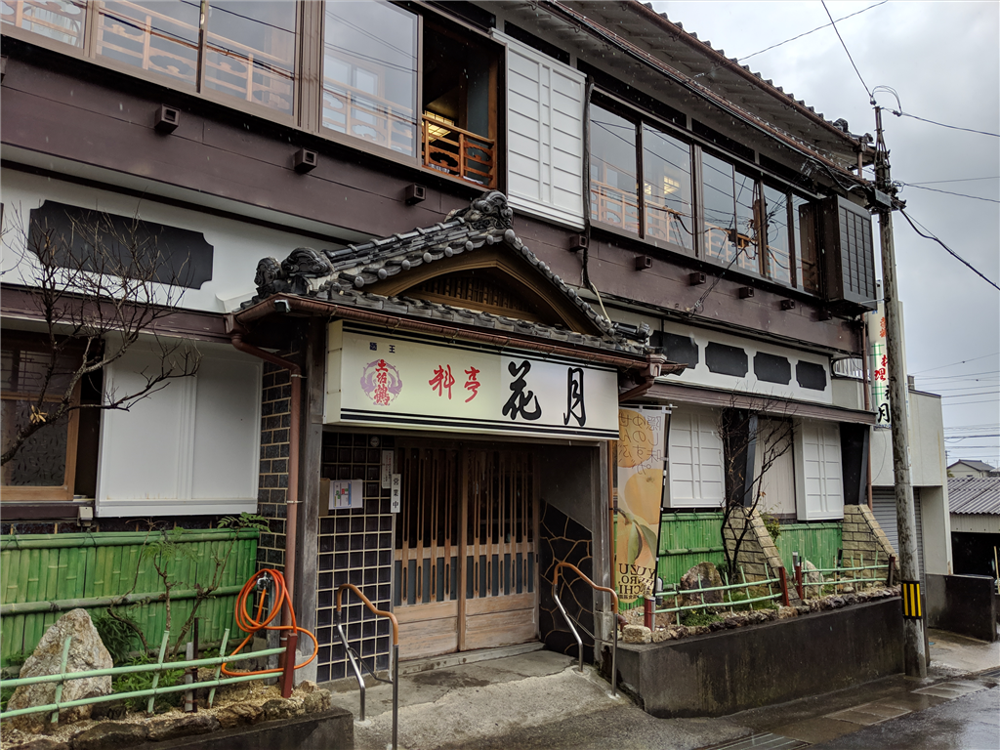
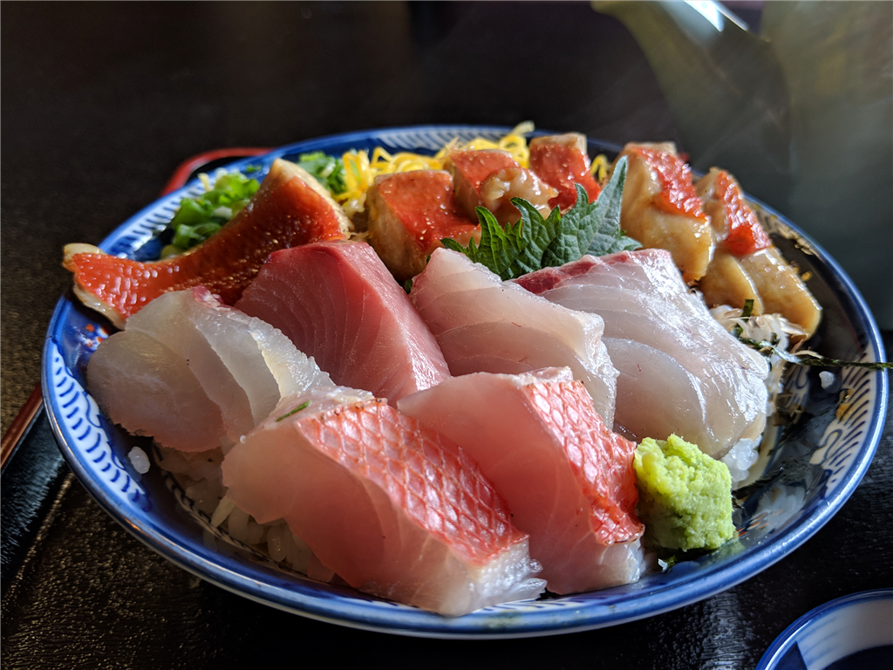
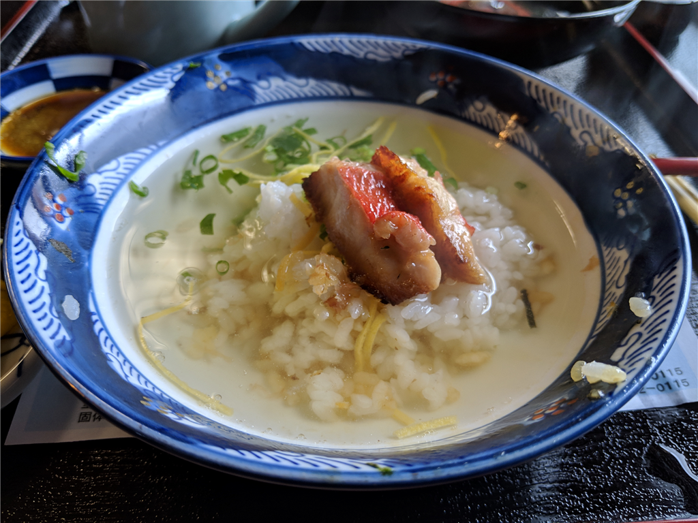
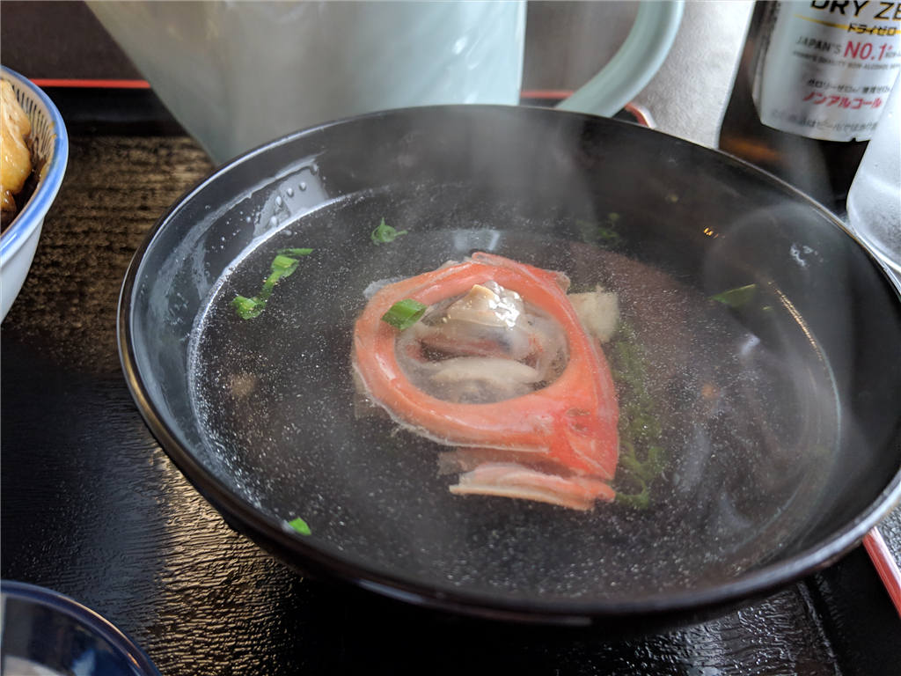

前回のあらすじ――睡眠サイクルが大崩壊しただるやなぎは、疲れからか夜明け前に S660 のルーフをあけ、気温1度の久万高原へ出撃してしまう。すれ違いすら困難な山道を決死の勢いで抜けた先に待っていたのは、四国カルストの雄大な風景だった。そのあとも行き当たりばったりで高知をさまよい、ようやく午後3時、室戸岬にとった宿に潜り込んだのであった……。

<iframe src="https://hatenablog-parts.com/embed?url=https%3A%2F%2Fblog.daruyanagi.jp%2Fentry%2F2019%2F04%2F14%2F062210" title="4月13日：四国カルスト～室戸岬 - だるろぐ" class="embed-card embed-blogcard" scrolling="no" frameborder="0" style="display: block; width: 100%; height: 190px; max-width: 500px; margin: 10px 0px;"></iframe><cite class="hatena-citation"><a href="https://blog.daruyanagi.jp/entry/2019/04/14/062210">blog.daruyanagi.jp</a></cite>

翌日は、雨の予報。朝ご飯をもしゃもしゃ食べながら「雨の中帰るのはだるいなー」「いっそのこと連泊して、宿でお仕事するか」と思い立つ。宿に確認をとると、そのままその部屋に泊まっていいとのことだったので、日がな一日ゴロゴロすることにした。転がりたくなったら横になり、眠たくなったら寝て……やがて NHK 将棋講座が終わり、お昼どきになった。雨脚も少し衰えたようなので、クルマで室戸市街へ向かう。

室戸のあたりは道が簡単で、市街（東）～岬（南）～三津漁港（西）～（トンネル）～市街 といった感じの三角形を成している。少し遠回りだけどぐるっと一周して、途中、ホームセンターで買い物をしたりしながら、おいしそうな店を探した。でも、大きな通り沿いにはあまりないみたい。仕方なく、役場の周りの路地に入ってみたけど、軽自動車でも曲がるのが困難な十字路なんかもあり、あきらめて適当なところで車を止め、徒歩でぶらぶら彷徨う。再び雨脚が激しくなってきたけど、たまたまクルマに置きっぱなしだった折り畳み傘があったので問題ない。

高知の方ではよく見かける、津波避難の塔を抜け――

お店の気配のある路地を行く。どこも閉まってるみたい……お寿司屋さんは見つけたけど、お酒の飲めないハンドルキーパーには辛いなぁ、もう少し定食屋さんっぽい感じのところがないかなぁ。

すると、料亭花月というお店を見つけた。料亭という響きにちょっとしり込みしつつも、なんかお客さんも多そうだし、行く価値はありそう。「孤独のグルメ」センサーに感アリ。思い切って暖簾をくぐってみた。

店は忙しそうだったけど、すぐに2階の席へ通された。畳敷きの広間にテーブルがいくつか置かれていて、結構にぎわっている。

メニューにはマンボウの刺身？だのいろいろ面白いのが載っていたが、中でも一押しは「室戸キンメ丼」らしい。さっそく頼んでみたけど、キンメダイ以外にもいろいろ乗っかっていて、お得そうな感じだった。

関東の人はキンメダイをやたら推すけど、煮つけならともかく、刺身をあまりおいしいと感じたことはない（伊豆で1回だけおいしいなーって思った民宿はあったが）。でも、ここのは結構イケた。それ以上に、キンメダイの照り焼きというのがうまい。やっぱり、キンメダイは火が入った方がおいしいのではないだろうか。生だとのっぺりした味わいが、ぎゅっと締まってくる。皮目が香ばしいのもいい。ほかのお刺身もおいしかった。

この「室戸キンメ丼」、醤油はかけずに刺身の類を味わい、最後にご飯を少し残して、だし茶漬けにして食べるのが流儀だという。自分はキンメダイの照り焼きを2切れだけ残して、キンメダイの出汁をひたひたにしてみた。

思わずご飯をお替りしたくなるぐらいおいしい……いいぞ、いいぞ。

目玉の入ったお吸い物をすすりながら、連泊してよかったなーとしみじみと感じた。そのあとはまた宿に帰って、寝たり、風呂に浸かったり、晩御飯食べたり、また寝たりしたけど、大変リフレッシュできたと思う。おかげで、仕事は全く進まなかったが――まぁ、たまにはいいよね！　雨の降る室戸の海を眺めながら、その日はほぼ何もせずに過ごした。

