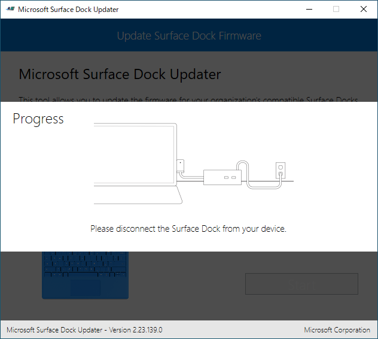

知らなかったんだけど、Surface Dock のファームウェアってアップデートできるらしい。

<iframe src="https://hatenablog-parts.com/embed?url=https%3A%2F%2Fwww.windowscentral.com%2Fhow-update-microsoft-surface-dock-firmware" title="Did you know you can update Microsoft&amp;amp;#039;s Surface Dock? Here&amp;amp;#039;s how." class="embed-card embed-webcard" scrolling="no" frameborder="0" style="display: block; width: 100%; height: 155px; max-width: 500px; margin: 10px 0px;"></iframe><cite class="hatena-citation"><a href="https://www.windowscentral.com/how-update-microsoft-surface-dock-firmware">www.windowscentral.com</a></cite>

とくに不具合はないのだけど、うちのも買ってから結構経つし、何らかの改善があるかもしれない。――というわけで、試しにアップデートしてみた。

ちなみに、日本語のサポートページは<a href="https://support.microsoft.com/ja-jp/help/4023478/surface-update-your-surface-dock">&#x3053;&#x3061;&#x3089;</a>。

<h3>「Surface Dock Updater」のインストール</h3>

まず、Surface Dock のアップデートを行うツール「Surface Dock Updater」をダウンロード・インストールする。

<iframe src="https://hatenablog-parts.com/embed?url=https%3A%2F%2Fwww.microsoft.com%2Fen-us%2Fdownload%2Fdetails.aspx%3Fid%3D46703" title="Download Surface Tools for IT from Official Microsoft Download Center" class="embed-card embed-webcard" scrolling="no" frameborder="0" style="display: block; width: 100%; height: 155px; max-width: 500px; margin: 10px 0px;"></iframe><cite class="hatena-citation"><a href="https://www.microsoft.com/en-us/download/details.aspx?id=46703">www.microsoft.com</a></cite>

いろいろダウンロードできるけど、必要なのは Surface_Dock_Updater_v2.23.139.0.msi だけみたい。

ウィザードにしたがってセットアップを完了すると――

スタートメニューに「Surface Dock Updater」が追加される。

 

<h3>「Surface Dock Updater」の実行</h3>

続いて、「Surface Dock Updater」を起動してファームウェアのアップデートを行う。途中で何回か PC から切断する必要はあるけど、Surface Dock の電源は切らないように。

まずは［Start］ボタンを押す。

ファームウェアのバージョンチェックが行われる。うちは最新版ではないとのこと。バージョンも書いておいてくれると親切なのだけど。

ファームウェアのアップデート処理には最大で7分ぐらいかかる。おしっこは先に済ませておいた方がよいだろう。

アップデートの開始。途中で切断しろと言われるけど、言われる前に切断したら殺すぞ、という警告が表示される。進捗が 50％ になるまでは Surface Dock を PC へ接続したままにしておこう。

50％ になるまでお茶を飲んで待つ。

50％ になると、切断しろと言われる。PC から Surface Dock をぶっこぬく。

もう一回接続しろとの由。切断しろだの、再接続しろだの、結構めんどくさいなぁ。

残りの 50％ の処理が行われる。なにをしているのかはよくわからん。

これで完了――と思いきや、ファームウェアのファームウェアのアップロード（コピー）処理が始まった。カウントダウンが終わるまで、しばし待つ。

ファームウェアのアップロードが完了したらしい。Surface Dock を再び PC から切断し、有線 LAN のチカチカを眺めながら 3 分ほど過ごす。

ファームウェアの適用が終了。再び再接続。

おめでとう！　最新のファームウェアです。バージョンも書いておいてくれると親切なのだけど。

なにがよくなったのかはさっぱりわからないけど、いい気分になったから今日はこれで満足しておく。

