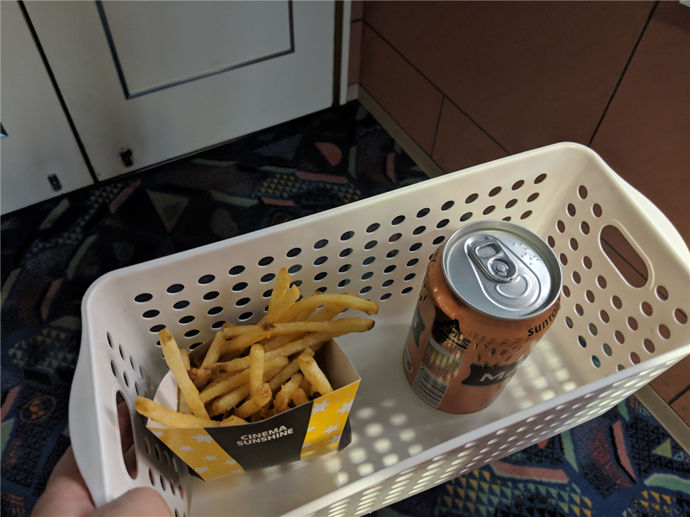

安くチケットを譲ってもらったので、仕事じまいをした後、大街道まで出かけて『ソローキンの見た桜』を観た。日露戦争のとき、松山市にあったロシア人捕虜収容所を舞台にしたラブロマンス。「日露戦争時代のロミオとジュリエット」って触れ込みだけど……どうなんすかね。

ロシア兵捕虜に関しては、以前本で読んで多少は知っていたし、お墓にも足を運んだことがある。『坂の上の雲』にもちょっと描写があるよね。

<iframe src="https://hatenablog-parts.com/embed?url=https%3A%2F%2Fblog.daruyanagi.jp%2Fentry%2F2014%2F03%2F18%2F193904" title="『ロシア兵捕虜が歩いたマツヤマ―日露戦争下の国際交流』 - だるろぐ" class="embed-card embed-blogcard" scrolling="no" frameborder="0" style="display: block; width: 100%; height: 190px; max-width: 500px; margin: 10px 0px;"></iframe><cite class="hatena-citation"><a href="https://blog.daruyanagi.jp/entry/2014/03/18/193904">blog.daruyanagi.jp</a></cite>

この墓地は山越の我が家からは約10分ほどの小高いところにある。いい塩梅に勾配があったので、ランニングコースにしていた。まぁ、毎日行くうちに飽きちゃってやめてしまったのだが……。もともとは違う場所にあったらしいけど、ここに移設されたと聞く。

それはともかく、映画ですよ、映画。松山が舞台ということもあり、市民には結構知られているタイトルだけど、実際見にくる人はさほど多くはないみたい。平日の夜ということを差し引いても、僕を含めて劇場に３、4人というのは少し寂しい。――とりあえず、ビールとポテトのセットを抱えてスタンバイ。

この映画、なんとなくだけど『永遠のゼロ』の二番煎じというか、祖母（？）のラブロマンスを現代を生きる孫（新聞記者）が追う……という流れになっているのだが、現代パートの演出や演技がちょっと見ていられないレベルだった。そもそもね、<b>地元の人間は坊っちゃん列車で移動しねえよ</b>。松山の観光アピールも兼ねてるんだろうけど、それ見ただけで白ける。

でも、過去パートはフツーによかった。昔の三津浜ってあんな感じなんだろうか？（どこまで真面目に考証しているのかわからん）　墓地にあった胸像の大佐、動いてる！（しかも結構、再現度高い？）　イッセー緒方はちょっと演技が大げさな気もするが、やっぱり安定していていいな。いい味出してる。

感想としては、「現代パートをサックリ削って、過去パートの尺を伸ばして掘り下げれば、結構いい感じになったのでは」と思った。ラブロマンスとしてはちょっといまいちだったので、なんかもっと盛り上がるポイントも欲しい。どうせ史実をベースにしたフィクションなんでしょ？　大胆にやっちゃってもよかったんじゃないかなぁ。

<h3>後日談</h3>

行きつけの居酒屋で「観たよ」っていったら、「ソローキン？　どんな人が見に行くのかと思ったけど、目の前にいた」って言われて、思わず笑ってしまった。みんなが想像している観客像から、僕ほどかけ離れた人間もなかなかいないだろう。

あと、生まれて初めてムビチケのチケット使った。ムビチケ童貞を捨てられて満足。

