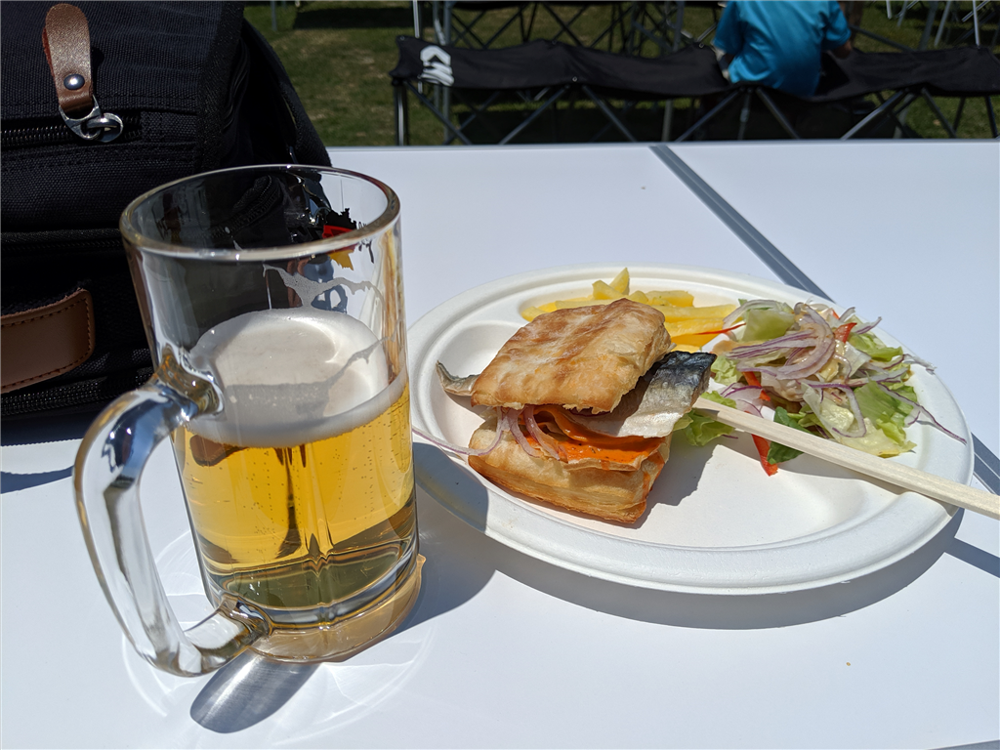
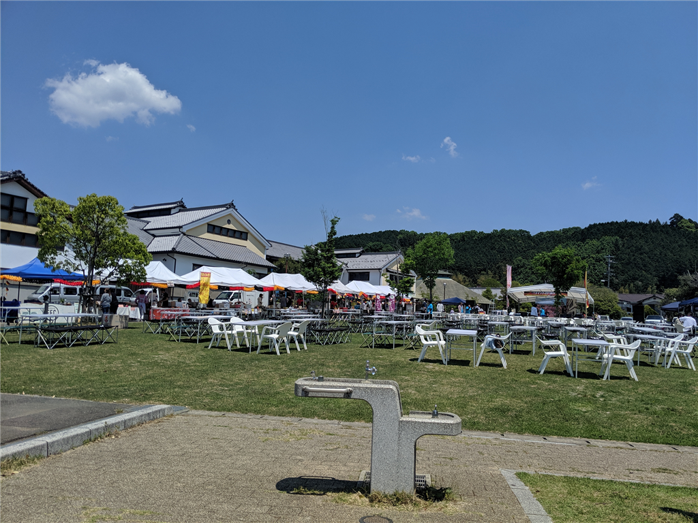
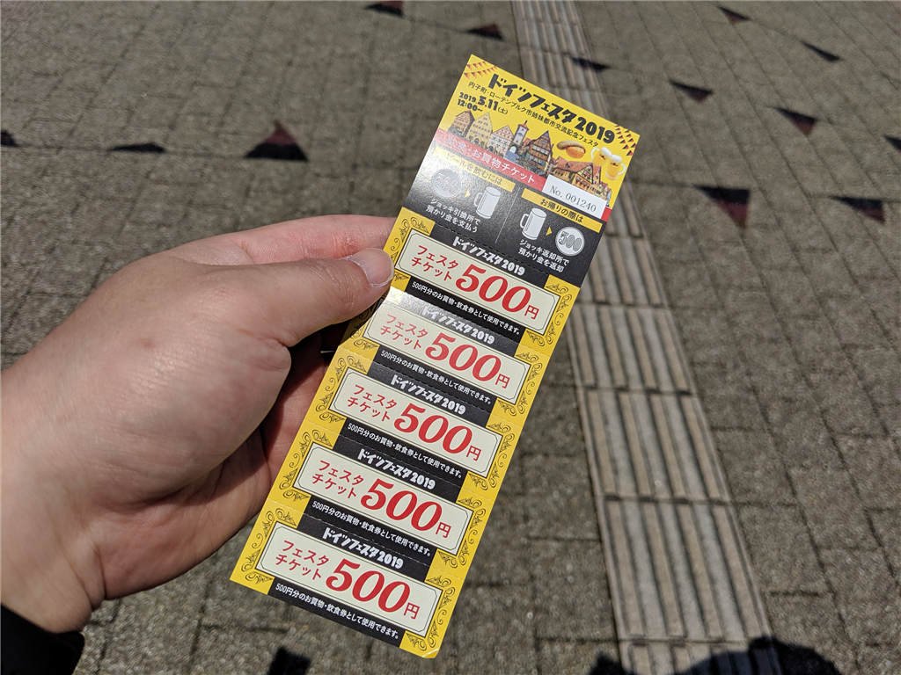

土曜日は「内子ドイツフェスタ 2019」に行ってきました。

<iframe src="https://hatenablog-parts.com/embed?url=https%3A%2F%2Fwww.iyokannet.jp%2Fevent%2F5109" title="ドイツフェスタ2019" class="embed-card embed-webcard" scrolling="no" frameborder="0" style="display: block; width: 100%; height: 155px; max-width: 500px; margin: 10px 0px;"></iframe><cite class="hatena-citation"><a href="https://www.iyokannet.jp/event/5109">www.iyokannet.jp</a></cite>

いわゆるオクトーバーフェストというヤツで、毎年10月に行われているのですが、去年は台風かなにかで中止に。今回は5月の開催となりました。去年は都合がつかなかった自分にとっては渡りに船（ぉぃ）。

内子までは、久しぶりに JR 四国の汽車に乗りました。お酒飲むからね、クルマやバイクはダメ。やたら長いロングシート、一両編成のローカル線は、ちょうど席が埋まる程度の賑わいでした。

会場は駅から徒歩10分ほどのところにある“内の子広場”。内子町の施設がいろいろ集まったところに併設されている広場みたいですね。町からかき集めてきたのかな？　キャンプ用のテーブルや椅子が所狭しと並べられていました。写真は開場前なのであまり人がいませんが、実際はちょっと椅子やテーブルが足りないぐらいな集客。以前にきたときよりも盛り上がっていますね。

システムは、

<ul>
<li><b>500円でジョッキを貸し出し</b>：ジョッキを返したら 500円返金される（デポジット）。記念に持って帰ることも可能</li>
<li><b>2500円分のチケット</b>：ビールや屋台の食べ物に利用可能。前売りを買うとちょっと安いけど、今回は普通に買った</li>
</ul>
みたいな感じ。一昨年に持って帰ったジョッキが使えると聞いていたので、しっかり洗って持参したのですが、残念ながら今回からジョッキが変わっちゃったようで、古いのは使えませんでした。ちょっと残念。

内子の生ハム、アイスバイン（塩漬け・冷蔵しておいた豚の脚肉をゆでたドイツの家庭料理）、ソーセージと一緒に、ビールをがぶ飲みできて幸せでした。写真撮るの忘れてたから、ビールやごはんをあまり紹介できないのは残念でしたが……結局、チケットは3綴り買ったかな？　割りと頑張ったかもしれない。

帰りは、地元の佐々木先生の家にお邪魔して、クーラーで涼ませてもらいました（日差しが暑かったので、めっちゃ助かりました。天国！！）。また行きたいですね～

