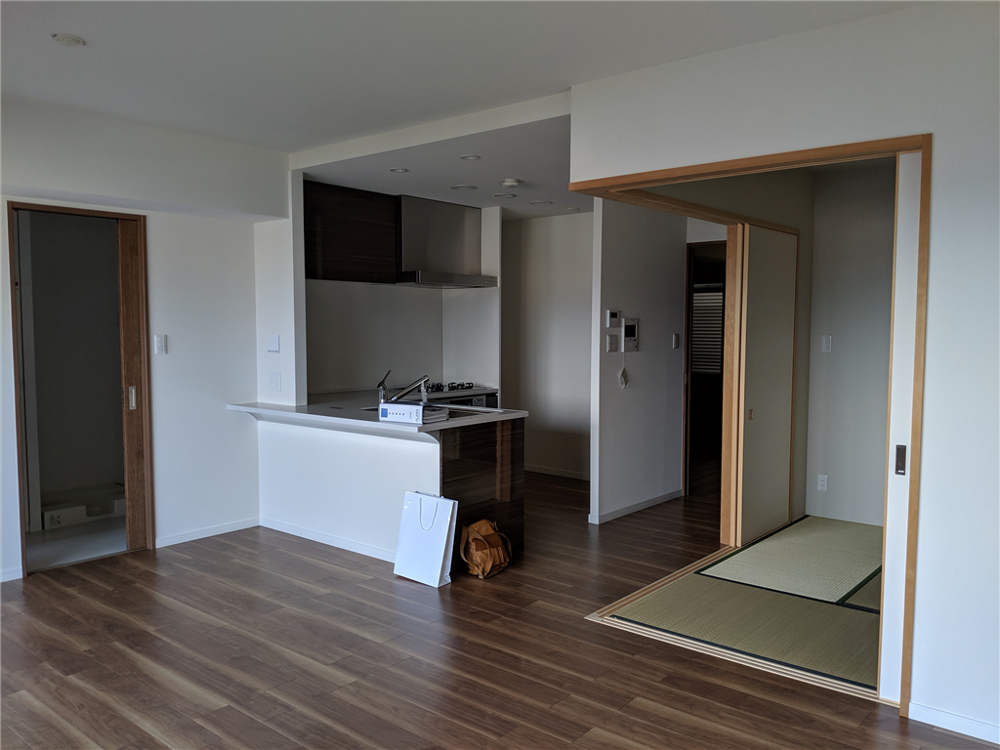

JR 松山駅前に 3LDK のマンションを買いました。5月10日に融資が実行されて、夕方にカギの受け取り。晴れて 3,000 万円の借金持ちに。まぁ、死んだり、ガンになったりすればチャラなので（ガンはいろいろ条件あり）、そんなに負担感はない。いい感じにサクッと死ねたら母ちゃんにいくばくかのお金が残っていいのになぁ（父ちゃんは自力で生きろ）、なんて思っています。その点、嫁・子どものいない身は気楽なもんです。

ちなみに Twitter では「だるハウス」という名前が定着してしまいましたが、別に「ハウス（house：一軒家）」ではないです。condominium？　ちゃんと言うなら、だるコンドだな。

それにしても、おニューの家というのは結構気持ちのいいものですね。まだ引っ越しまでに2週間あるので空っぽなのですが、バイクでキャンプ道具（ベッド、チェア、寝袋などなど）を持ち込んで泊まり込んでみましたが――大変よろしい。

母方のじいちゃんが東京で不動産屋を営んでいたこともあり、永く賃貸派でした――じいちゃんも<i>「新しいところを転々とするのがよい」</i>と言っていました――が、分譲には賃貸にはないいいところもあります。どっちがお得か――というのは状況次第でもあるので一概には言い切れませんが、そもそも地方都市だと東京ほど新しい物件がポコポコでない（供給、流動性がない）ので、新しい物件をリーズナブルに借りるのは難しいです。そもそも、物件がそれほどない。それに、クッソ安い家賃相場から逆算してハコを建てると、まぁ、それなりの品質になりますよね。その点、分譲は「買ってもらう」ためにあれやこれやと盛るので、設備的には満足できます。うちの物件はいろいろあったみたいですが、それなりにハイグレードみたいですし。個人的にも、

<ul>
<li>ゴミをいつ出してもいい（市の回収以外にも、マンション独自の回収がある）</li>
<li>セコム完備</li>
<li>エレベーターが2機（片方はちょっと大型で、非常用電源対応）</li>
<li>一括受電でちょっと電気代が安い</li>
<li>プロパン → 都市ガス化によるガス代削減も見込める</li>
</ul>
あたりは気に入っています。変動金利の高騰や固定資産税に殺されないかぎりは、分譲もありかなって感じ。

あとね、移住してきて5年になるけど、いまだに<b>「いつか東京帰るんでしょ？」</b>みたいに言う人がいるんですよ。よっぽどのことがない限り、嫌ですよ、ずっとここにいますよ。自分用語でいうとことろの「東京への引力」を振り切るためにも、実はこっちに来て3年目ぐらいからなんとなく分譲は視野に入れていました。

<blockquote class="twitter-tweet" data-lang="HASH(0xdbe4d10)">
引っ越しを決めた理由の一つ <a href="https://t.co/vcxjdhHZFl">pic.twitter.com/vcxjdhHZFl</a>
&mdash; 赤いきつねと緑のやなぎ (@daruyanagi) <a href="https://twitter.com/daruyanagi/status/1125199544008884224?ref_src=twsrc%5Etfw">May 6, 2019</a></blockquote>

物件購入の決め手は、ずばり JR 松山駅から徒歩10分圏内の立地です。松山市は JR 松山駅よりも伊予鉄の松山市駅の方がにぎわっているので、地元の人からすると「JR かよ」って感じかもしれませんが……県外に出る機会の少なくない自分にとっては、空港や JR の駅が近いのはむしろポイントかな。なんだかんだで伊予鉄の市内電車（チンチン電車）や徒歩で市駅・街の方に出るのは苦ではないし、悪い場所ではないと感じます。探してみるとご飯やさんも結構あるし、スーパー銭湯近いし、手を伸ばせばだいたいのモノに手が届く感じがいい。今の家と比べると、コンビニがちょっと遠くなったのだけが少し不便かな？　それも、徒歩3分が10分程度になっただけですが。再開発でさらなる利便性向上が期待できるのもいいですね。今住んでいる山越ではちょっと……無理っぽい。

<blockquote class="twitter-tweet" data-lang="HASH(0xd9192f8)">
だるハウスの価値、高まりそうや( ^)o(^ ) <a href="https://t.co/Kui7YLdJDM">pic.twitter.com/Kui7YLdJDM</a>
&mdash; 赤いきつねと緑のやなぎ (@daruyanagi) <a href="https://twitter.com/daruyanagi/status/1108129048683667456?ref_src=twsrc%5Etfw">March 19, 2019</a></blockquote>

正直なところを言えば、マンションよりも古民家をリフォームして住みたい欲の方が高いのですが、老いた父が死ぬまでは便利なところに住んでおこうかなって感じ。15年かそこら経って、改修の時期に売り飛ばして（← それまでに繰り上げ返済しちゃって）移住できたらちょうどいいんだけどなって思っています。それまでにいい感じのところを見つけられたらいいな。

<blockquote class="twitter-tweet" data-lang="HASH(0xd1d4710)">
だるハウス、こういうのもありやな <a href="https://t.co/k6xHbMU6Ok">pic.twitter.com/k6xHbMU6Ok</a>
&mdash; 赤いきつねと緑のやなぎ (@daruyanagi) <a href="https://twitter.com/daruyanagi/status/1123025963497840640?ref_src=twsrc%5Etfw">April 30, 2019</a></blockquote> 

<h3>追伸</h3>

<blockquote class="twitter-tweet" data-lang="HASH(0xdf11260)">
だるハウスを拠点に世界征服へ乗り出すぞ
&mdash; 赤いきつねと緑のやなぎ (@daruyanagi) <a href="https://twitter.com/daruyanagi/status/1126805940638965761?ref_src=twsrc%5Etfw">May 10, 2019</a></blockquote>

