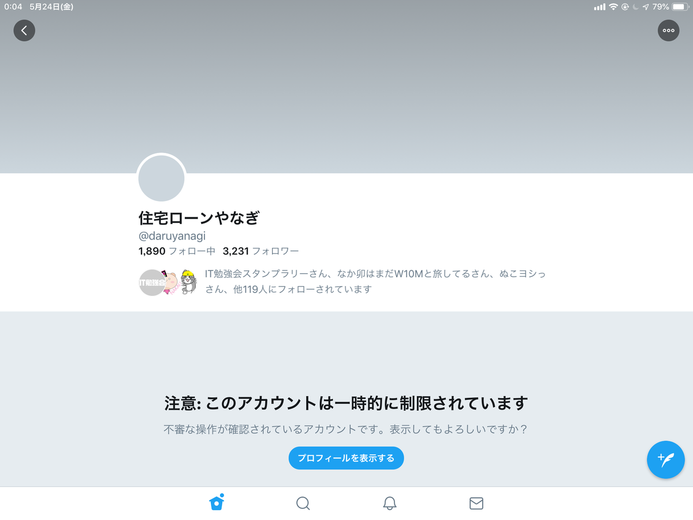
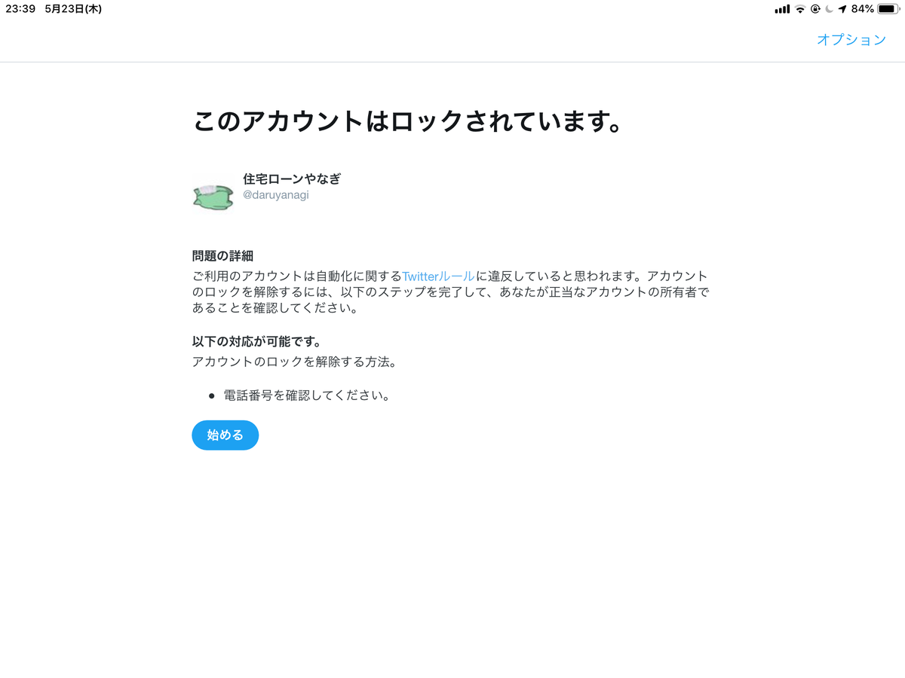
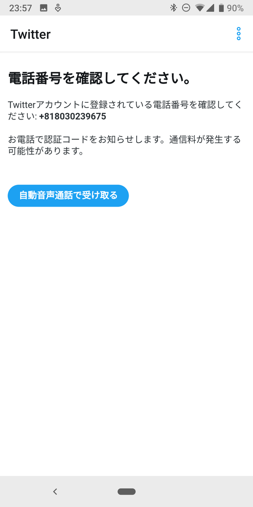
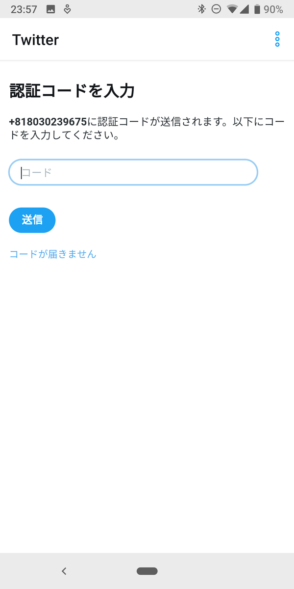
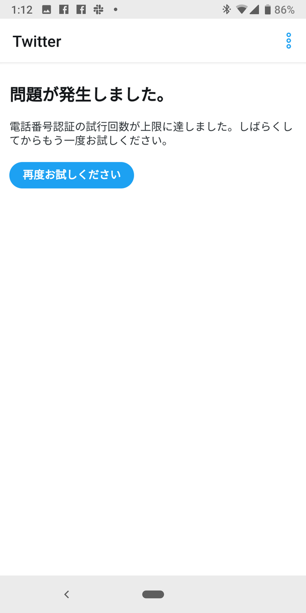

不審な操作が確認されたとのことで、Twitter のアカウントがロックされた。

<h3>発端</h3>

<blockquote class="twitter-tweet" data-lang="ja">
【悪の組織】 面接官「では次の方、自己PRをお願いします」  だるやなぎ「理由とかない真の悪です、需要あります」  面接官「特技は？」  だるやなぎ「スピードがマッハ3出ます、試します？」  面接官「幹部採用」<a href="https://twitter.com/hashtag/%E6%82%AA%E5%BD%B9%E9%9D%A2%E6%8E%A5?src=hash&amp;ref_src=twsrc%5Etfw">#悪役面接</a><a href="https://t.co/EU8gz27zCy">https://t.co/EU8gz27zCy</a>
&mdash; 住宅ローンやなぎ (@daruyanagi) <a href="https://twitter.com/daruyanagi/status/1131569787455152129?ref_src=twsrc%5Etfw">2019年5月23日</a></blockquote>

午後11時半。診断メーカーで遊んだあと、<b>「うははｗ 幹部だぜー」</b>的なことを投稿しようとしたらアカウントがロックされた。

おそらく機械学習的な、なにかフィルターっぽいものに引っかかって、軽くサスペンドされたらしい。電話番号が正しいことを確認すれば、すぐに解除されるはず。

<h3>失敗</h3>

　

アカウントがロックされた場合、解除コードは SMS ではなく、自動音声で取得するようだ。手順に従い、通話をリクエストする......が、一向に着信がない。

　

そのうち、試行回数がオーバーしたという警告が出て、なにもできなくなった。ひょっとして、と思い着信履歴を確認してみると、非通知の着信が大量にきている。どうやら Android 端末が午後11時から「おやすみモード」に入っており、着信を拒否する「サイレントモード」が自動で有効化されていたようだ。まったく気付かなかった……。

結局、丸一日ブロックされたままだった。

<blockquote class="twitter-tweet" data-lang="HASH(0x560e0669a7b0)">
ただいまんこ
&mdash; 住宅ローンやなぎ (@daruyanagi) <a href="https://twitter.com/daruyanagi/status/1132033996508938241?ref_src=twsrc%5Etfw">May 24, 2019</a></blockquote>

25日になってようやく復帰。みんなに温かく迎えてもらった。自動音声はお姉さんの声で日本語の案内があると期待していたところ、英語のおっさんの声だったのでかるくビビった。まぁ、数字だけなので不通に聞き取れるし、あまり問題はない。

<h3>反省</h3>

<ul>
<li>Twitter の機械学習をうまくすり抜けるツイートを心掛ける</li>
<li>おやすみモードには注意する</li>
</ul>

<h3>得られた知見</h3>

<ul>
<li>ブロック中も DM を送ることはできる。が、読んだり、返事を書くことはできない</li>
<li>ブロックされたことを Facebook で報告すると、「ちょういいね」や「うける」みたいなリアクションを返すヤツが結構いた。暗殺リストの上位にリストアップしておく</li>
</ul>

