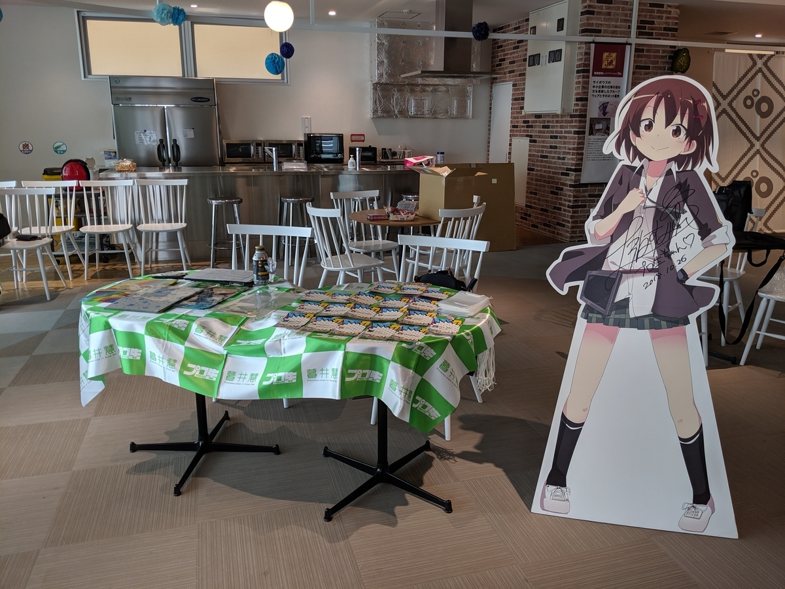
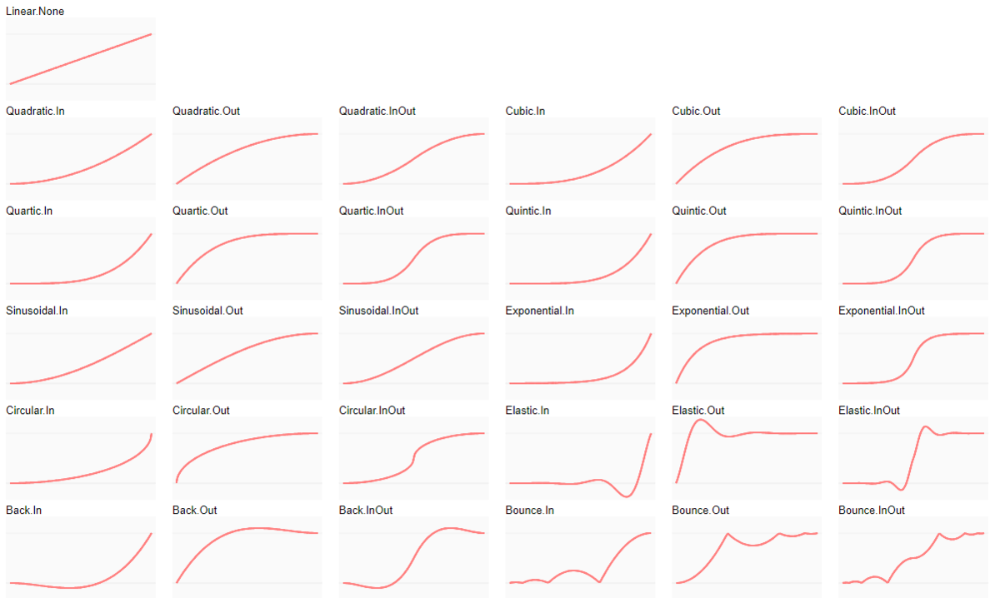
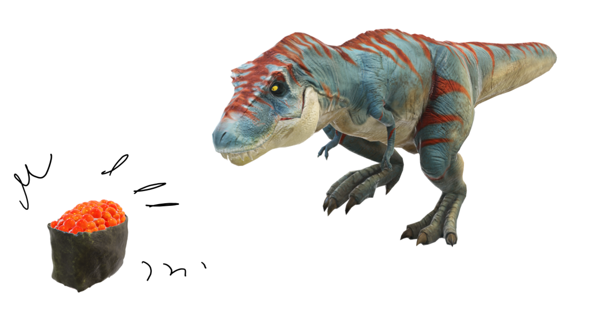
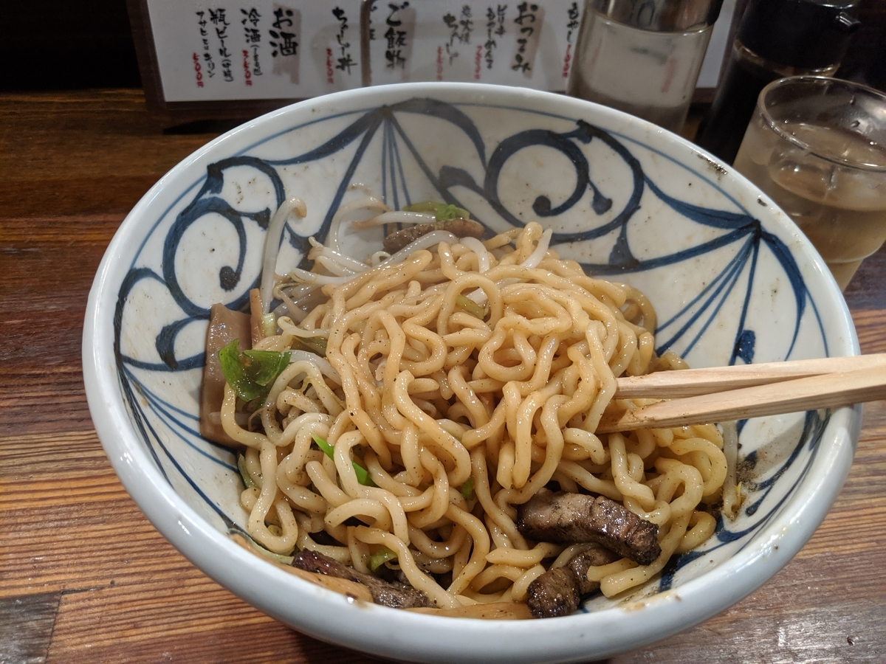

<iframe src="https://hatenablog-parts.com/embed?url=https%3A%2F%2Fatnd.org%2Fevents%2F104613" title="プログラミング生放送勉強会 第59回＠サイボウズ株式会社 松山オフィス（愛媛） : ATND" class="embed-card embed-webcard" scrolling="no" frameborder="0" style="display: block; width: 100%; height: 155px; max-width: 500px; margin: 10px 0px;"></iframe><cite class="hatena-citation"><a href="https://atnd.org/events/104613">atnd.org</a></cite>

ご来場、ご視聴の方、ありがとうございました！　登壇者の皆様もお疲れ様です。今回はゲーム関連がちょっと多かったのかな？　でもいい感じにジャンルがばらけてて、結構楽しかったと思います。

<h3>セッション1：竹内 佑介さん「tweenアニメーション入門」</h3>

<blockquote class="twitter-tweet" data-lang="HASH(0x55adae1335d0)">
今日の発表スライドです。<a href="https://t.co/ig7iRIj0h0">https://t.co/ig7iRIj0h0</a><a href="https://twitter.com/hashtag/pronama?src=hash&amp;ref_src=twsrc%5Etfw">#pronama</a>
&mdash; 竹内 佑介 (@pegass85) <a href="https://twitter.com/pegass85/status/1134726785235542016?ref_src=twsrc%5Etfw">June 1, 2019</a></blockquote>

JS 大好き（誤解を招く表現）竹内さんが、Javascript アニメーションライブラリ「Tween.js」を紹介してくださいました。「Tween」って Windows 向けの Twitter クライアントアプリが有名で、検索してもそっちばっかりヒットする！

<blockquote class="twitter-tweet" data-lang="HASH(0x555addfb37d0)">
今日のサンプルコードです。<a href="https://t.co/hLpNlg6dio">https://t.co/hLpNlg6dio</a><a href="https://twitter.com/hashtag/pronama?src=hash&amp;ref_src=twsrc%5Etfw">#pronama</a>
&mdash; 竹内 佑介 (@pegass85) <a href="https://twitter.com/pegass85/status/1134675485324005376?ref_src=twsrc%5Etfw">June 1, 2019</a></blockquote>

見てるだけなので何とも言えんのですが、結構簡単に本格的なアニメーションが実装できるのなぁ……初期セットアップがちょっとめんどいけど、あとは定義した動きを Chain するだけ。Easing 関数を適用してやると、にょろーんとかむにゃーんとかいう動きも再現できるみたい。

プリセットの関数だけでも十分だけど、やる気さえあれば時前実装も可能みたい。へぇ......。オフセッションの雑談では、アニメーションの難しいポイントなんかも聞けました。

<h3>セッション2：HAL（@PET_HAL）さん「勉強会に参加しまくって蓄えた、知見とやってきたこと」</h3>

ちょっとトラブルがあって2番目になったけど、結構ためになりましたね。

<iframe id="talk_frame_519994" src="//speakerdeck.com/player/539dac3635cf4bbbb9ceb4666d917716" width="710" height="399" style="border:0; padding:0; margin:0; background:transparent;" frameborder="0" allowtransparency="true" allowfullscreen="allowfullscreen" mozallowfullscreen="true" webkitallowfullscreen="true"></iframe><cite class="hatena-citation"><a href="https://speakerdeck.com/pet_hal/2019-06-01-pronama">speakerdeck.com</a></cite>

自分は割と漫然と勉強会に参加してるというか、ハンズオンの復習なんかはたまにするけど、会場の様子を Toggetter にまとめたり～みたいな活動はさぼり気味ですね。まぁ、こういう「参加したよ」ブログは書くようにしてるんですが（いくら内容が薄くても、ちゃんと<b>参加ブログを書くまでが勉強会！</b>）……あくまでも個人視点で、勉強会を実りあるものにするために最後にひと手間かけるという発想はあんまりありませんでした。ちょっと反省ですね！――とはいえ、めんどくさい。

<iframe src="https://hatenablog-parts.com/embed?url=https%3A%2F%2Ftogetter.com%2Fli%2F1361888" title="【自分用まとめ】プログラミング生放送勉強会 第59回＠サイボウズ株式会社松山オフィス #pronama" class="embed-card embed-webcard" scrolling="no" frameborder="0" style="display: block; width: 100%; height: 155px; max-width: 500px; margin: 10px 0px;"></iframe><cite class="hatena-citation"><a href="https://togetter.com/li/1361888">togetter.com</a></cite>

こうやってまとめてくれると大変助かりますです。

<h3>セッション3：タカユキ（@nezumimusume）さん「ゼロから始めるシェーダープログラミング。レイトレースもやるかも？」</h3>

まさかのゲームプログラミングの先生によるセッション......竹内さんがあとで「ガチな人の前でえらそうなことを語ってしまった」的なことを言ってましたが、Web ゲームとネイティブのゲームはまた違うものだなって思いました。どっちもちゃんとフィットするシーンってのはあって、どっちも大事だと思いますよ。

<blockquote class="twitter-tweet" data-lang="HASH(0x56076a981dc0)">
ゲーム界のHello, World的なヤツかな❓ <a href="https://twitter.com/hashtag/pronama?src=hash&amp;ref_src=twsrc%5Etfw">#pronama</a> <a href="https://t.co/44YMFKsNdk">pic.twitter.com/44YMFKsNdk</a>
&mdash; Takahiro Kato (@TakahiroKato311) <a href="https://twitter.com/TakahiroKato311/status/1134702743484895232?ref_src=twsrc%5Etfw">June 1, 2019</a></blockquote>

内容は......まじめにやると単なる三角形を描画するだけでも結構大変なんだぜ、ネイティブゲームの世界って！　ってな感じですかねー。個人的には、あんなにリアルに見えるゲーム表現が割と「ウソだらけ」なのはビックリでした。

<blockquote class="twitter-tweet" data-lang="HASH(0x55b8ba07aea0)">
本物の反射データを出力するのではなく、近似の代用に耐えうるデータを出力する話が面白い。 確か、電話も生の音声を出力しているのではなく、音声解析をして近似の音声データを出力する事で負荷か何かを軽くしているらしいので、近似データで代用するのは応用の効く重要な技術なのかも <a href="https://twitter.com/hashtag/pronama?src=hash&amp;ref_src=twsrc%5Etfw">#pronama</a>
&mdash; Takahiro Kato (@TakahiroKato311) <a href="https://twitter.com/TakahiroKato311/status/1134710343874170885?ref_src=twsrc%5Etfw">June 1, 2019</a></blockquote>

でも、リアルタイムレイトレーシングみたいなのまで実用化されるとなると、全部ひっくり返っちゃったりするのかな……アプリの世界だとあんまりリソースを気にすることが減ってきた気がしますが、ゲームの世界はまだまだ何バイト、何秒を削る世界で、イノベーションがすごいなーって感じです。あ、そうそう、リアルタイムレイトレーシングって、1回だけ光の反射をまじめに計算して、あとは機械学習技術みたいなのを活用して「予測」で代用してたりするんだそうですね。こういうところにも機械学習使うんだ……なんにでも使えるもんだな。

<h3>ロングトーク</h3>

@seaki 君がひたすらプリキュアの話をするのかと思ってたら――

<blockquote class="twitter-tweet" data-lang="HASH(0x561677cc2048)">
急に真顔にGraphQL の話しだしたぞ、こいつ　<a href="https://twitter.com/hashtag/pronama?src=hash&amp;ref_src=twsrc%5Etfw">#pronama</a>
&mdash; 住宅ローンやなぎ (@daruyanagi) <a href="https://twitter.com/daruyanagi/status/1134714677882044416?ref_src=twsrc%5Etfw">June 1, 2019</a></blockquote>

GraphQL  便利そうじゃねえか……

<h3>ライトニングトーク</h3>

離島のフェリーの時刻表サイトを作る話だったり、ガストでカロリーを得る話（ナップザック問題）だったり、IT が絡みつつも、割と地方色豊かな発表が多かった気がしました。

<blockquote class="twitter-tweet" data-lang="HASH(0x556272460c38)">
ガストで1000円あれば最大何kcal撮れるか　<a href="https://twitter.com/hashtag/pronama?src=hash&amp;ref_src=twsrc%5Etfw">#pronama</a>　愛媛はサイゼないもんね……
&mdash; 住宅ローンやなぎ (@daruyanagi) <a href="https://twitter.com/daruyanagi/status/1134720445633028096?ref_src=twsrc%5Etfw">June 1, 2019</a></blockquote>

自分は最近の PowerPoint で実装されたお気に入りの機能（ただし、あまり出番はない……）を簡単にまとめてみました。それなりにウケたみたいなので良かったです。

最後の締めは、@jz5 にやってもらいました。画像から音楽が作れちゃう iOS アプリをアクセシビリティ対応にするためにやったこと。

<iframe src="https://hatenablog-parts.com/embed?url=http%3A%2F%2Fmupic.jp%2F" title="mupic | 画像から音楽を作ろう！動画にしてみんなとシェアしよう！" class="embed-card embed-webcard" scrolling="no" frameborder="0" style="display: block; width: 100%; height: 155px; max-width: 500px; margin: 10px 0px;"></iframe><cite class="hatena-citation"><a href="http://mupic.jp/">mupic.jp</a></cite>

VoiceOver みたいな機能があるのは知っていましたけど、実際にどうやってアプリと連携させるのか……みたいな話はまったく触れたことのない世界なので、大変お勉強になりました。こういうのって大事だってのはわかるんだけどね……なかなかね。

<h3>懇親会</h3>

今年も 銀次郎 さんにお世話になりました。でも、写真撮り忘れた......／(^o^)＼

僕は、高速バスで大阪へ帰る @jz5 を万歳三唱で見送った後、締めにラーメンを食べて帰りました。若い子においしいラーメン屋を教えてもらえて、ラッキーな感じです。

