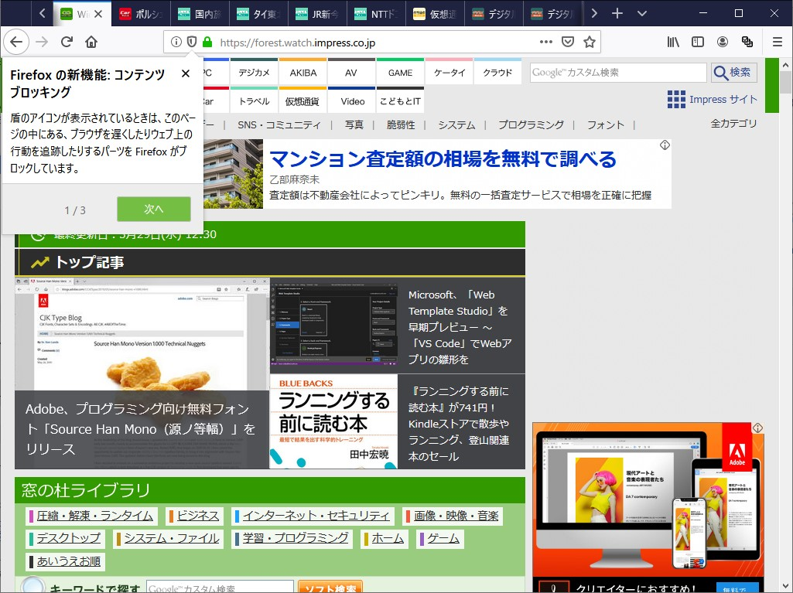
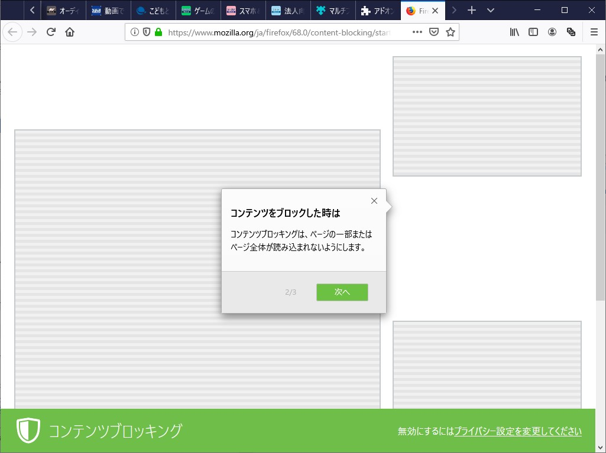
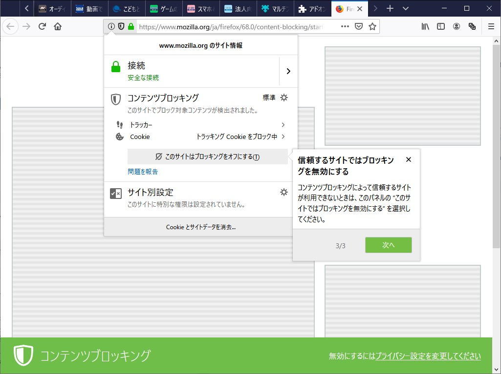
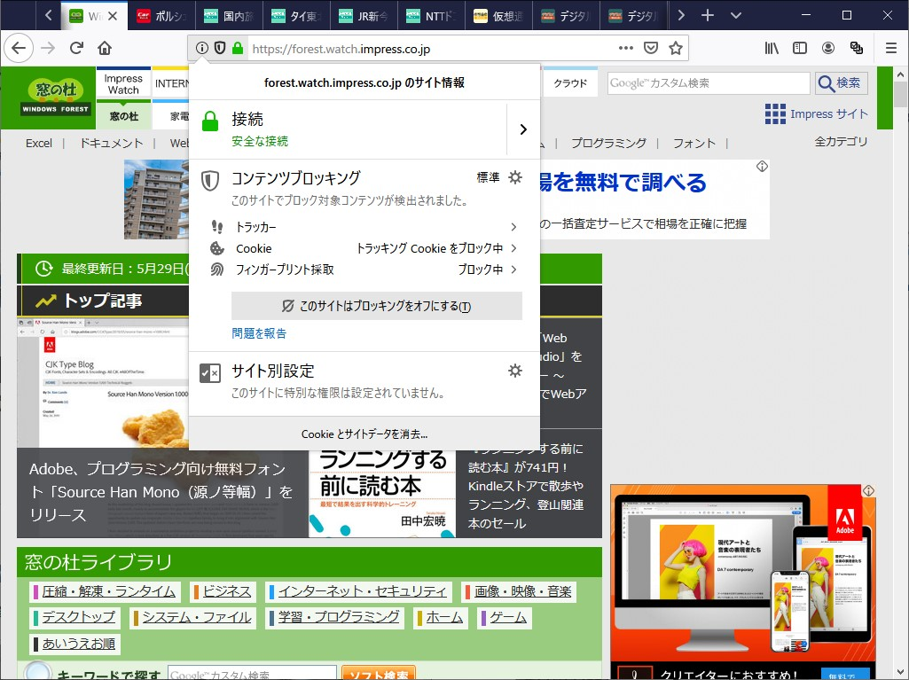

たまたま遭遇したので、スクリーンショットを残しておいた。

いわゆる広告ブロッカーと呼ばれるものが単に広告を除去するだけなのに対し、Firefox のコンテンツブロッカーは「ブロックするとどうなるのか」がちゃんと説明されていて、結構好感度が高い（まだ舌足らずなところはあるけど）。できれば「なぜブロックするのか」のもちゃんと説明してあるといいと思った。

個人的には、広告ブロッカーというのはコンテンツに対するフリーライドだと思っている。マクロでみれば、広告ブロッカーはコンテンツ提供者が本来得るべき収益を失わせ、ときに奪いさえする。これはコンテンツの持続性にかかわる問題だ。

その一方で、広告にはさまざまな問題があり、それは年々ひどくなる傾向にあるとも感じる。露出競争、トラッキングの強化（、挙句はアンチコンテンツブロック）......そういうものに対し、ユーザーが個別に判断して導入することに対してとやかく言うつもりもない。Web ではそれぞれのユーザーに"自衛権"が認められている（特定の不自由な国は除く）。広告を見ることを強制されることはない。

広告に代わるスマートな収益手段が見つかるまでは、この2つの間でバランスをとっていかなければならないのだけど、Firefox のコンテンツブロッカーのような仕組みがモデレートな仲介者として機能してくれることを期待してる（でも、あいつら、どっちかっていうとりそうで頭でっかちだからなー）。

