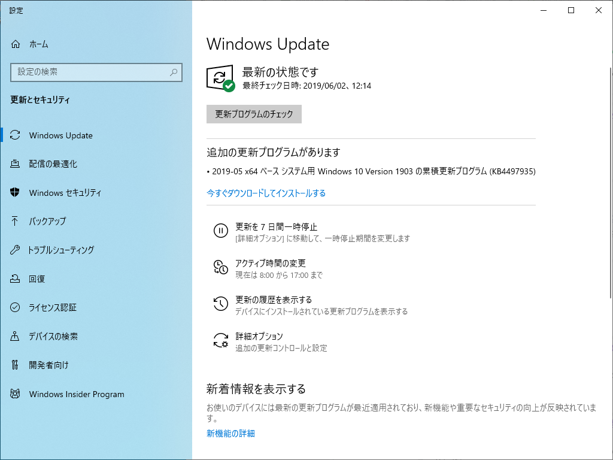

うちにも［今すぐダウンロードしてインストールする］画面がきたぞ！　内容はたぶん今月のパッチチューズデーの内容のプレビュー（セキュリティ関係を除く）。よくみてないけど、いろいろ直ってるみたいやね。

<iframe src="https://hatenablog-parts.com/embed?url=https%3A%2F%2Fforest.watch.impress.co.jp%2Fdocs%2Fnews%2F1187443.html" title="「May 2019 Update」に初めてのパッチ ～アップグレードに関わる問題などを修正／オプションでの先行配信" class="embed-card embed-webcard" scrolling="no" frameborder="0" style="display: block; width: 100%; height: 155px; max-width: 500px; margin: 10px 0px;"></iframe><cite class="hatena-citation"><a href="https://forest.watch.impress.co.jp/docs/news/1187443.html">forest.watch.impress.co.jp</a></cite> 

<h3>追伸</h3>

Surface にはぜんぜん 1903 がきません。別にいいけど……

