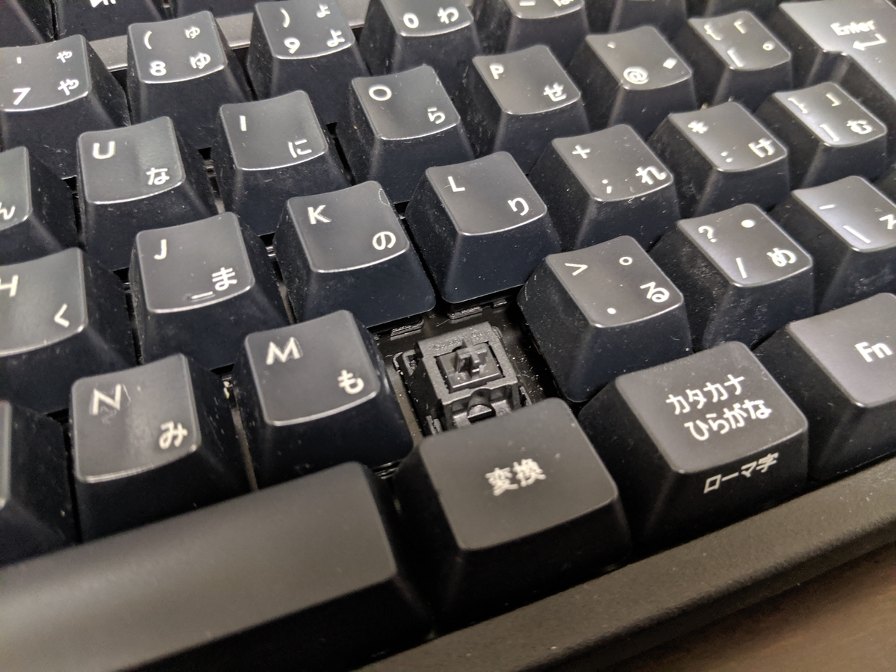

1年半前に買ったキーボードがあり得ないぐらい汚れていたので、引っ越しを機に洗うことにした。それにしてもグロい……触りたくねえ。

<iframe src="https://hatenablog-parts.com/embed?url=https%3A%2F%2Fblog.daruyanagi.jp%2Fentry%2F2017%2F10%2F25%2F171621" title="キーボードを買い換えました - だるろぐ" class="embed-card embed-blogcard" scrolling="no" frameborder="0" style="display: block; width: 100%; height: 190px; max-width: 500px; margin: 10px 0px;"></iframe><cite class="hatena-citation"><a href="https://blog.daruyanagi.jp/entry/2017/10/25/171621">blog.daruyanagi.jp</a></cite>

まずはキートップをすべて外す。このキーボードにはキートップ外しがついていたのでそれを使ったが、ダメなら Amazon あたりから取り寄せればよい。500円ぐらいで買えるので、1つ持ってると便利。

<a href="http://www.amazon.co.jp/exec/obidos/ASIN/B0047MQJ4I/bestylesnet-22/">FILCO Keypuller キーボードメンテナンス用キーキャップ引き抜き工具 ブラック FKP01</a>
<ul><li>出版社/メーカー: FILCO</li><li>メディア: Personal Computers</li><li>購入: 55人 クリック: 67回</li><li><a href="http://d.hatena.ne.jp/asin/B0047MQJ4I/bestylesnet-22" target="_blank">この商品を含むブログ (5件) を見る</a></li></ul>

これを洗面所にぶち込み、洗剤をちょっと垂らして、MAKUAKE で買った謎のブルブル洗浄マシンにかける。超音波で洗うとかなんとかで、つい衝動買いをしてしまったのだけど……ちょっと役に立ってうれしい。まぁ、手でモミ洗いした方が早い気もするが。

で、次はキーボードの本体。ほんとは水につけず、使い古しの歯ブラシか何かで磨こうと思っていたのだけど、絶対に触りたくない感じが極まっていたので、これもそのまま洗面台にぶち込んで、キートップと一緒にブルブルで洗うことにした。結構高いキーボードだし、作りもしっかりしてるから、逆さにしたら中まで浸水しない気がする。

おかげで、ものの10分でピッカピカになった。とりあえず［Enter］だの［Space］だのという大きめのキーを取り付け、パコパコ打鍵して喜びを表す。生乾きの状態だけど、USB ケーブルをつないだらちゃんと動く。いえーぃ！（パコパコ　<i>そしたら動かなくなった。</i>どうやら、キーを打ちまくってるうちに内部へ浸水したらしい。しかも、キートップを全部つけてみたんだが、どうにも1つ足りない。

<i>HTML が打てなくなった。</i>っていうか、そもそもキーが反応しないので、HTML どころではなくなった。――わいは慟哭した。んで、その3分後には新しいキーボードを Amazon で注文してた。

<a href="http://www.amazon.co.jp/exec/obidos/ASIN/B07CL42YK6/bestylesnet-22/">ゲーミングキーボード Logicool ロジクール G512-TC ブラック メカニカル タクタイル 静音性 RGB 航空機グレードアルミ合金 FPS 国内正規品 2年間メーカー保証</a>
<ul><li>出版社/メーカー: Logicool(ロジクール)</li><li>発売日: 2018/05/24</li><li>メディア: Personal Computers</li><li><a href="http://d.hatena.ne.jp/asin/B07CL42YK6/bestylesnet-22" target="_blank">この商品を含むブログを見る</a></li></ul>

ゲーミングキーボードには興味はまったくないのだけど、なんかキーの底にゴミがたまらない構造に見えたのが気に入った。ダストブロワーを突っ込んでぶしゅーっとすれば、簡単にごみを取り除けそう。

うち心地も悪くない。うちは「タクタイル」というタイプを買ったのだが、メカニカルほどガチャガチャいわないし、それでいて打鍵感はしっかりしてる。癖がない感じ？　まぁ、キーボードにはあまりこだわりはないので、そこらへんはよくわからないが……1万円には見合うキーボードだと感じる。

でもな……色が派手なのはかなわん。いちいち色が変わるのが鬱陶しすぎるｗｗｗ

<blockquote class="twitter-tweet" data-lang="HASH(0x55ec05eecec0)">
鬱陶しいwww <a href="https://t.co/CAmaOV16zA">pic.twitter.com/CAmaOV16zA</a>
&mdash; 住宅ローンやなぎ (@daruyanagi) <a href="https://twitter.com/daruyanagi/status/1133981090731839488?ref_src=twsrc%5Etfw">May 30, 2019</a></blockquote>

あと、ケーブルが太いな。

USB ポートを2本使って、キーボード＋もう1台なにか USB 機器をつなげられるのは便利だけど。うちは有線マウスをつなげておいたが、Windows Hello の指紋認証デバイスなんかをつけておいてもよさげ。

<h3>追伸</h3>

壊れたと思った古いキーボードは、3日ほど乾かしたところ直りました。どこかへ出かけていたキートップも、無事発見。ちゃんと元の通りに動くようになりました。

こいつはこいつで結構気に入ってる（有線でも無線でも使える）ので、スペアとしてまだまだ活躍してもらうつもり。ってか、バックアップとして確保してある Apple Wireless Keyboard が Windows だと使いにくくて……キー交換とかすればましになるんだろうけど、そもそもコンパクトタイプはキーが足りない（［Home］とか［End］とか［PrintScreen］とか割かし使うのよね！）。うちは（テンキーレス）フルサイズじゃないと絶対だめだなぁ……。

