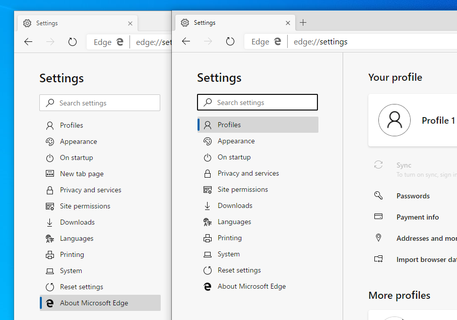
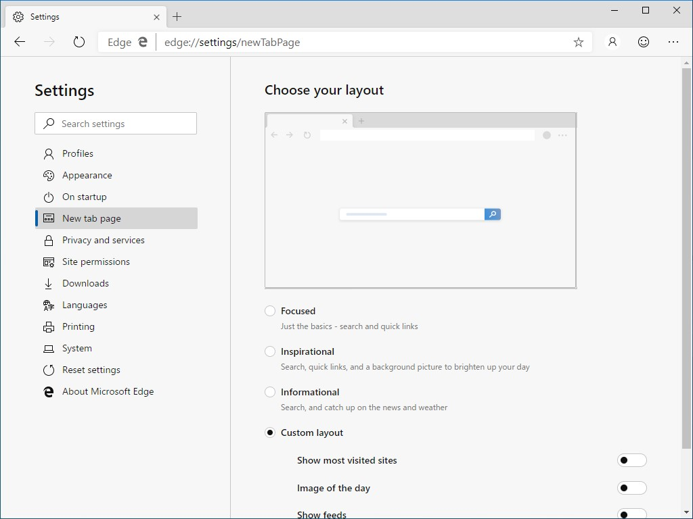
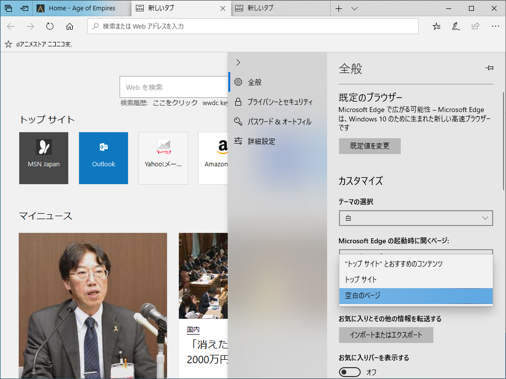
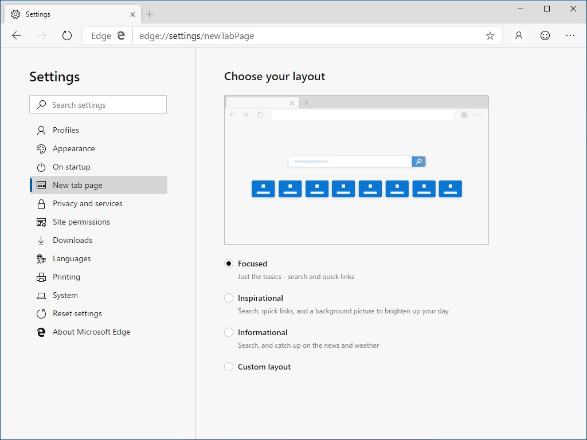
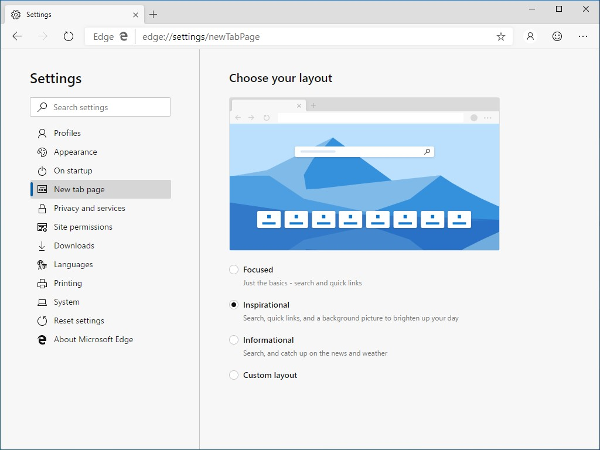
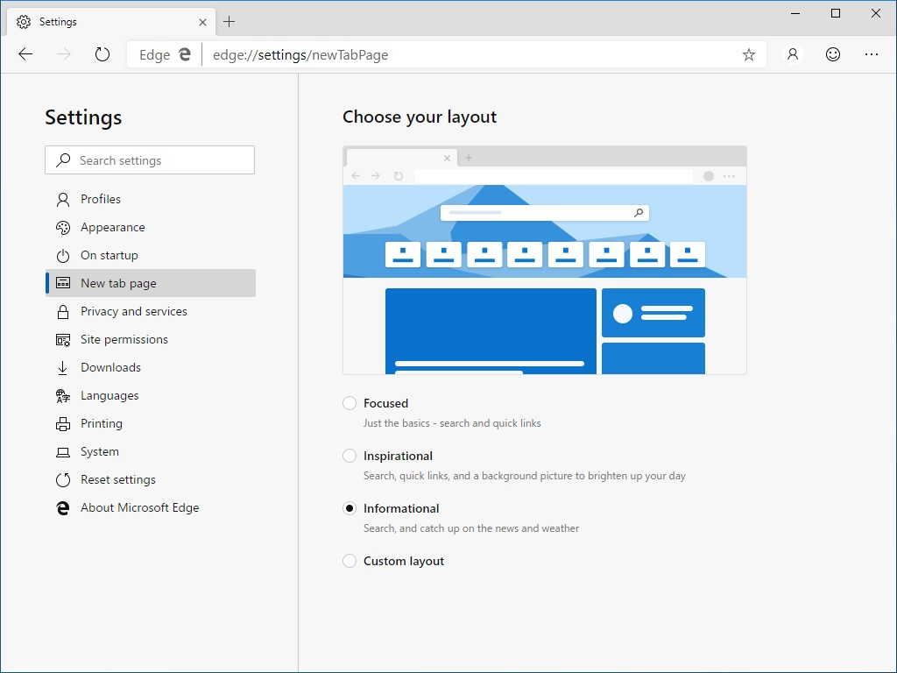

Microsoft Edge Canary に edge://settings/newTabPage が追加された。3つのプリセットデザインとカスタムデザインが利用できる。

<h3>Custom</h3>

まずは説明の都合上、一番下の［Custom］から。これを選ぶと、お好みで

<ul>
<li>Show most bisited sites</li>
<li>Image of the day</li>
<li>Show feeds</li>
</ul>
という 3 つのオプションを ON/OFF 可能。全部オフにすれば検索ボックスだけのシンプルな UI にすることができる<a href="#f-14dc8d65" name="fn-14dc8d65" title="これは以下のプリセットでは実現できない">*1</a>。

現行の Microsoft Edge でいうと、"トップサイト"が［Show most bisited sites］に相当し、"おすすめのコンテンツ（マイニュース）"が［Show feeds］にあたる感じ。

<h3>Focused</h3>

カスタムデザインでいえば `Show most bisited sites` のみが有効な状態。

<h3>Inspirational</h3>

カスタムデザインでいえば `Show most bisited sites` と `Image of the day` が有効な状態。

<h3>Informational</h3>

カスタムデザインでいえばすべてのオプションが有効な状態。

個人的にはずいぶんわかりやすくなった気がするかな？　以上、Version 77.0.186.0 (Official build) canary (64-bit) で確認。

<a href="#fn-14dc8d65" name="f-14dc8d65" class="footnote-number">*1</a>:これは以下のプリセットでは実現できない

