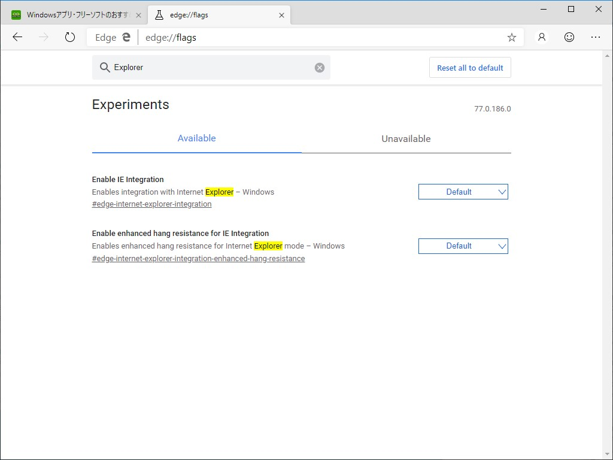
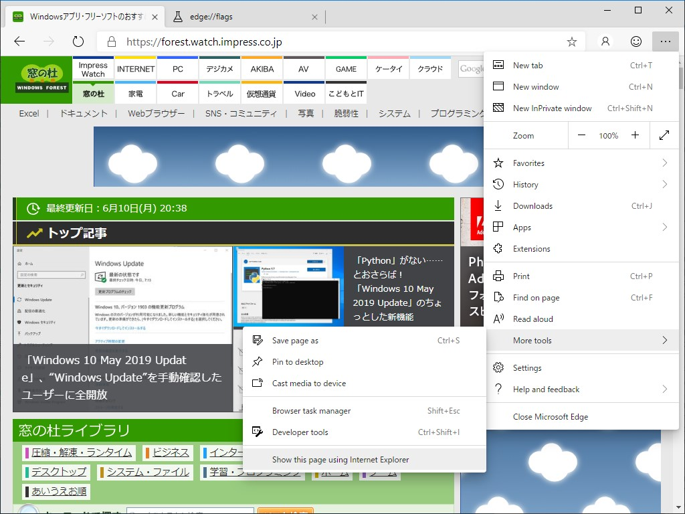
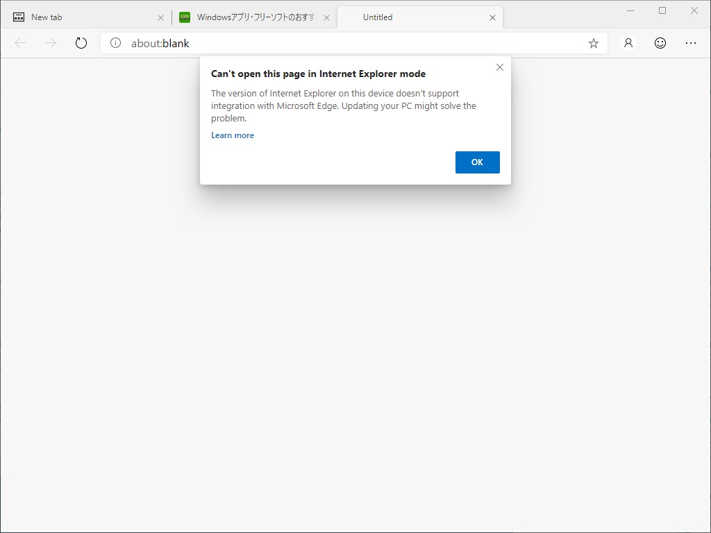
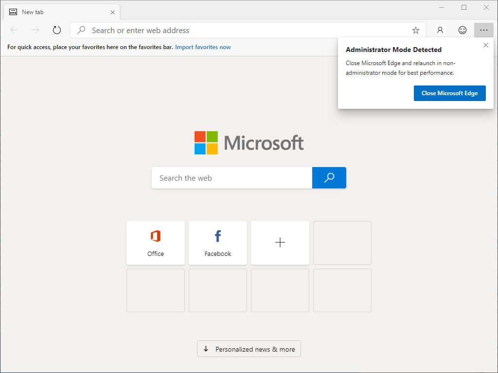
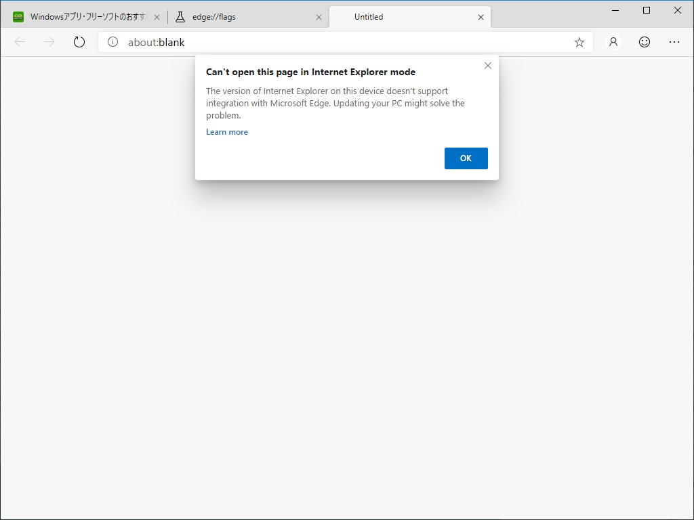
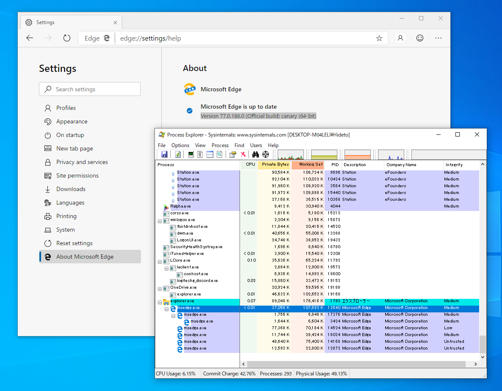

about:config だか edge:config だかで検索すると、Enable IE Integration というフラグがあるので Enabled に。

すると、［More tools］メニューに［Show this page in Internet Explorer］という項目があらわれる。これを選べば、閲覧ページが IE モードで開けるはず……！

しかし、現時点ではエラーとなる（Version 77.0.186.0 (Official build) canary (64-bit)）。

管理者権限で起動すればいいのかなと思って再挑戦するも――

あえなく失敗。

それはともかく、新しい「Microsoft Edge」って管理者権限で起動するとちゃんとアラートが出るんだな。えらいと思った。「Google Chrome」などはとくになにも言われないようだけど、Web ブラウザーみたいなのはできるだけ低い権限で動かすに限る。

あー、でも、AppContainer では動いていないんだな……

