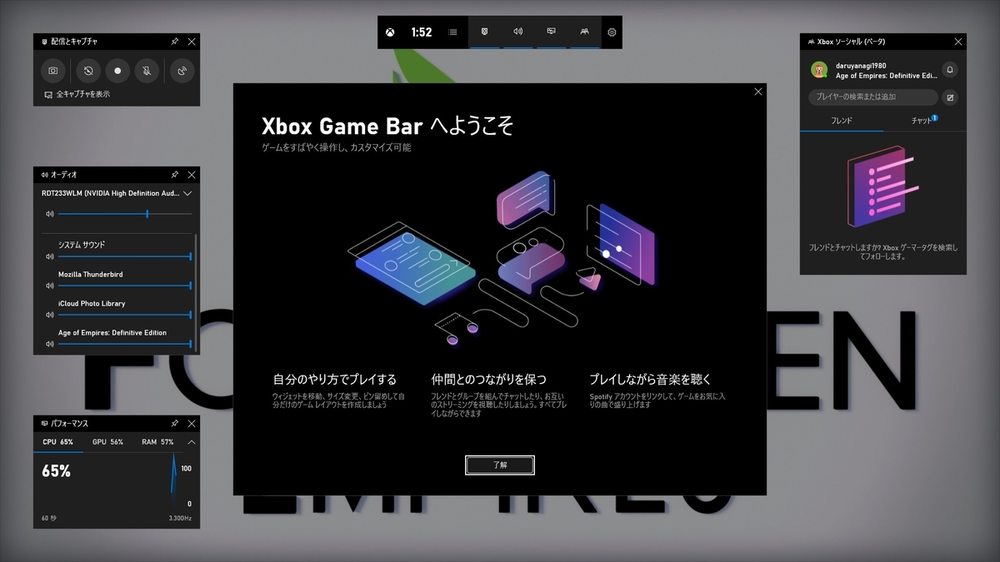
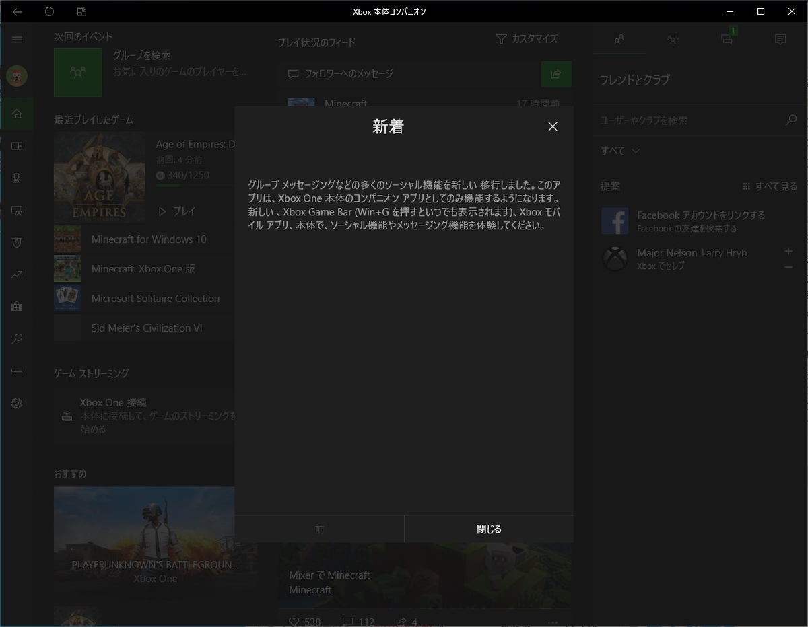
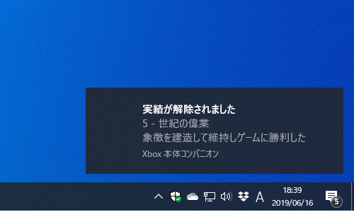

自分はあまりゲームはやらなくて、気晴らしに AoE1:DE をやる程度なのだけど――あ、そうそう、今度 2 にも DE が出るらしくてうれしい！

<iframe src="https://hatenablog-parts.com/embed?url=https%3A%2F%2Fforest.watch.impress.co.jp%2Fdocs%2Fnews%2F1189377.html" title="Microsoft、「Age of Empires II: Definitive Edition」を発表 ～今秋発売へ／Steam版「Age of Empires: DE」は8月、Windows 10版とのクロスプレイへ対応" class="embed-card embed-webcard" scrolling="no" frameborder="0" style="display: block; width: 100%; height: 155px; max-width: 500px; margin: 10px 0px;"></iframe><cite class="hatena-citation"><a href="https://forest.watch.impress.co.jp/docs/news/1189377.html">forest.watch.impress.co.jp</a></cite>

――それはともかく、起動時にちょろっとでてくるゲームバーの案内がちょっと変わってるっぽい。

Microsoft は最近、Windows 10 のゲーム バーをちょろちょろイジってるっぽくて、Xbox Insider か何かに入るとプレビューを受け取れるのだが、これがなかなかいい感じだと思う。

もはや「バー」ではなく、オーバーレイな何かになってしまっているが……

<ul>
<li>キャプチャー、録画</li>
<li>ストリーミング配信</li>
<li>リソースメーター</li>
<li>チャット</li>
</ul>
なんかが統合されていて、割と使いやすい。友達がいないのでチャット機能の使い道がないのがアレだが……

それぞれのパネルは配置や表示の ON/OFF を変えられるので、自分の使いやすいようにカスタマイズできる。リセット機能もあるので、気軽に試してみるといいかも。

あと、XBOX アプリも「Xbox 本体コンパニオン」という名前になったみたい（ちょっと前からかな？）。

<iframe src="https://hatenablog-parts.com/embed?url=https%3A%2F%2Fwww.microsoft.com%2Fja-jp%2Fp%2Fxbox-%25E6%259C%25AC%25E4%25BD%2593%25E3%2582%25B3%25E3%2583%25B3%25E3%2583%2591%25E3%2583%258B%25E3%2582%25AA%25E3%2583%25B3%2F9wzdncrfjbd8%3Factivetab%3Dpivot%3Aoverviewtab" title="Xbox 本体コンパニオン を入手 - Microsoft Store ja-JP" class="embed-card embed-webcard" scrolling="no" frameborder="0" style="display: block; width: 100%; height: 155px; max-width: 500px; margin: 10px 0px;"></iframe><cite class="hatena-citation"><a href="https://www.microsoft.com/ja-jp/p/xbox-%E6%9C%AC%E4%BD%93%E3%82%B3%E3%83%B3%E3%83%91%E3%83%8B%E3%82%AA%E3%83%B3/9wzdncrfjbd8?activetab=pivot:overviewtab">www.microsoft.com</a></cite>

Xbox 本体に PC をつないでストリーミングする機能なんかが面白そうなので、引っ越しして段ボールに突っ込んだままになってる Xbox One を救出したら試してみたいと思ってる。

