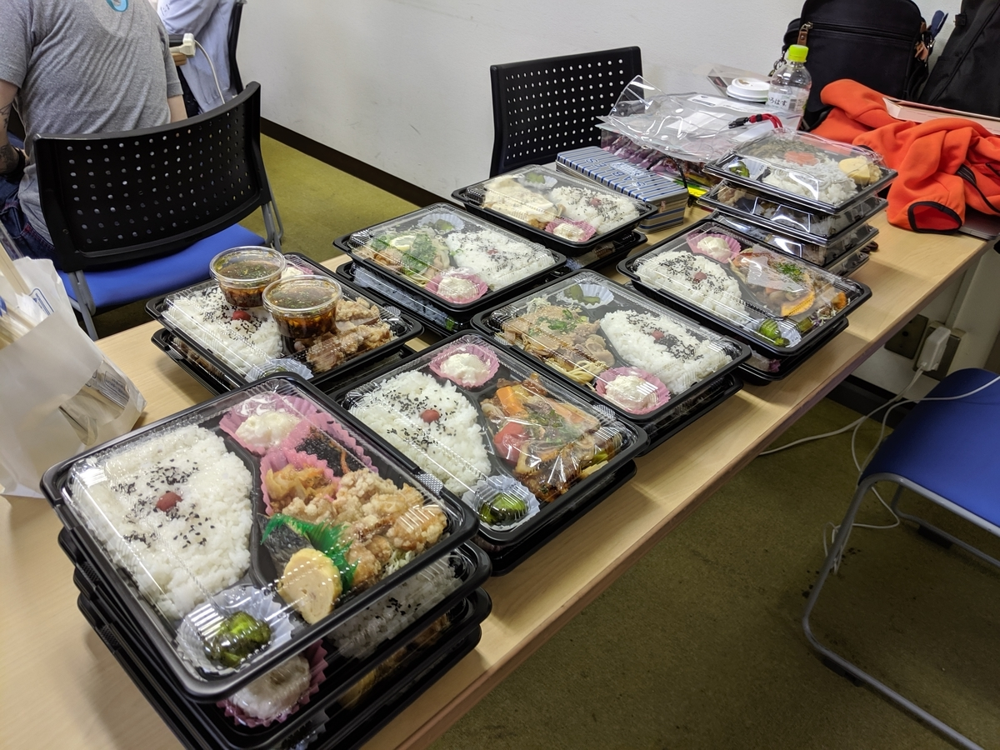

Rails Girls 愛媛 というイベントにスタッフとして参加してきました。松山市のとあるレンタルオフィス（？）さんを借りて、14日（金）は環境構築のためのインストールデー、15日（土）は実際に Rails アプリを組んで Heroku でデプロイしてみましょうといった感じ。

<iframe src="https://hatenablog-parts.com/embed?url=http%3A%2F%2Frailsgirls.com%2Fehime.html" title="Ehime 14-15 June 2019" class="embed-card embed-webcard" scrolling="no" frameborder="0" style="display: block; width: 100%; height: 155px; max-width: 500px; margin: 10px 0px;"></iframe><cite class="hatena-citation"><a href="http://railsgirls.com/ehime.html">railsgirls.com</a></cite>

ソフト開発の現場って男ばっかりじゃね？　ってのはまだまだ世界共通のようで、そういうのを少しずつよくできたらなーという感じでやってる世界規模の草の根勉強会っぽいですね（この日はブラジルとかでもやってたのかな？　忘れた）。個人的にもソフトウェア開発は女性向き（肉体労働と比べて、みたいな）な職業だと思うので、むしろ女性が多いぐらいでいいのではないかと思うので、こういう取り組みは大賛成です。

ちなみに、このイベントは女性向けですが、コーチやスタッフとしてならおっさんでも参加できるみたいです。とくにコーチは……今回、東京から何人かきていただいたのですが、地元の方は男女問わず少ない状態です。地元のコーチがいれば、東京からきやすい松山市だけでなく、東予や南予、なんだったら離島でも気軽に開催できると思うので、我こそは、と思う方は手伝ってほしいですね。僕はあまり Rails を知らないので、あまり力になれませんが……あ、物理的な力にはなれます。今回もお弁当運びやジュース運び、買い出しを頑張りました。会場は4階なのにエレベーターがなくて、結構しんどかった。

<figure class="figure-image figure-image-fotolife" title="めっちゃ頑張って運んだお弁当（参加者は無料です。スポンサーの方々、ありがとうございます！）"><figcaption>めっちゃ頑張って運んだお弁当（参加者は無料です。スポンサーの方々、ありがとうございます！）</figcaption></figure>

それにしても、参加者の方の多種多彩なこと！　詳しくは言いませんけど、よくもまぁ、こんなにいろんなバックグラウンドのある人が参加したな―って感じです。あと、みなさん、モチベーションが高いというか、チャレンジ精神にあふれるというか……IT に関係のあるお仕事をしてる方ばかりじゃないのに、すごいなって思いました。イベントを知ってくれたのも、ネットやチラシではなく、なんか地元の会社で読まれてる情報紙で知った方が多かったみたいで、そこんところも地方色なのかなって感じました。プロ生勉強会の募集もそうしたところに掲載をお願いした方がいいのかも……まったく盲点でした。コーチの方も画用紙片手に PC や Ruby、Heroku の概念からわかりやすく伝えていて、ここまでやるんだなーと感心しきりです。

自分も、インストールデーはスタッフ仕事の傍ら環境構築にチャレンジしてみたのですが、WSL＋Visual Studio Code ＆ Remote Deploy 拡張機能で Rails アプリをかけるところまでちゃんとできました。Rails は大学時代に 2 を触っていたのを最後に遠ざかっていますし、正直なところ、おっさんになって今さら Rails 頑張る気が起きないのですが（むしろ .NET で Blazor とかがんばりたい）、あんまり出しゃばりすぎない程度にお力になれたらなーって思いました。

おしまい。

