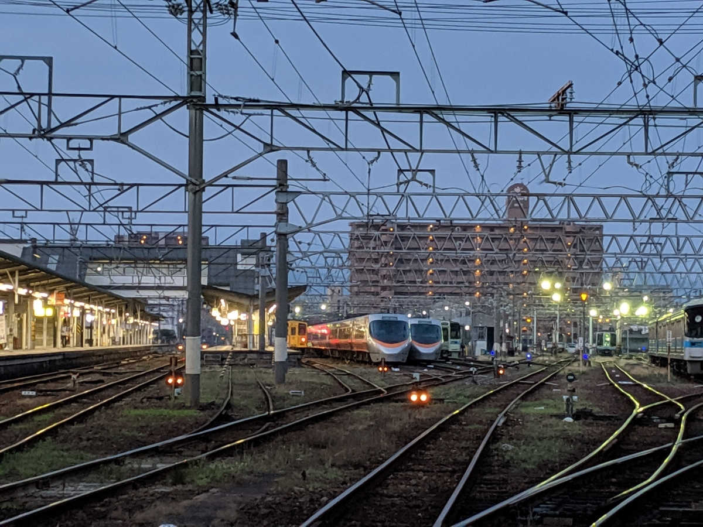

だるやなぎ職人の朝は遅い。

だるやなぎは言う。

「晩御飯を食べると、そのまま寝ちゃうんですよ。でも、寝られるのは4時間だけ。無職の仕事が心配で、目が覚めちゃうんですよね。結局、夜が明けるまでそのまま仕事をして、また寝ます（笑）」

さりげなく語るが、そこには苦悩と、確たる睡眠不足が見えた。

夜中目覚めるときは、全身が鉛のように重い。どうせなら8時間ぐらいぶっ通しで寝たいのだが、いくら眠気に耐えて入眠時間を遅らせても、きっかり4時間ほどで目が覚めてしまう。

明け方の眠りは、比較的心地よい。日曜日など朝に気絶して、目が覚めたら午後の6時だったが、とても寝覚めがよく、ひと心地ついた気分だった。

しかし、さすがに平日は昼には起きていないと諸々、無職のお仕事に障りが出る。眠い目をこすりながら机に向かい、仕事を終えて、用意された晩御飯を平らげると、そこで力尽きてしまう。

合計すれば1日に8時間は寝ているのだが、どうにも「寝た！」という実感がなくてしんどい。月曜日の仕事を終えた時点で、まるで水曜日のような疲れがある。

というわけで、最近はがんばって早朝に散歩に出たりもしている。道後温泉に入りに行ったり、24時間空いてる牛丼屋へわざわざ朝ご飯を食べに行ったり……状況は全く改善されないけれど、これはこれでちょっと楽しい。昨日などは、JR 松山駅の周りを徘徊して、始発前の電車をカメラに収めるなどしていた（いや、スマホなんだけど）。こういう時間に歩かないとわからないことも割とある。

<figure class="figure-image figure-image-fotolife" title="早朝ドライブで双海～松山空港"><figcaption>早朝ドライブで双海～松山空港</figcaption></figure>

<figure class="figure-image figure-image-fotolife" title="誰もいない！"><figcaption>誰もいない！</figcaption></figure>

<figure class="figure-image figure-image-fotolife" title="メタモルフォーゼ中の道後温泉"><figcaption>メタモルフォーゼ中の道後温泉</figcaption></figure>

<figure class="figure-image figure-image-fotolife" title="すき家よりなか卯だな―、自分は。"><figcaption>すき家よりなか卯だな―、自分は。</figcaption></figure>

まぁ、最近はそんな感じ。お布団も変えてみたんだけど、それはまた、日を改めて書こうと思う。

