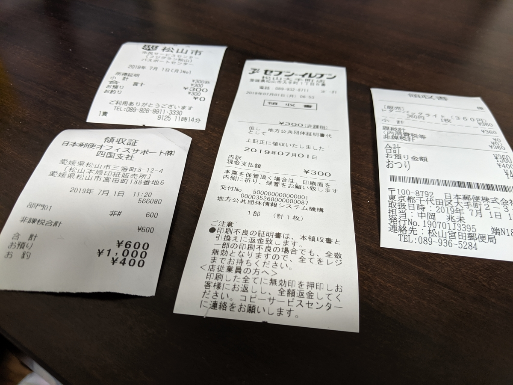

新居を買うために貯金をすべて吐き出したうえ、お母ちゃん（200万円）と弟1号（100万円）にお金まで借りてしまった だるやなぎ。弟1号にはすぐさま返済を果たしたものの、メイン口座がシケンミンゼイの不意打ちにあってしまう。幸いあまり稼いでなかったので税金もそれほど多くなく、かろうじて致命傷で済んだものの、口座の残高はここ10年で最低レベルに。マジで水と卵かけご飯の生活を余儀なくされそう。

――と、そんな折、こんなサイトを見つけました。

<iframe src="https://hatenablog-parts.com/embed?url=http%3A%2F%2Fsumai-kyufu.jp%2F" title="すまい給付金の公式ホームページ" class="embed-card embed-webcard" scrolling="no" frameborder="0" style="display: block; width: 100%; height: 155px; max-width: 500px; margin: 10px 0px;"></iframe><cite class="hatena-citation"><a href="http://sumai-kyufu.jp/">sumai-kyufu.jp</a></cite>

よくわからんけど、お金がもらえるらしい。

というわけで、物件引き渡しのときにもらった分厚いバインダーを引っ張り出し、契約書やらなんやら、必要な書類をコピーしてシコシコと申請書を作成しました。

まずは、住民票と課税証明書を収集します。最近はマイナンバーカードさえあればコンビニで発行してもらえるのですが

<ul>
<li>松山市の場合、朝6時半からしかやってない（夜中暇だったのでやろうかなと思ったのだけど、受付時間外だった）</li>
<li>課税証明書は「最新」のものしか取れない（去年のが必要だった</li>
</ul>
みたいな罠があり、今回は結局フジグランにある松山市市民サービスセンター（9:00～）まで出かける羽目になりました。とはいえ、わざわざ市役所（ちんちん電車で10分ほど）までいかなくていいのは楽ですね。徒歩5分で行ける。

法務局もすぐそばにあるので、ついでに回って登記事項証明書をゲット。ネット経由でも取り寄せできるらしいのですが、ここも徒歩5分なので直接言った方が早い。

前の前の会社では結構法務局に行く用事があったのだけど（会社の登記関係の書類を取りに～とか）、それ以降はとんとご無沙汰で、実に10年ぶりの法務局でした（家を買わなかったら、もう一生いかなかったかも……）。久しぶり＆初めての土地の法務局は勝手がわからず、申請書類を書いて印紙を買いに行ったら、「もし登記されてなかったら無駄になるから、先に申請を出してから買う方がいいですよ」とアドバイスを受けるなどしました。うん、まぁ、言われてみればそうだな。

あと、昔は自分でどの印紙を買えばいいのか調べたり聞いたりしていた気がするのですが、今回は「600」と書かれたカードを渡され、それを印紙販売の窓口にもっていくと600円の印紙を売ってくれるという、なんかアナログだけど洗練された仕組みになっていました。便利なんだか、どうせならもっと機械化しろよっていうか。

で、最後に宮田町の郵便局（徒歩5分）でレターパックを買い、収集した書類を詰めて投函！　たぶんこれで大丈夫だと思う。レターパックも久しぶりに買ったのだけど、最近は普通のとライトってのがあるんだね。普通のやつは厚みに制限がないけど、ライトにはあって、その分ちょっと安い。ウチはライトで大丈夫そうなので、安いの（350円ぐらい）を買いました。

結局、契約書を約款まで含めてコピーしたりしたおかげで、なんだかんだで割とお金がかかりました（1,500円ぐらい）。久しぶりに役所仕事をやったって感じがする。

この すまい給付金 というのは消費税率引き上げに伴う経過措置なんだそうで、要するに 8％ → 10％ になっても急に負担が増えないように補助金を出すよーってことらしいです。おかげで一部の人は増税後の方が負担が減ったり（購入価格×2％＜すまいる給付金）もするとか。年収にもよるから何とも言えませんが、無理して駆け込み購入する必要なんかないんですね。まぁ、メーカーさんも売り上げに波があるのは大変だし、制度の趣旨はりかいできるかも……とはいえ、家が買えない人もたくさんいるのに補助金配りまくるのもどうなんすかね（自動車の減税でもなんでもそうだけど）。

でも、今の財政事情的にはすごく助かる……ウチの場合は、20万円だか、30万円だかもらえるっぽい。おかげで、お母ちゃんに早くお金が返せるし、うれしい。でも、しいて言えば、役所の方から教えてほしいなって感じ。なんか住宅を取得してから1年以内に申請しなきゃいけないらしいんだけど（今は1年3カ月）、もしそれを逃していたら……憤死していたかもしれないｗ（そのうち案内が送られてくるのかもしれないけれど

