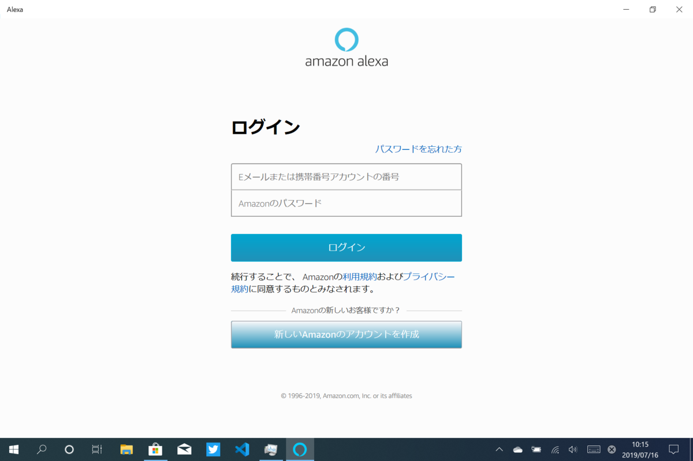
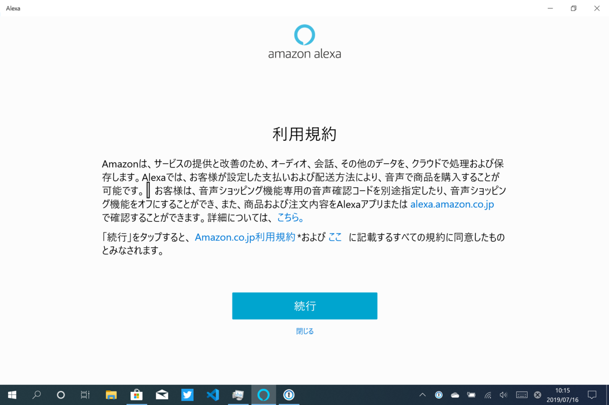
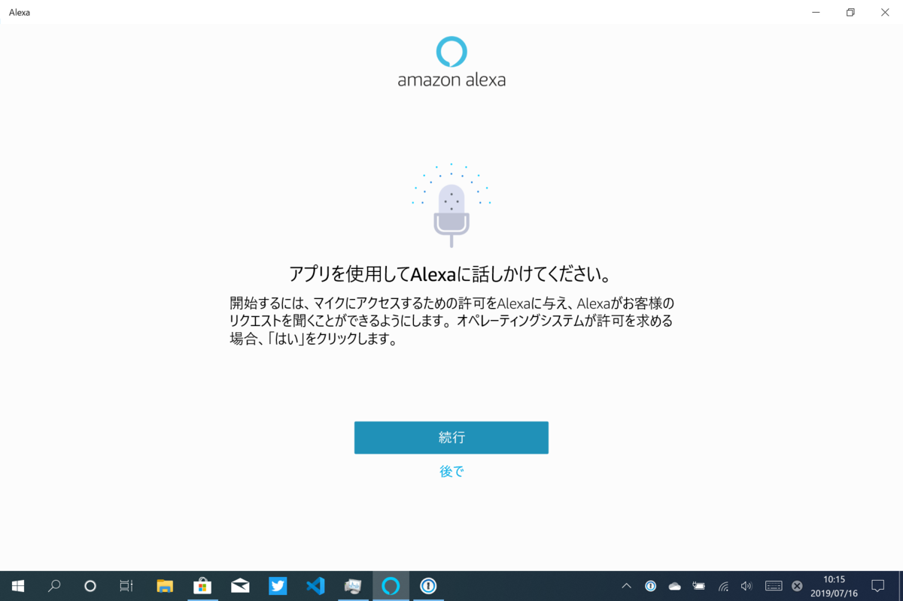
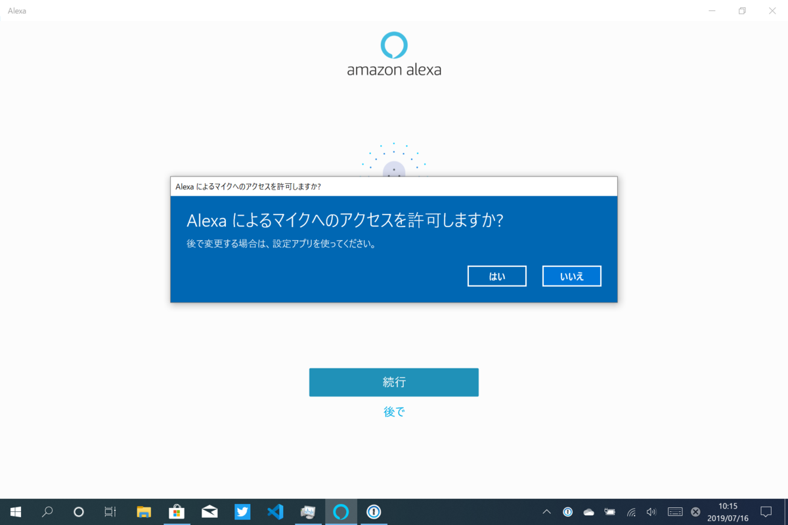
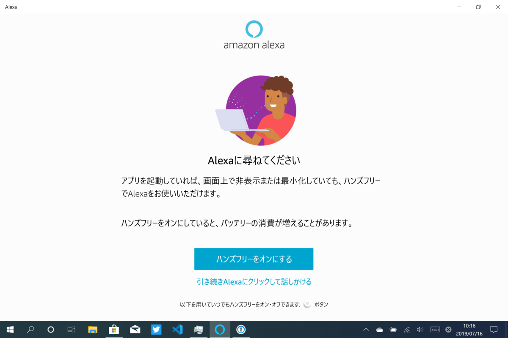
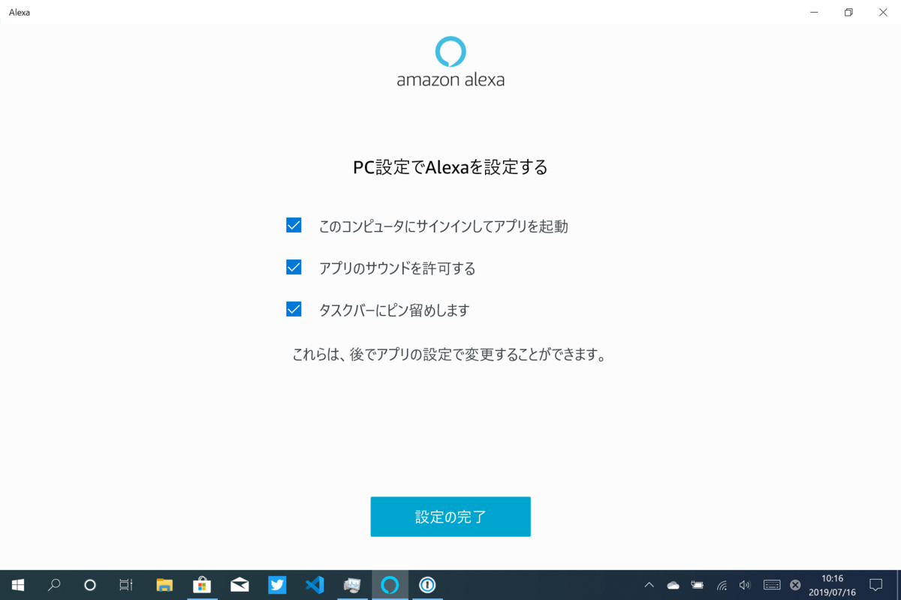
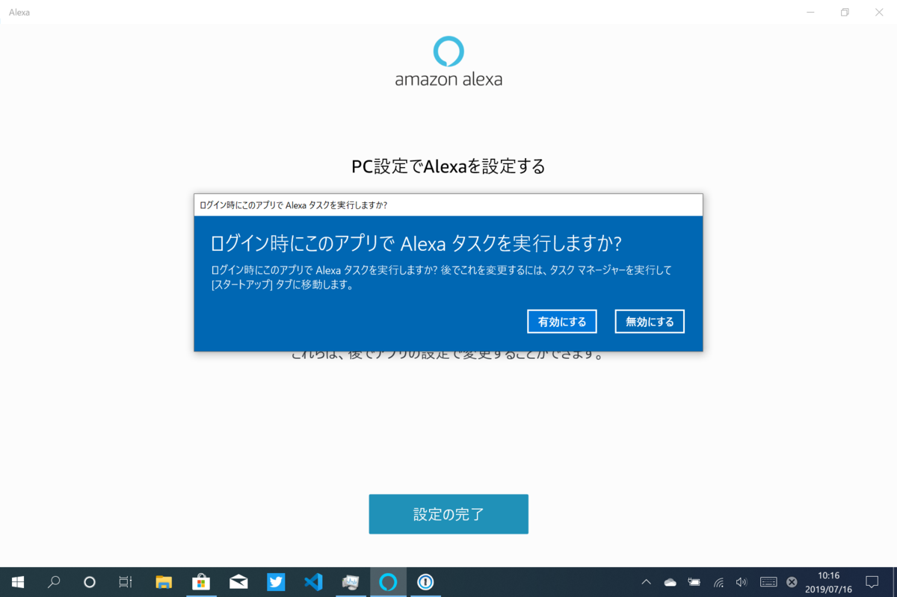
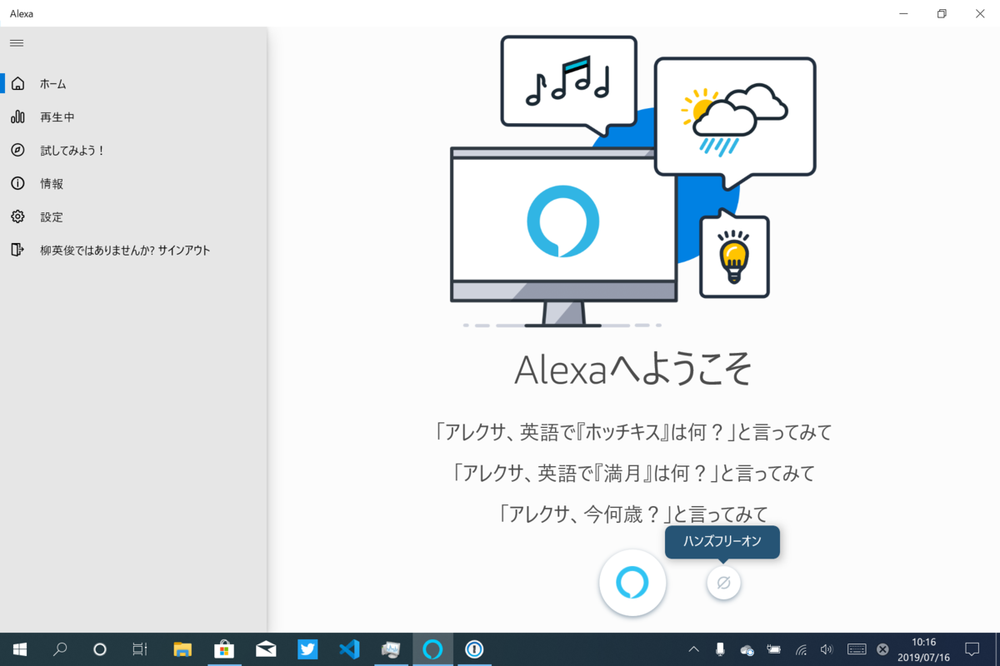

<blockquote cite="https://blogs.windows.com/windowsexperience/2019/07/15/announcing-windows-10-insider-preview-build-18362-10005-19h2/">

A change to enable third-party digital assistants to voice activate above the Lock screen.

<cite><a href="https://blogs.windows.com/windowsexperience/2019/07/15/announcing-windows-10-insider-preview-build-18362-10005-19h2/">Announcing Windows 10 Insider Preview Build 18362.10005 (19H2) | Windows Experience Blog</a></cite>
</blockquote>

そろそろ Windows 10版「Alexa」アプリを試してみなければという気がしてきたので、とりあえず入れてみた。

<iframe src="https://hatenablog-parts.com/embed?url=https%3A%2F%2Fwww.microsoft.com%2Fja-jp%2Fp%2Famazon-alexa%2F9n12z3cctcnz" title="Amazon Alexa を入手 - Microsoft Store ja-JP" class="embed-card embed-webcard" scrolling="no" frameborder="0" style="display: block; width: 100%; height: 155px; max-width: 500px; margin: 10px 0px;"></iframe><cite class="hatena-citation"><a href="https://www.microsoft.com/ja-jp/p/amazon-alexa/9n12z3cctcnz">www.microsoft.com</a></cite>

ウェルカムページとログイン。

利用規約にさらっと目を通し――

マイクへのアクセスを許可する。

現行版はハンズフリーにも対応している。

<iframe src="https://hatenablog-parts.com/embed?url=https%3A%2F%2Fwww.watch.impress.co.jp%2Fdocs%2Fnews%2F1177246.html" title="AmazonのAlexa、Windows 10 PC対応。春にはハンズフリー化" class="embed-card embed-webcard" scrolling="no" frameborder="0" style="display: block; width: 100%; height: 155px; max-width: 500px; margin: 10px 0px;"></iframe><cite class="hatena-citation"><a href="https://www.watch.impress.co.jp/docs/news/1177246.html">www.watch.impress.co.jp</a></cite>

最後にオプションを指定（あとからでも変えられる）。スタートアップも許可しておいた。

今のところロック画面に関連するオプションは見当たらない気がする。たぶん今回は Windows 10 側の内部的な変更で、本格的な対応はこれからなんじゃないかな。知らんけど。

