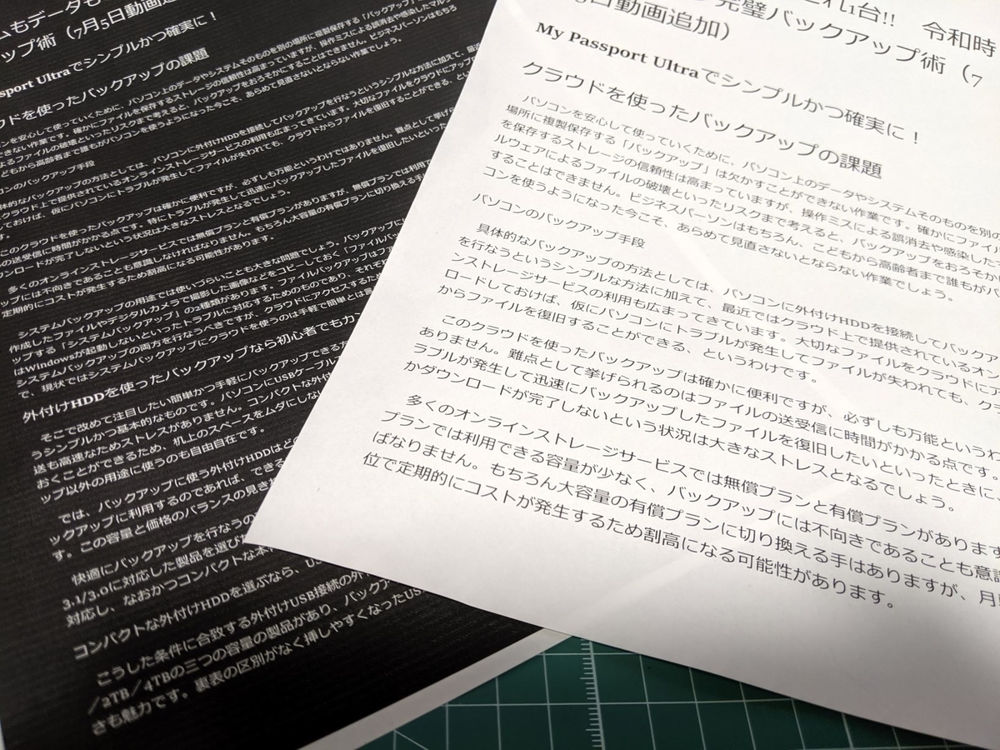
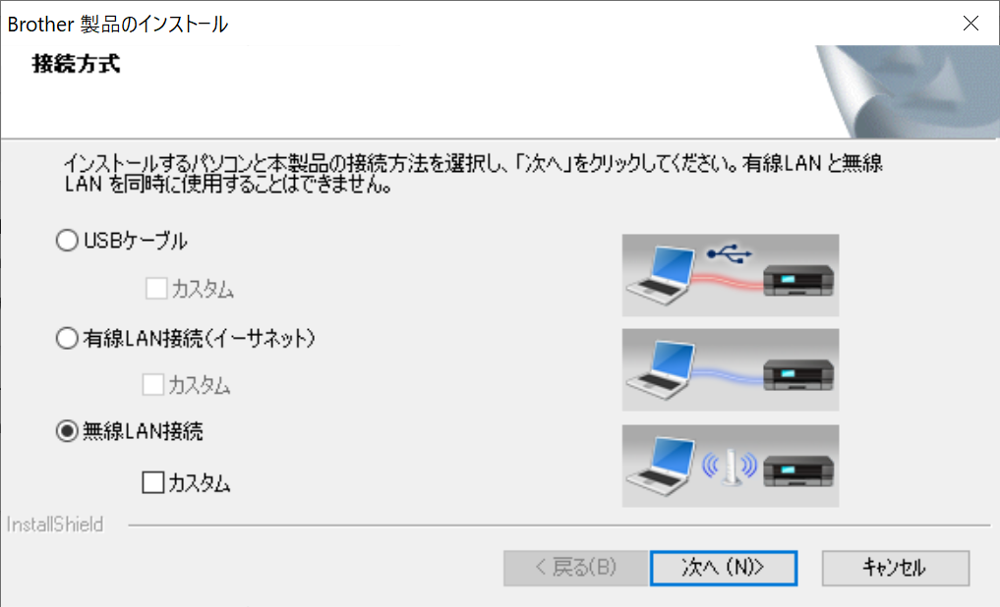
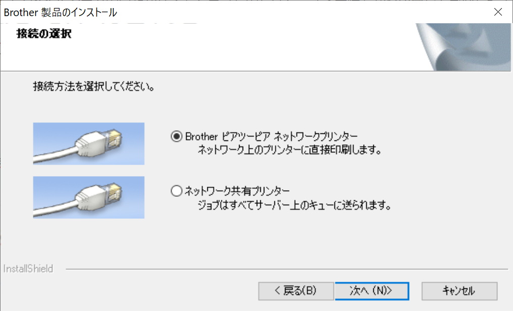

久しぶりにデスクトップ PC から Web ページを印刷すると、白黒逆に印刷された。最初は「スタイルシートの問題かな？」と思ったのだけど、「メモ帳」から印刷しても同じ結果になる。

うちのプリンターは1年半ほど前に購入したブラザーのレーザープリンター <b>HL-L2365DW</b>。今までは接続しただけで、とくに何もせず正常にプリントアウトできていた。もしかしたら「Windows 10 May 2019 Update（バージョン 1903）」にアップデートした時点でおかしくなっていたのかもしれないが、いつもは Surface Book 2（Windows 10 バージョン 1809）から印刷していたので気づいていなかった。

<iframe src="https://hatenablog-parts.com/embed?url=https%3A%2F%2Fblog.daruyanagi.jp%2Fentry%2F2017%2F10%2F01%2F090000" title="お仕事部屋の改造計画を進めている - だるろぐ" class="embed-card embed-blogcard" scrolling="no" frameborder="0" style="display: block; width: 100%; height: 190px; max-width: 500px; margin: 10px 0px;"></iframe><cite class="hatena-citation"><a href="https://blog.daruyanagi.jp/entry/2017/10/01/090000">blog.daruyanagi.jp</a></cite>

解決は簡単で、単にドライバーをインストールすればよい。

<iframe src="https://hatenablog-parts.com/embed?url=https%3A%2F%2Fsupport.brother.co.jp%2Fj%2Fb%2Fdownloadtop.aspx%3Fc%3Djp%26lang%3Dja%26prod%3Dhll2365dw" title="ソフトウェアダウンロード | HL-L2365DW | 日本 | ブラザー" class="embed-card embed-webcard" scrolling="no" frameborder="0" style="display: block; width: 100%; height: 155px; max-width: 500px; margin: 10px 0px;"></iframe><cite class="hatena-citation"><a href="https://support.brother.co.jp/j/b/downloadtop.aspx?c=jp&lang=ja&prod=hll2365dw">support.brother.co.jp</a></cite>

えらく古臭いユーザーインターフェイスのインストーラーだったけど、

無線で接続している場合は［無線LAN接続］を選択し――

［Brother ピアツーピアネットワークプリンター］<a href="#f-c62da4b7" name="fn-c62da4b7" title="ここで少し躓いた">*1</a>を選ぶと <b>HL-L2365DW</b> が自動で識別され、ドライバーやユーティリティがインストールされた。印刷も元通り。

<a href="#fn-c62da4b7" name="f-c62da4b7" class="footnote-number">*1</a>:ここで少し躓いた

