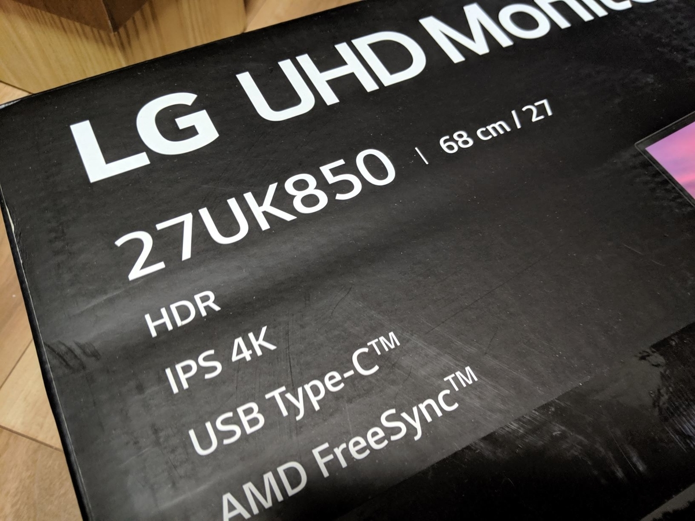
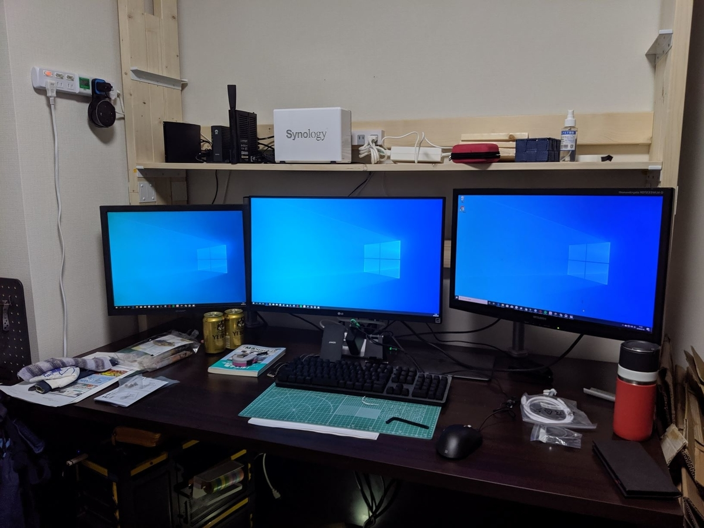
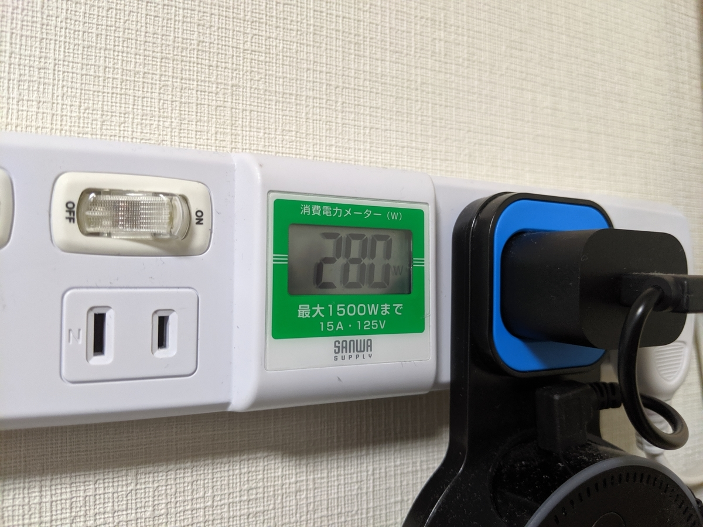

Amazon Prime Day  で HDR/USB-C なモニターを確保した。ずっとほしかったので、値段を監視していたのだ！

<a href="http://www.amazon.co.jp/exec/obidos/ASIN/B078XXYDWZ/bestylesnet-22/">LG モニター ディスプレイ 27UK850-W 27インチ/4K/HDR対応/IPS非光沢/USB-Type-C、HDMI×2、DisplayPort/スピーカー搭載/FreeSync、高さ調節、ピボット対応</a>
<ul><li>出版社/メーカー: LG</li><li>発売日: 2018/02/14</li><li>メディア: Personal Computers</li><li><a href="http://d.hatena.ne.jp/asin/B078XXYDWZ/bestylesnet-22" target="_blank">この商品を含むブログを見る</a></li></ul>

参考価格 88,800 円のところを、56,488 円（<b>約2/3</b>）で買えたので満足。もっとも、このモニターは型落ちで（最新版は HDR10 → HDR400）、たいてい7万円弱で買える。実際、今見てみたところ 74,980円＋10,000引きクーポンで売ってた。

おかげさまで、古いデスクトップで作業するときもトリプルモニターが使えるようになった。いい機会だし、うちの子たちを改めて紹介しよう。

<ul>
<li>左：シャープ LL-T2015（20.1インチ） 2003年製</li>
<li>中：LG 27UK850-W（27インチ）2018年製</li>
<li>右：三菱 RDT233WLM（23インチ） 2011年製</li>
</ul>
RDT233WLM を買ったのは 2012年6月9日 らしいので（Amazon の購入履歴を調べた）、約8年ぶりのモニター購入ということになる。まだ小岩に住んでいたころだな……LL-T2015 に至っては15年ぐらい、たぶん大学辞める時ぐらいから使っているはず。意外に自分は物持ちがよいようだ。

<blockquote class="twitter-tweet" data-lang="HASH(0x557f8649f8c0)">
見た目の本体は薄いのに、アダプタがデカいの、詐欺だよな <a href="https://t.co/e07Ry9Uw8C">pic.twitter.com/e07Ry9Uw8C</a>
&mdash; ふつうのだるやなぎ (@daruyanagi) <a href="https://twitter.com/daruyanagi/status/1150953721645264896?ref_src=twsrc%5Etfw">July 16, 2019</a></blockquote>

AC アダプターがやたらデカいかったのを除けば、だいたい想像していた通りのデキで、とくに不満はない。あぁ、そういえば、音（HDMI 出力）はなかなかよかったかな……RDT233WLM と比べての話だからそれなりだけど、Age of Empire:DE を遊んだとき、今まではボタンを押すとボンッと鳴るだけだったのが、余韻と深みのあるドゥムッっという音になっていて……「あ、ほんとはこういう音だったんだな！」って実感した。あと、重箱の隅をつつくようなツッコミになるが、<b>ベゼルが狭すぎて Mouse の Windows Hello カメラが安定しない</b>。まぁ、さすがにこれはイチャモンレベルだが……ベゼルレスは基本的に快適だ。消費電力は 80W ぐらい。うちの PC は以前からある2枚のモニターを含めて 200W ぐらい使っていたのが、280W に跳ね上がった。電気代への影響はちょっと気になるけど……新居は一括受電でちょっと電気代が安くなってるから、まぁ、差し引きゼロぐらいだろう。

ちなみに、うちはすぐモニターアームをつなげたので、スタンドの使い勝手はわからない。Amazon の商品説明だけだとわかりにくいけど、さすが今どきのモニターだけあって、ちゃんと VESA には対応している。

<blockquote class="twitter-tweet" data-lang="HASH(0x557f85903c10)">
めっちゃあったで <a href="https://t.co/SFKNx4HMTo">pic.twitter.com/SFKNx4HMTo</a>
&mdash; ふつうのだるやなぎ (@daruyanagi) <a href="https://twitter.com/daruyanagi/status/1150971137569873920?ref_src=twsrc%5Etfw">July 16, 2019</a></blockquote>

Windows 10 の HDR は使えなかったし（ビデオカード側がしょぼいからかなぁ）、USB-C もまだ試していないんだが（ぉぃ！）、おおむね満足してる。USB-C を省けばもう1万円ぐらいは余裕で安くなったけど、将来性を考えれば付いていた方が絶対いいはずだ。

