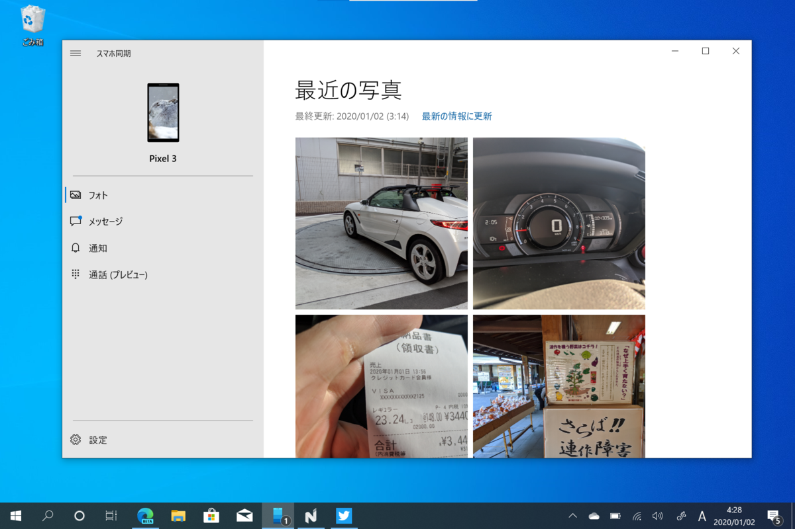
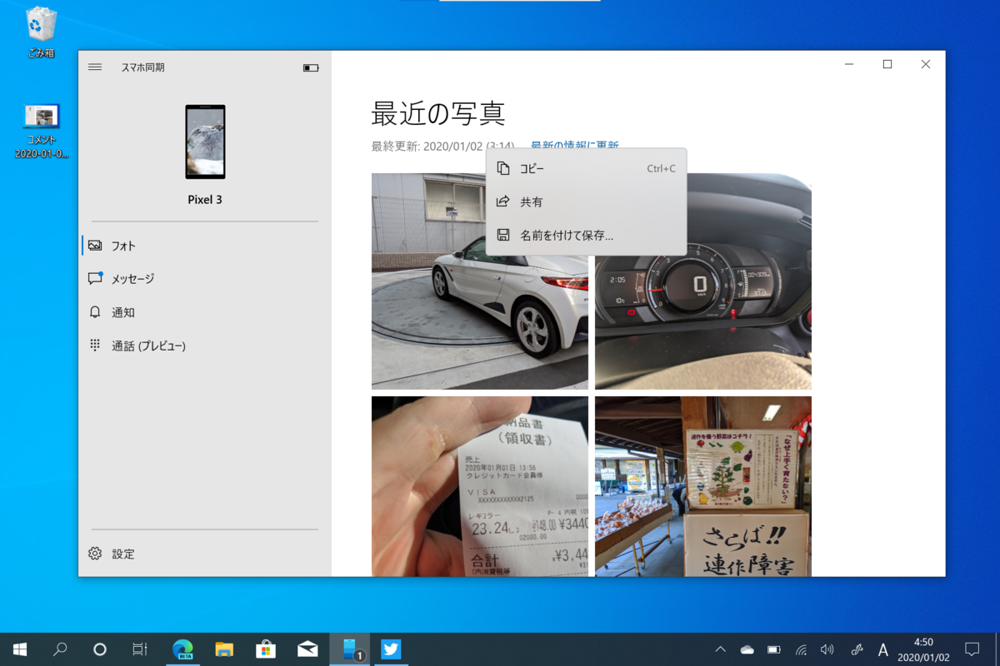
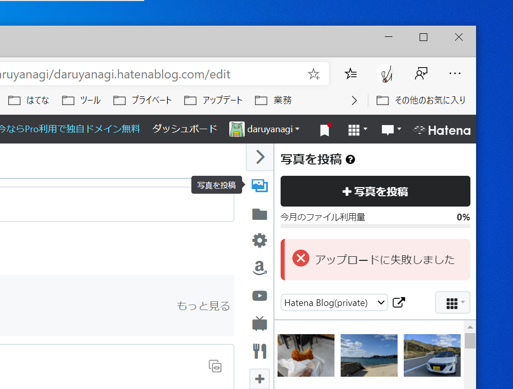

Window 10 の「スマホ同期」アプリのおかげで、スマホの写真を用いてブログを書くのがとても簡単に……ならない話。

「スマホ同期」アプリというのは、PC とスマホの間でデータを同期するアプリ……ではなく、どっちかっていうと、PC からスマホを「のぞき込める（リモートアクセスできる）」アプリだと思う。スマホをポケットやカバンのなかにいれたまま、そのデータ（写真）にアクセスしたり、SNS/MMS のやり取りや通話が行える。

最近、この「スマホ同期」アプリのフォト機能が強化されて、リモートアクセスできる写真の数が 25 → 2,000 に拡充された。

<iframe src="https://hatenablog-parts.com/embed?url=https%3A%2F%2Fforest.watch.impress.co.jp%2Fdocs%2Fnews%2F1224861.html" title="「スマホ同期」の“通話”機能が一般公開 ～同期可能な写真の数も25から2,000に／リモート操作機能はペン入力に対応" class="embed-card embed-webcard" scrolling="no" frameborder="0" style="display: block; width: 100%; height: 155px; max-width: 500px; margin: 10px 0px;"></iframe><cite class="hatena-citation"><a href="https://forest.watch.impress.co.jp/docs/news/1224861.html">forest.watch.impress.co.jp</a></cite>

25 枚しか同期できないときはたいして魅力に感じなかったが、2,000 ともなるとなかなか便利だ。たとえば――

「スマホ同期」アプリでスマホの写真をコピーし、はてなブログに張り付ければ、そのまま写真がアップロードされる。［共有］コマンドで「切り取り＆スケッチ」アプリをはさみ、ペンで書き込みを入れて貼り付けるというのも簡単だ。

でも、ここで問題となるのが、はてなブログ側。アップロードできる画像のファイルサイズに制限があるので、単にコピーするだけではときどきアップロードに失敗してしまう。［共有］機能で他のアプリに送るにしても、「切り取り＆スケッチ」アプリにはリサイズ機能がない。「フォト」アプリに送れば（なんで「スマホ同期」アプリから直接共有できないんだ？）リサイズ機能があるが、こいつはファイルを保存する。まぁ、保存したファイルを Web ブラウザーにドラッグ＆ドロップすればいいんだけど、クリップボードで操作が完結しない（余計なマウス操作が必要になる）のは面倒だなー。

ってわけで、画像をリサイズするだけのプチアプリでも作るか、という気になっている。

