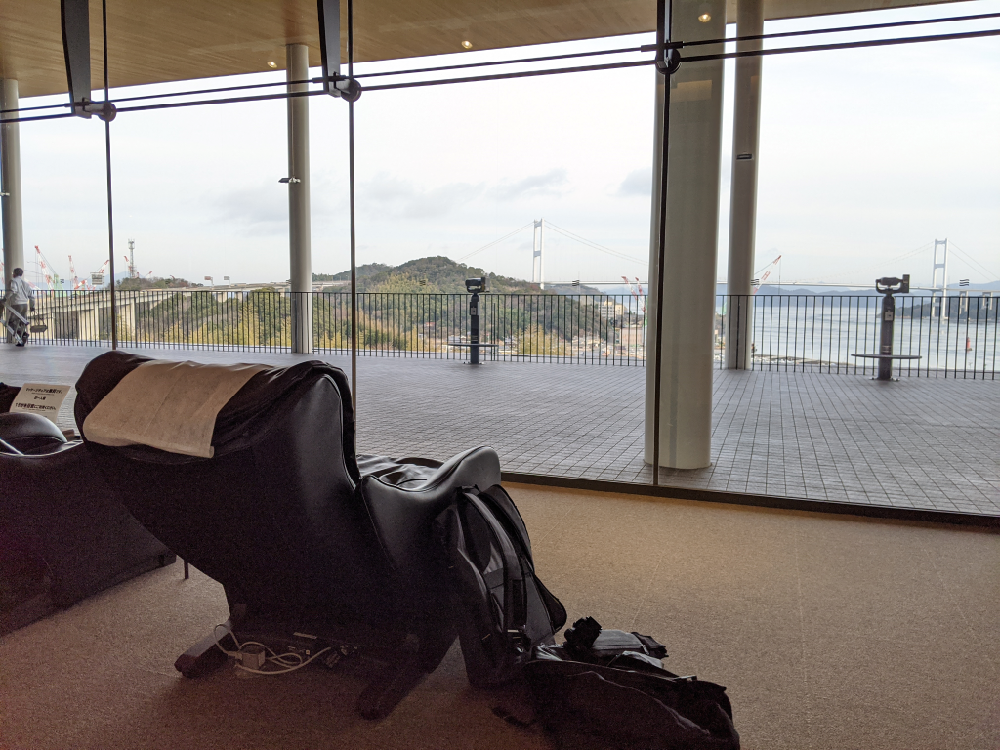
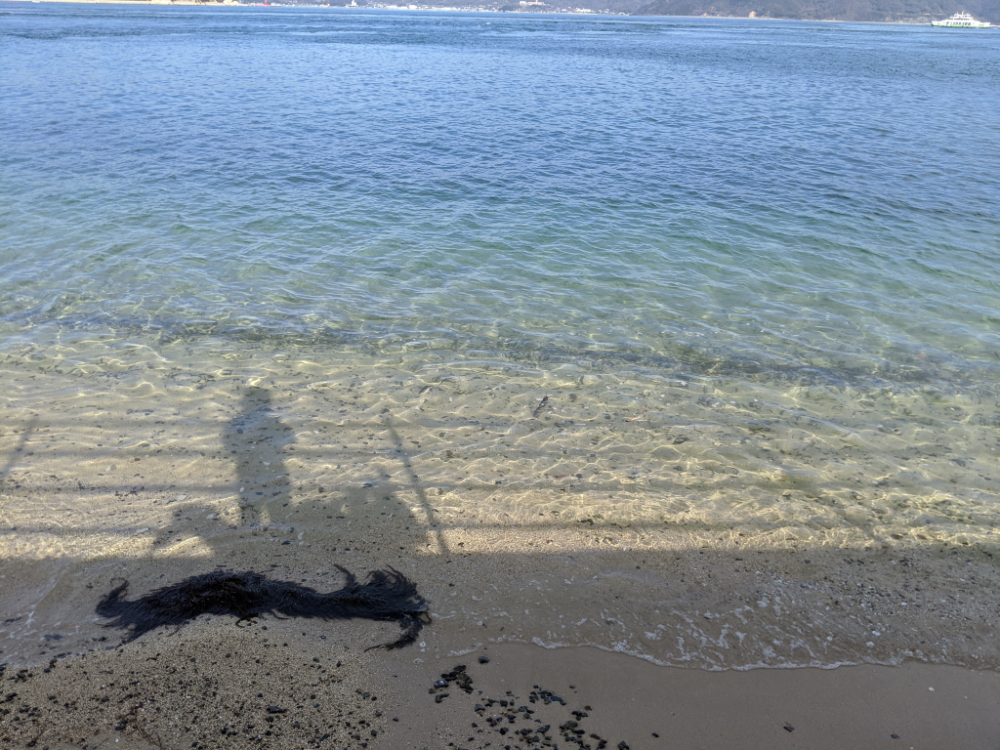

※本当は Surface Pro X の開封記事を書く予定でしたが、ちょっとしたミスで発売日の受け取りに失敗したので、違うネタをお届けします（↓ こいつ、ウッキウキで Togetter にまとめてるんだろうなぁって思うと怒髪冠を衝く思いですが、わざわざ自分で事情を解説するのはもっと馬鹿らしいので、興味のある人は Togetter でも見てください。）。

<blockquote class="twitter-tweet" data-lang="ja">
「だるやなぎ、Surface Pro X を購入するも受け取りに失敗する」をトゥギャりました。 <a href="https://t.co/UVfwLzetKm">https://t.co/UVfwLzetKm</a>
&mdash; しばやん (@shibayan) <a href="https://twitter.com/shibayan/status/1216974594680094720?ref_src=twsrc%5Etfw">2020年1月14日</a></blockquote>

三連休の初日。天気予報によると晴れるのはこの日だけのようなので、確定申告の準備はいったん棚上げし、バイクに乗る。行先は決めてなかったが、正月に S660 で大三島を半周したとき「バイクのほうが楽しそうだなぁ」と思ったのをふと思い出し、早速やってみることにした。

<figure class="figure-image figure-image-fotolife" title="今回のルート"><figcaption>今回のルート</figcaption></figure>

大三島は、つま先を西に向けて短いブーツのような恰好をしており、その外周には県道51号線という環状線が敷かれている。しまなみ海道のインターから大三島に降りると51号線の東側に出るが、それを少し北にたどり、ちょうど足首部分を貫く県道21号線に折れて西進すると、山を抜けて島の反対方向にある大山祇神社へ素早く抜けられる。そのため、この51号線をわざわざぐるっと回る人はあまりいないが、一部を除き2車線が整備されているので割と走りやすい。海に向けて下る坂道、ちょっとエキサイティングだけどけっして難しくはないワインディング、鄙びた港……外周40kmほどだが、なかなかにバラエティに富んだ風景を楽しめる。波をかぶることがあるのか、道の上にたまに砂が浮いていること、落ち葉が広がる季節のあること、ときどき地元の人や自転車と出会うこと（学校もあるので子どもたちには注意）などに注意する必要はあるが、誰もいないところは誰もいないので、ちょっとハメを外すことだってできる。

島は南回りで巡るのがよいだろう。左手に海を近くに感じることができる。ところどころに朽ちかけたモノレールがあるが、たぶんミカンを運ぶためのものだろう。ときどきバイクを止めて、それがどこまで続いているのか眺めてみても楽しい。

島でごはんを食べるところはいくつかあるが、今回は道の駅で「マハタ」という魚の定食を食べた。「高級魚でしられるクエと同じハタ科の魚、プリプリとした触感と今注目されるコラーゲン」が売りだそうだが、値段はともかく、なかなかおいしかった。

寒風のなかバイクを駆ると、温泉に入ってあったまりたくなる。少し前まで、この島には「多々羅温泉しまなみの湯」という温泉施設があったが、残念ながら西日本豪雨で被災してしまった。

<iframe src="https://hatenablog-parts.com/embed?url=https%3A%2F%2Fwww.asahi.com%2Farticles%2FASM655277M65PFIB007.html" title="愛媛）多々羅温泉を廃止へ　西日本豪雨で被災、復旧断念：朝日新聞デジタル" class="embed-card embed-webcard" scrolling="no" frameborder="0" style="display: block; width: 100%; height: 155px; max-width: 500px; margin: 10px 0px;"></iframe><cite class="hatena-citation"><a href="https://www.asahi.com/articles/ASM655277M65PFIB007.html">www.asahi.com</a></cite>

代わりに「しまなみドーム」というところにある温泉施設が使えるが、個人的には今治まで戻り、新しくできた喜助の湯に入るのがおすすめ。ラウンジはちょっと高いけど、岩盤浴、鳥かごチェア、ハンモック、地酒バー、マンガ、ファミコン・スーファミミニ、各種ボードゲームまでそろっている。追加料金さえ払えば、夜の11時以降も滞在可能。朝までゴロゴロできるので、カプセルホテルっぽく使うこともできるみたい。お風呂は何回でもはいれるし、お腹がすいたらご飯も食べられるので、飽きるまでゆっくりするといいだろう。

「温泉は湯冷めするからちょっと……」という人は、来島海峡 SA の2階にあるマッサージチェアはどうだろう。来島海峡大橋の景色を眺めながら、タダで全身をモミモミしてくれる。15分ぐらいで次の人に譲るのがマナーだが、存在をあまり知られていないせいか、並んだり急かされることはいまだない。

まだまだ書き足りないことがある気がするが、今日はここまで。Surface Pro X の発売日受け取りに失敗したショックから立ち直るためにも、早く寝る。

