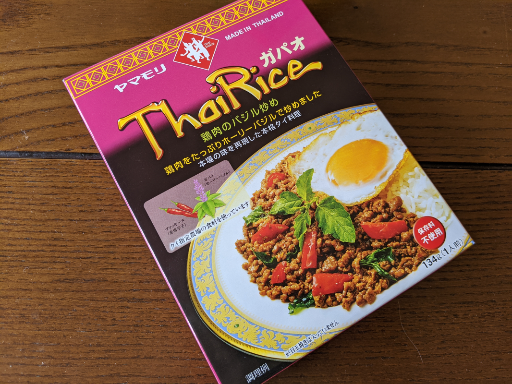
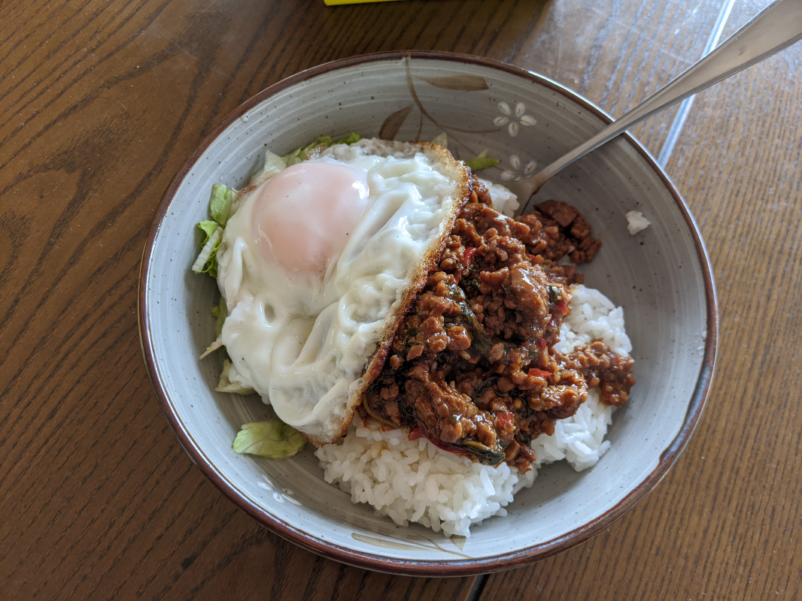

Amazon で ヤマモリ タイカレー&ガパオごはん 全10品セット を購入してみたので、作ってみた。

<a href="https://www.amazon.co.jp/exec/obidos/ASIN/B07SXGRGTV/bestylesnet-22/">【Amazon.co.jp限定】 ヤマモリ タイカレー&amp;ガパオごはん 全10品セット</a>
<ul><li>メディア: 食品&amp;飲料</li></ul>

今回は ガパオ（鶏肉のバジル炒め）に挑戦。ちなみに、「ガパオ」っていうのはカミメボウキと呼ばれるシソ科の植物、いわゆる「ホーリーバジル」と呼ばれる香草のことだとか。いままで「なんかタイあたりで作られてる挽肉＋ごはん料理」のことを「ガパオ」と呼ぶのかと思ってたけど、思いっきり勘違いしていた。

このレトルトにはガパオにブリッキーヌという赤唐辛子が含まれているとの由。パッケージの裏には辛さが5段階中上から4番目（4辛）と書かれている。もしかしたらちょっと辛いのかもしれない。

パッケージに「※目玉焼きは含まれていません」とあったので、仕方なく（？）こちらで用意。ちょっと草を食べたかったので、ついでにレタスもみじん切りにして添えてみた。このレトルトは1個357円もするだけあって、ちゃんと鶏ひき肉がギッシリ詰まっている。魚醤だろうか、ちょっと変わったにおいがツンとただよってきて、食欲をそそられる。

味もなかなかよい。甘味よりは、ほんのちょっとだけ醤油辛さが勝っているか。ちょっと気になっていた辛さは、正直たいしたことがない。もう少し辛みを加えてもよいぐらいだが、このままでも十分おいしい。手を加える必要がない。量も申し分なく、これはリピートしてもいいかなって思った。

