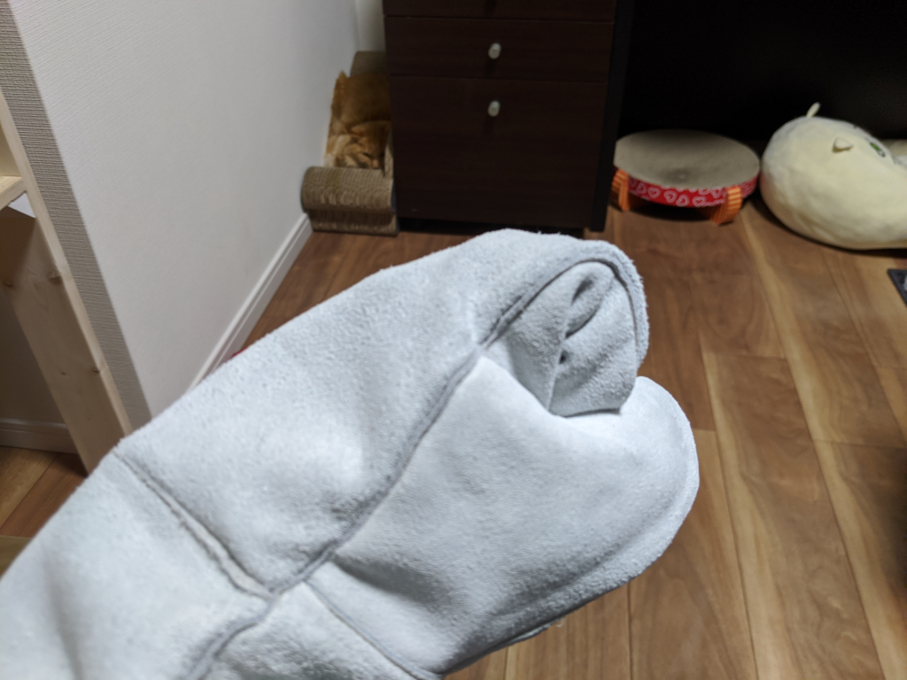

11月に8カ月の♂ネコをお迎えしたのだが、なかなか慣れてくれない。小さい頃に人と接することが少なかったようで、近づくと極度におびえる。まぁ、それだけなら別にいいのだけど、モノを片付けようと近寄ろうものなら、シャーっと威嚇して、噛んだり引っ掻かれたりするのは少し困る。どうしても手で触れなければならないときは、バイク用の冬グローブをはめて自衛に努めていたが、ネコの爪や牙はそれすら貫通するのだ。

というわけで、防具を買った。

<a href="https://www.amazon.co.jp/exec/obidos/ASIN/B07WDFRP57/bestylesnet-22/">Mare GooDs 噛みつき防止 ペットグローブ ロング (ホワイト)</a>
<ul><li>メディア: その他</li></ul>

ドカタ時代によく使っていた革手が、肘まで伸びた感じ。少しサイズが大きな気もするが、革手というのは手にぴったりフィットしていなければならないものでもないし、あまり気にはならない<a href="#f-9e416e1d" name="fn-9e416e1d" title="ドカタ時代は軍手の上に革手をしていたが、一度、クレーンのフックに指を持っていかれたとき、革手だけで済んで助かった">*1</a>。

試しにこれを付けてネコにちょっかいをかけてみたが、ネコパンチごときでは傷一つ……ついたけど、なかまでは貫通しない。牙をたてられても、痛痒を感じない。これはかなりの防御力だ。今期のアニメに『痛いのは嫌なので防御力に極振りしたいと思います。』というのがあるが、その気持ちがよく分かった。ネコ氏のほうも、2、3回攻撃してまったく通用しないと悟ると、小さく唸ってプリンターの裏に引っ込んでしまった。見たか、これが文明の力だ！

ネコには早く慣れてもらって、まず病院で異常がないかなどを確認したり、予防接種があれば受けさせたいのだけど、かなり時間がかかりそう。ストレスも感じてるみたいだし、なるべく無視して、無害な存在であることをアピールせねばなるまい。とはいえ、夜になると活動的になり、飼い主の上で踏んだり蹴ったりと元気なので、そんなに心配しないでもいいかなぁって思ってる。

<a href="#fn-9e416e1d" name="f-9e416e1d" class="footnote-number">*1</a>:ドカタ時代は軍手の上に革手をしていたが、一度、クレーンのフックに指を持っていかれたとき、革手だけで済んで助かった

