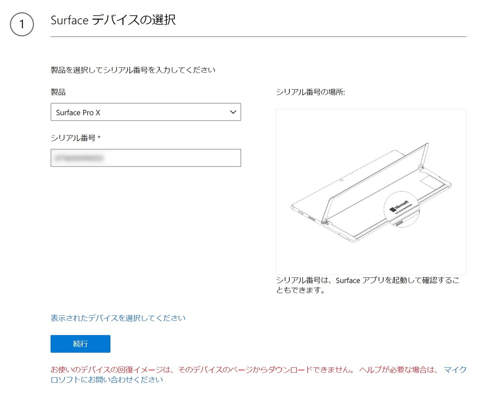
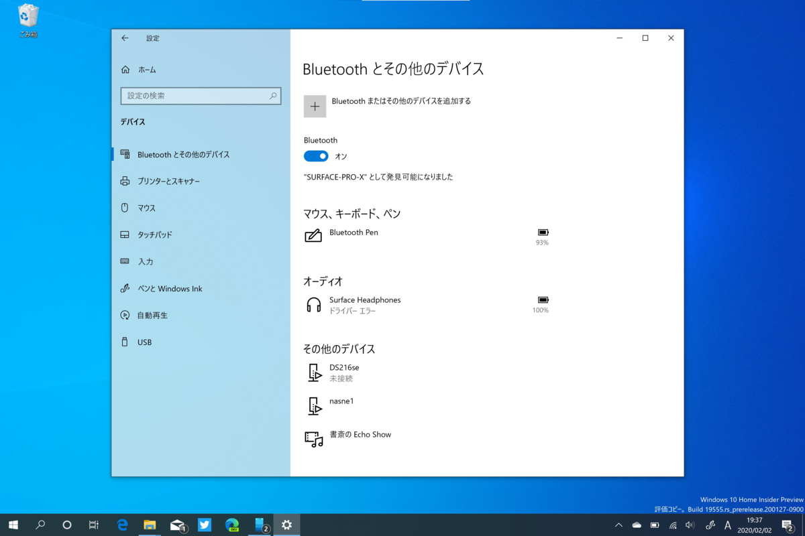

ARM64 の検証機として Surface Pro X を購入。さっそく、Windows Insider Program の Fast リングに加えた<a href="#f-b5611386" name="fn-b5611386" title="最初はなかなか新しいビルドが降ってこなくて、ARM64 端末は Windows Insider Preview に参加できないのかと思ったけど、そんなことはなかった">*1</a>。

<a href="https://www.amazon.co.jp/exec/obidos/ASIN/B082WWKYCY/bestylesnet-22/">マイクロソフト Surface Pro X / Microsoft SQ1 / Office H&amp;B 2019搭載 / 13インチ / SQ1 /16GB / 256GB / LTE / ブラック QFM-00011</a>
<ul><li>発売日: 2020/01/14</li><li>メディア:</li></ul>

というのも、Windows 10 の最新プレビュー版では「タスク マネージャー」がいい感じにアップデートされていて、プロセスのアーキテクチャーを簡単に確認できるのだ。

<blockquote class="twitter-tweet" data-lang="ja">
Windows Insider にしたらプロセスが x86 か ARM64 か一発で分かって便利だぜー <a href="https://t.co/N8xb8BOHw4">pic.twitter.com/N8xb8BOHw4</a>
&mdash; 新型だるやなぎウイルス (@daruyanagi) <a href="https://twitter.com/daruyanagi/status/1219465127793061889?ref_src=twsrc%5Etfw">2020年1月21日</a></blockquote>

<iframe src="https://hatenablog-parts.com/embed?url=https%3A%2F%2Fforest.watch.impress.co.jp%2Fdocs%2Fnews%2F1228222.html" title="「タスク マネージャー」にプロセスアーキテクチャーを表示する機能 ～ Windows 10 Build 19541が“Fast”リングに／今年も「Windows 10 Insider Preview」が始動。開発ブランチの試験機能をいち早く試せる" class="embed-card embed-webcard" scrolling="no" frameborder="0" style="display: block; width: 100%; height: 155px; max-width: 500px; margin: 10px 0px;"></iframe><cite class="hatena-citation"><a href="https://forest.watch.impress.co.jp/docs/news/1228222.html">forest.watch.impress.co.jp</a></cite>

Google Chrome はともかく、DAX3API <a href="#f-95ea7f17" name="fn-95ea7f17" title="Dolby Atmos 関連のプロセスらしい">*2</a>なんかも x86 で動いてるんだな。こういうのが ARM64 ネイティブになれば、バッテリーライフはもっと伸びると思う。

――それはさておき。

Build 19546 は無事に適用されたのだが、そこから Build 19551 へアップグレードするとき、それは起こった。

<blockquote class="twitter-tweet" data-lang="ja">
Windows Insider のアップデートなう <a href="https://t.co/y3sg9nVpH4">pic.twitter.com/y3sg9nVpH4</a>
&mdash; 新型だるやなぎウイルス (@daruyanagi) <a href="https://twitter.com/daruyanagi/status/1220458197464551424?ref_src=twsrc%5Etfw">2020年1月23日</a></blockquote>

なぜか更新画面で文字化けが発生する。それだけならまだいいのだけど、アップグレードの完了後、PC を起動しても Windows ロゴから先に進めず、フリーズしてしまうようになった。

まぁ、Windows Insider Program は不具合上等のプレビュービルド。こういうこともあるよね、と思い、リカバリーを始めた。起動ディスクはまだ作ってなかったので、Microsoft のサポートページにアクセスして、Surface Pro X のイメージをもらわなければならない。しかし――

おーまいがー、ふぁっきんしっと！　もう一度再起動を試みるが、やはり起動しない。<i>「まさかの文鎮というやつでは？」</i>と一瞬焦ったが、ハードリセットを何回か繰り返すうちに、ロールバック処理が始まった。そう、<b>最近の Windows 10 は Windows Update が原因で起動しなくなったことを検知すると、それをアンインストールして、元の環境を（できるだけ）復旧してくれるのだ</b>。賢くなったよね、Windows 7 から乗り換える気になったよね！

この問題を「フィードバック Hub」に投げて、Twitter でも軽く言及すると、米国の Windows 10 チームのなかの人と思しき人からコンタクトがあり、「見たことないエラーだから詳細を教えてくれ」という。すでに「フィードバック Hub」へ投稿済みのリンクを教えてあげると、次の Build 19555 ではしっかり対処された。

<blockquote class="twitter-tweet" data-lang="ja">
“We fixed an issue resulting in ARM64 devices not being able to upgrade to the previous build” あざっす！ / “Announcing Windows 10 Insider Preview Build 19555 | Windows Experience Blog” <a href="https://t.co/PH87ig8qIh">https://t.co/PH87ig8qIh</a>
&mdash; 新型だるやなぎウイルス (@daruyanagi) <a href="https://twitter.com/daruyanagi/status/1223042873005789186?ref_src=twsrc%5Etfw">2020年1月31日</a></blockquote>

教訓、教訓。

フィードバックはちゃんとしよう。結構直してくれるぞ！　自分の場合、「Bluetooth 機器のバッテリー残量を見れるようにしてほしい」とフィードバックしたところ、ちゃんとなかの人から「いいアイデアだな、そのうち付けるぜ！」と返事があって、実際に実装された。日本語 IME などのトラブルはとくに、日本人ユーザーが言わなければ改善されることはないので、積極的に文句を付けに行きたいところだ。

<a href="#fn-b5611386" name="f-b5611386" class="footnote-number">*1</a>:最初はなかなか新しいビルドが降ってこなくて、ARM64 端末は Windows Insider Preview に参加できないのかと思ったけど、そんなことはなかった

<a href="#fn-95ea7f17" name="f-95ea7f17" class="footnote-number">*2</a>:Dolby Atmos 関連のプロセスらしい

