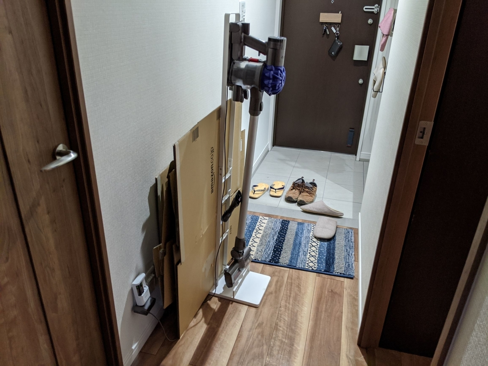
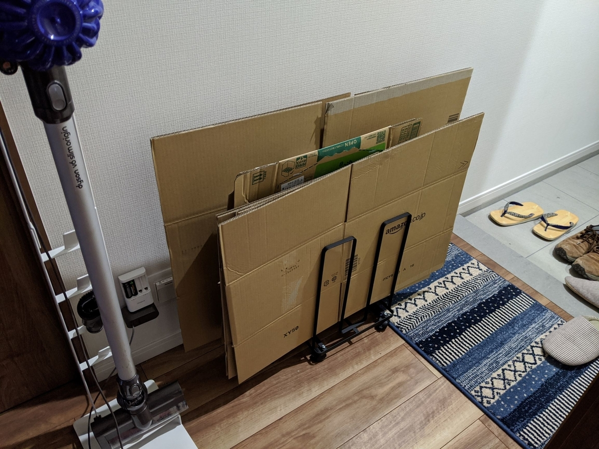
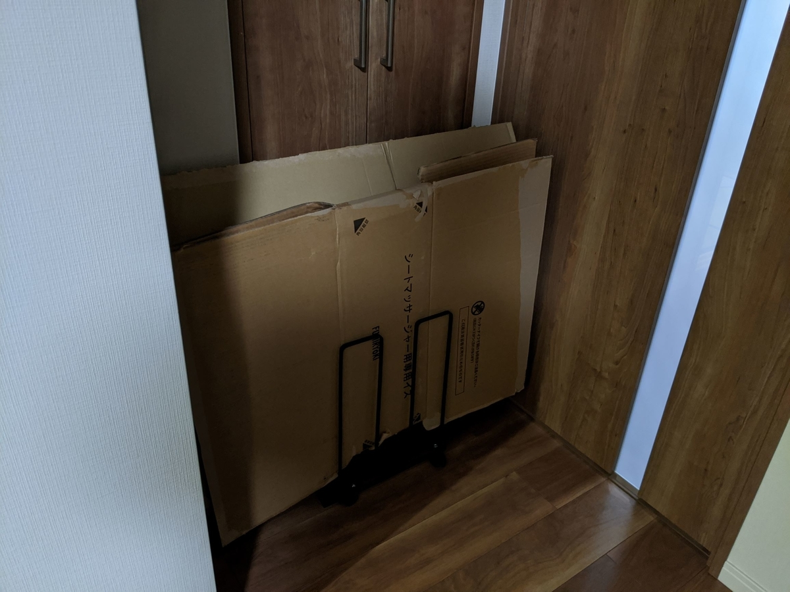

前々から欲しかったんだけど、なんとなく買わずにいた段ボールストッカーを、先日とうとう買ってしまった。

これまで、たまった段ボールはダイソンの掃除機立てで挟み、玄関に置いていたのだが、だんだん掃除機立ての方が耐えられなくなり、ネジが緩んでグラグラしてきたのだ。しかも、ネジひとつ、どこか行ってまうし……このまま放置するわけにもいかず、しぶしぶ購入と相成った。

そのおかげで、こうじゃ！　すごくスッキリして気持ちがいい。こんなことなら、もっと早くに買うべきだったぜ。

<a href="https://www.amazon.co.jp/exec/obidos/ASIN/B06VWDWGMJ/bestylesnet-22/">山崎実業 そのまま結束できる ダンボール収納 ダンボールストッカー タワー ブラック 3304</a>
<ul><li>メディア: ホーム&amp;キッチン</li></ul>

今回買った「山崎実業 そのまま結束できる ダンボール収納 ダンボールストッカー タワー ブラック 3304」にはキャスターもついているので、部屋から部屋への移動も楽だ。試しにリビングへ転がし、<a href="https://blog.daruyanagi.jp/entry/2020/02/01/233128">&#x3053;&#x306E;&#x524D;&#x5EFA;&#x7BC9;&#x3057;&#x305F;&#x98DF;&#x5668;&#x68DA;</a>の段ボールをまとめてみたが……スチールのフレームがしっかり段ボールを挟んでくれるので、とても結束しやすい。今までは段ボールを何枚も一生懸命太ももで挟んで……みたいに頑張ってたんだが、それは無駄な行為だった。

ちなみに、この段ボールストッカーは下から紐を通してそのまま結束できるのが売りだが、この作業は割とダルかった。あらかじめ紐を這わしておいて、その上に段ボールを積んでいけばいいのだけど。その意味でも、なんかいい紐（＋くるくる結束）のいい収め方はないものかと考えている。本体がスチール製だから、強力なマグネットフックか何かで引っ掛けられないだろうか。

<a href="https://www.amazon.co.jp/exec/obidos/ASIN/B07KWQWKRC/bestylesnet-22/">ナガオ 新聞・雑誌がかんたん縛れる くるくる結束器 CHK-01</a>
<ul><li>メディア: ホーム&amp;キッチン</li></ul>

ついでに言えば、このくるくる結束も、個人的にはかなりおすすめ。不器用で紐を結べない僕のようなクズでも、段ボールや雑誌がバラバラにならないようにできる。こういうインストゥルメントこそ文明の利器と呼ぶにふさわしい。

今回買った段ボールストッカーは結局、トイレの前、リビングの入り口に置いておくことにした。幅、奥行きともにジャストフィットだ。一見ドアを開く邪魔になるように見えるが、何回か試したところ、支障はなさそうだ。段ボールがないときは、廊下の収納にそのままゴロゴロッと IN してしまえる。まさしくピッタリで、我が家に迎えるべくして迎えたアイテムと言えよう。

