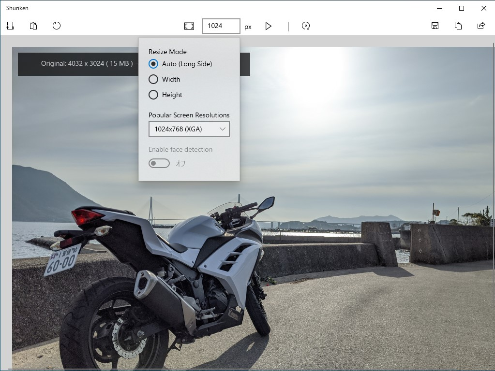

ブログ掲載のために画像をリサイズするだけのアプリ「Shriken」をリリースしました。「スマホ同期」で［共有］→ 画像をリサイズしてクリップボードへコピー → はてなブログへ貼り付ける というプロセスがちょっとだけ簡単になります<a href="#f-a95b695d" name="fn-a95b695d" title="たとえば「フォト」アプリだと、リサイズの幅・高さを微調整できないし、一度ファイルへ保存する必要があります">*1</a>。

<iframe src="https://hatenablog-parts.com/embed?url=https%3A%2F%2Fwww.microsoft.com%2Fja-jp%2Fp%2Fshriken%2F9nwsxb0bxg1j%3Frtc%3D1%26activetab%3Dpivot%3Aoverviewtab" title="Shriken を入手 - Microsoft Store ja-JP" class="embed-card embed-webcard" scrolling="no" frameborder="0" style="display: block; width: 100%; height: 155px; max-width: 500px; margin: 10px 0px;"></iframe><cite class="hatena-citation"><a href="https://www.microsoft.com/ja-jp/p/shriken/9nwsxb0bxg1j?rtc=1&activetab=pivot:overviewtab">www.microsoft.com</a></cite>

とりあえずストアに出して、Surface Pro X で使いたいと思い（だから ARM64 ビルドもあるよ！）、不安定な機能は全部削除しているので、普通の人はあまりこれのお世話になることはないと思いますが、将来的には以下の機能が実装される予定です。

<ul>
<li>クロップ</li>
<li>閲覧時のズーム</li>
<li>ペンによる注釈</li>
<li>顔認識と笑い男化</li>
</ul>
<blockquote class="twitter-tweet" data-lang="ja">
笑い男機能つけといた <a href="https://t.co/jRU3ibh8lA">pic.twitter.com/jRU3ibh8lA</a>
&mdash; 新型だるやなぎウイルス (@daruyanagi) <a href="https://twitter.com/daruyanagi/status/1216385486526140416?ref_src=twsrc%5Etfw">2020年1月12日</a></blockquote>

ここまで完成すれば、まぁ、需要はなくもないんじゃないでしょうか。

ちなみに、名前が Sh<b>u</b>riken ではなく Shriken なのは、他の人に名前がとられてたからです。でも、Shrink image からもじって付けようと思ってたので、あまり問題はない（キリッ

<h3>開発秘（？）話</h3>

久しぶりの UWP 開発だったので、どんな UI にしていいのかさっぱりわかりませんでした。

<blockquote class="twitter-tweet" data-lang="ja">
基本機能はできたので、UI をどうにかする（UWP の UI ってどうデザインすればスタンダードなのか、さっぱり忘れた） <a href="https://t.co/GgKE3nFn6R">pic.twitter.com/GgKE3nFn6R</a>
&mdash; 新型だるやなぎウイルス (@daruyanagi) <a href="https://twitter.com/daruyanagi/status/1212862135639793664?ref_src=twsrc%5Etfw">2020年1月2日</a></blockquote>

<blockquote class="twitter-tweet" data-lang="ja">
がんばって UI をマシにしてみた <a href="https://t.co/C1Alq1DvsY">pic.twitter.com/C1Alq1DvsY</a>
&mdash; 新型だるやなぎウイルス (@daruyanagi) <a href="https://twitter.com/daruyanagi/status/1212889342055550976?ref_src=twsrc%5Etfw">2020年1月3日</a></blockquote>

いろいろ試行錯誤した結果、標準アプリである「フォト」に似せればいいか、という考えに落ちつくまでに、View は3回ぐらい作り直しました。そのおかげで、最初はコードビハインドにべた書きしていた ViewModel、Model も分離されるようになり（だって、View 作り直すたびにコードビハインドをコピペするの大変じゃん？）、（あくまで個人的には）いい感じに設計できました。怪我の功名ってやつですね。機能追加してもそうそう破綻しなさそうです。

<blockquote class="twitter-tweet" data-lang="ja">
ぇ、ドキュメントサイトからコントロールギャラリーアプリを起動して実際に挙動を確かめられるの、めっちゃ素敵やん<a href="https://t.co/ZUiuvcxFaY">https://t.co/ZUiuvcxFaY</a> <a href="https://t.co/8NRNCsJNSE">pic.twitter.com/8NRNCsJNSE</a>
&mdash; 新型だるやなぎウイルス (@daruyanagi) <a href="https://twitter.com/daruyanagi/status/1212862945274654721?ref_src=twsrc%5Etfw">2020年1月2日</a></blockquote>

アプリを開発するうえでは、docs.microsoft.com のお世話になりました。最近は Web ページからサンプルアプリを起動して挙動を確認できるのね。すごくいいと思います。ドキュメントサイトはとかくディスられがちだけど、個人的には昔よりだいぶ良くなってると思います。チュートリアルというか、よくある処理の流れが一通り解説されたページや、似たような機能の違いを解説するページも増えてきて、「そう、それが知りたかったんだよ！」って思うことが増えました。かつては StackOverFlow : 公式ドキュメント：<a href="https://blog.okazuki.jp/">Kazuki &#x3055;&#x3093;&#x306E;&#x30D6;&#x30ED;&#x30B0;</a> ＝ 6:1:3 ぐらいな参照比率でしたが、今回は 5:3:2 ぐらいだったかもしれない。

<a href="#fn-a95b695d" name="f-a95b695d" class="footnote-number">*1</a>:たとえば「フォト」アプリだと、リサイズの幅・高さを微調整できないし、一度ファイルへ保存する必要があります

