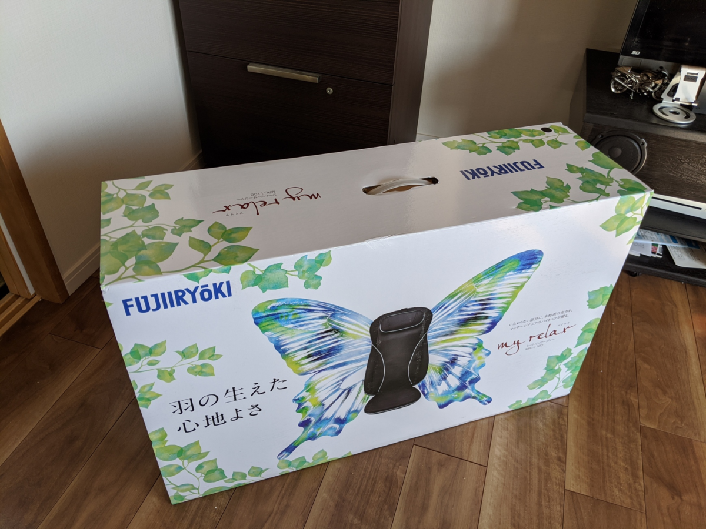
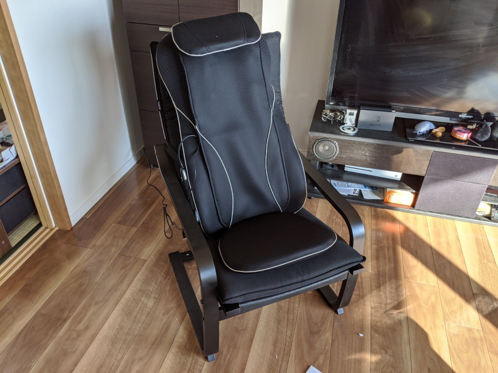
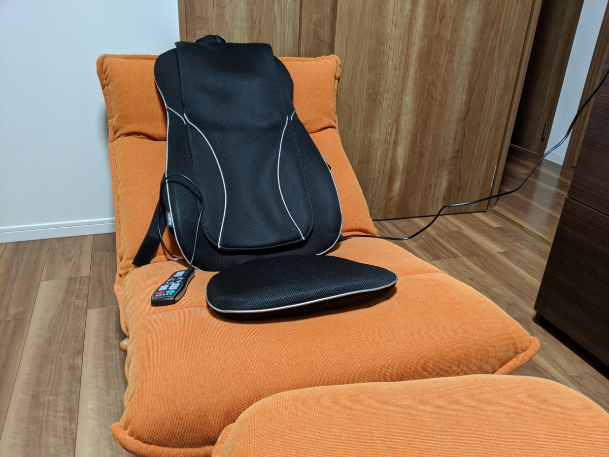

私事で恐縮ですが、去年の５月にマンションを買ったときの頭金として母や弟に借りていた借金を、先月末で完済しました！　いろいろやりくりして（ただし、QoL をなるべく犠牲にしないようにしながら）、一年で300万ぐらい返した……頑張った！

というわけで、ずっとほしかったのに我慢していたマッサージ機を買いました。本当は本格的なマッサージチェアを買ってやろうと思っていたのですが、あれって値段もさることながら、壊れて捨てる時が大変なんですよね。デカくて重い。その点、このシートマッサージャーというのは良さそう。

<a href="https://www.amazon.co.jp/exec/obidos/ASIN/B01MRG32UH/bestylesnet-22/">フジ医療器 シートマッサージャー（ブラック）my relax（マイリラ） MRL-1100BK</a>
<ul><li>メディア:</li></ul>

マッサージ機の背中の部分だけをとって、好きな椅子につけられるようにした感じかな？　一応、専用のチェアもあるみたいなので、それも併せて購入した。

<a href="https://www.amazon.co.jp/exec/obidos/ASIN/B019MOL3R8/bestylesnet-22/">フジ医療器 シートマッサージャー用チェア（ブラック）my relax（マイリラ） MRL-10C</a>
<ul><li>メディア:</li></ul>

で、組み立てて、こうじゃ！

正直、もうちょっとリクライニングできた方がいいな。チェア単体だと割と座り心地がよいのだけど、シートマッサージャーを置くと背中が立って、あまり落ち着かない。

でも、マッサージ機能は大変よかった。最初は「いててて……」って感じだったけど、だんだん「お"ぅっ……ぐ……ふへぇ……ぎもぢいぃ……」ってなった。

愛用のリクライニング座椅子と組み合わせると、これまた最高。でも、左右にズレそうで……そこさえクリアできたらこれが一番いい組み合わせだな。

フットマッサージャーもあるっぽいので、それを組み合わせれば完全にフル武装のマッサージチェアになりそう。当分は買わないつもりだけど、いつか買いそうな気もする。

