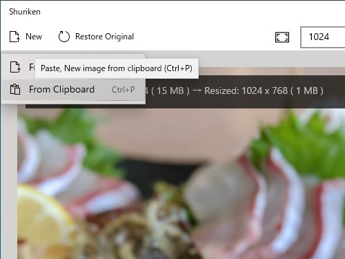
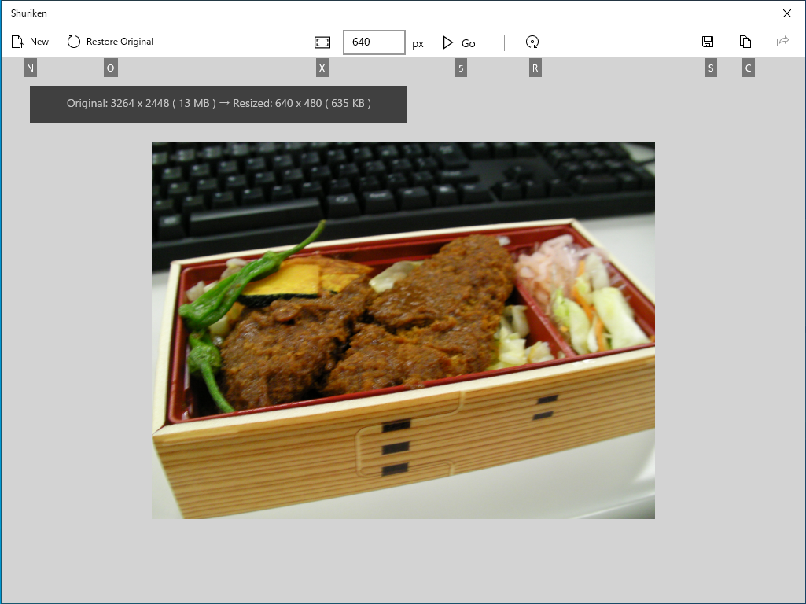

ショートカットキーやアクセラレーター（［Alt］キーを押すと、コマンドを実行するためのキーが表示されます）への対応を行いました。

あと、他のアプリから［共有］コマンドで「Shriken」を呼んだときだけ、［コピー］［保存］処理の終了後にウィンドウを自動で閉じるようにしていたのですが、うまく動かないことがあるようなので一時的に停止しています。

<iframe src="https://hatenablog-parts.com/embed?url=https%3A%2F%2Fwww.microsoft.com%2Fja-jp%2Fp%2Fshriken%2F9nwsxb0bxg1j%3Frtc%3D1%26activetab%3Dpivot%3Aoverviewtab" title="Shriken を入手 - Microsoft Store ja-JP" class="embed-card embed-webcard" scrolling="no" frameborder="0" style="display: block; width: 100%; height: 155px; max-width: 500px; margin: 10px 0px;"></iframe><cite class="hatena-citation"><a href="https://www.microsoft.com/ja-jp/p/shriken/9nwsxb0bxg1j?rtc=1&activetab=pivot:overviewtab">www.microsoft.com</a></cite>

<a href="https://github.com/daruyanagi/Shriken/releases/tag/v1.1">Release v1.1 &middot; daruyanagi/Shriken &middot; GitHub</a>

次のバージョンは Windows UI library を少し試して、Crop 処理を入れられたらいいなーって思っています<a href="#f-a73ecabd" name="fn-a73ecabd" title="[https://docs.microsoft.com/en-us/windows/communitytoolkit/controls/imagecropper:title=ImageCropper ]っていう素敵なコントロールがもうあるみたいなので！">*1</a>。それか、Undo/Redo かな……すでに履歴リストを保持する設計になってるんで、UI をくっつけるだけだしね。

<a href="#fn-a73ecabd" name="f-a73ecabd" class="footnote-number">*1</a>:<a href="https://docs.microsoft.com/en-us/windows/communitytoolkit/controls/imagecropper">ImageCropper </a>っていう素敵なコントロールがもうあるみたいなので！

