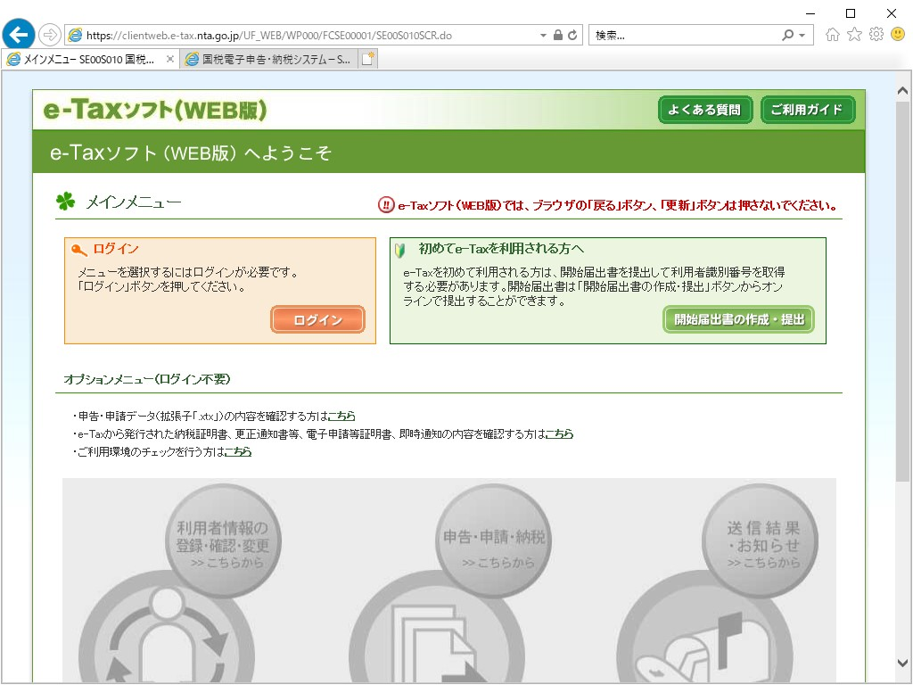

日曜日に電子申告を完了、今年度の確定申告を終えました。うおおおーーーッ！

今年度も基本的に去年と変わらなかったのですが、マンションを購入したので、事業用と私用でどう案分するか、住宅ローン減税ってどうやって計算するのかといった点が問題となりました。自分で調べてやってもできなくはなさそうだけど、さすがにここはちゃんとプロの人に相談した方がよかろうと、地元の税理士さんを紹介していただいて帳簿を見ていただき、いろいろ調整。やはり餅は餅屋というんでしょうか、サラッとみるだけで結構わかるのですね、ダメなところが。全体的にちゃんとやっているという評価は受けたのですが、数点指摘を受けて修正しました。

<blockquote class="twitter-tweet" data-lang="ja">
教えてもらった通り、資産の除却というのをやった <a href="https://t.co/CKwIMCK5QA">pic.twitter.com/CKwIMCK5QA</a>
&mdash; ガイウス・だるやなぎウス・あぶれオス🍊 (@daruyanagi) <a href="https://twitter.com/daruyanagi/status/1226374745911742464?ref_src=twsrc%5Etfw">2020年2月9日</a></blockquote>

たとえば、償却済みの資産が1円のまま帳簿に残っていたのですが……これ、勝手によしなにはしてくれないんですね。除却というのをやればいいというのを教えてもらって、帳簿がスッキリきれいになりました。マンションの建物と土地もちゃんと分けて記帳して（税理士さんにも見てもらってオッケーだった）……これで<b>固定資産、完全に理解した</b>。

あとは、住宅ローン控除の計算書が税込みになってなかった～とか、よくわかんねえ貸付金が1万ちょっとだけ残ってる～とか、そんなのですね。後者はどこかのタイミングで記帳をミスったようなのだけど、今さら修正もできないので、少額でもあることだし事業主さまから謎の返済を受けたことにして消した。なんか変なところを見つけるコツのようなものがちょっとだけわかったので、来年からは逐次チェックできそうな気がする。

ただ、電子申告ではちょっとトラブりました。去年、覚書しておいた

<blockquote cite="https://blog.daruyanagi.jp/entry/2019/02/17/190246">

むしろ普通の人にとっての難関は e-Tax の利用者識別番号、パスワード、マイナンバーのパスワード（アルファベットと数字：公的個人認証サービス、数字4桁：利用者証明用電子証明書のパスワード、券面事項入力補助用のパスワード）がごっちゃになりそうってところじゃないかな。

<cite><a href="https://blog.daruyanagi.jp/entry/2019/02/17/190246">2&#x6708;17&#x65E5;&#xFF1A;&#x78BA;&#x5B9A;&#x7533;&#x544A;&#x7D42;&#x308F;&#x308A;&#x307E;&#x3057;&#x305F;&#xFF08;freee &#x3067;&#x96FB;&#x5B50;&#x7533;&#x544A;&#xFF01; - &#x3060;&#x308B;&#x308D;&#x3050;</a></cite>
</blockquote>

という部分がクリティカルヒット……パスワード、正確に言うと「<b>利用者識別番号に紐づく暗証番号</b>」というのがわからん。

1Password に保存してあったパスワードは通らないし、心当たりのあるモノをすべて入れてみてもダメ。パスワードの再発行ができないものかと思ったのだけど、古臭い方の e-Tax サイトではボタンがグレーアウトして申請ができない。

<figure class="figure-image figure-image-fotolife" title="古臭い方のサイト"><figcaption>古臭い方の e-Tax サイト</figcaption></figure>

小一時間、うんうん悩みながらあちこち徘徊していたのですが、どこからか知らねど、たまたまリンクをたどって見つけた小ぎれいな方の e-Tax サイトで無事パスワードを再発行できました。

<figure class="figure-image figure-image-fotolife" title="小ぎれいな方の e-Tax サイト"><figcaption>小ぎれいな方の e-Tax サイト</figcaption></figure>

確定申告、何年やってもさっぱりわからん。古臭い方と、小ぎれいな方、なにがどう違うんだ。

でも、躓いたのは本当にここだけで、あとはすんなり書類のオンライン提出までできました。freee さん、本当にありがとう。はやく国税庁に買収されてほしい。

