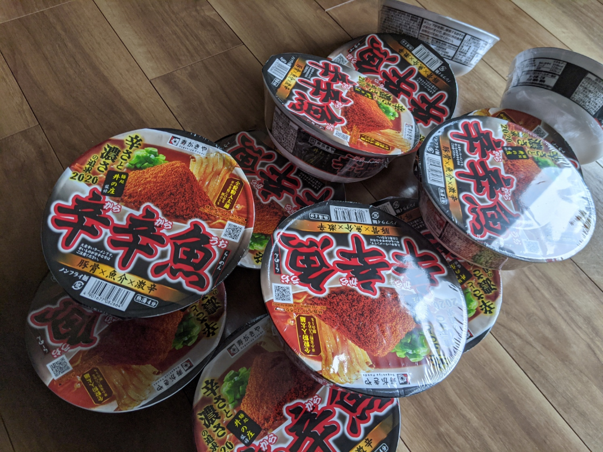
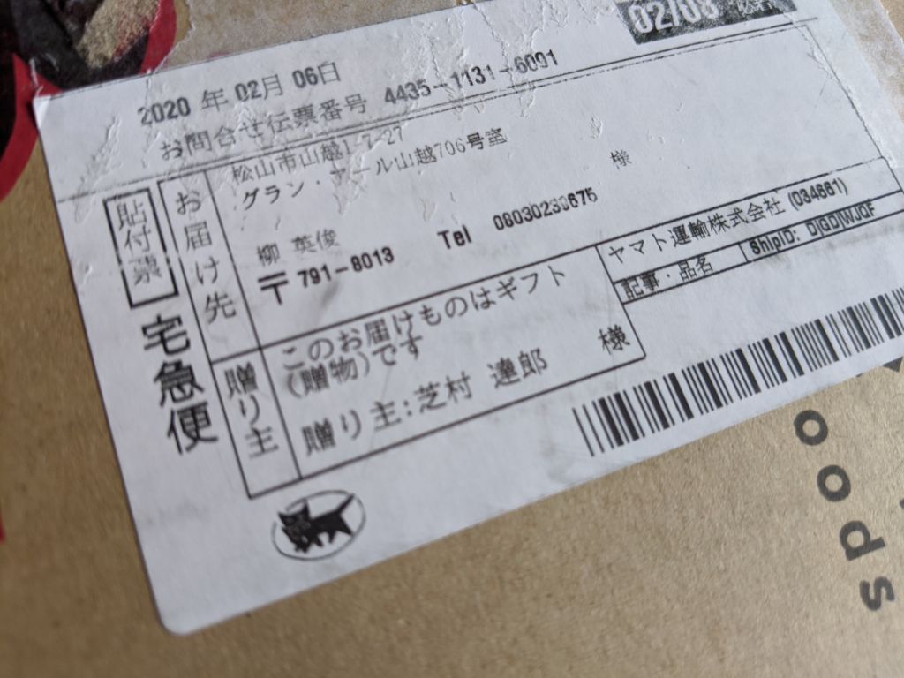
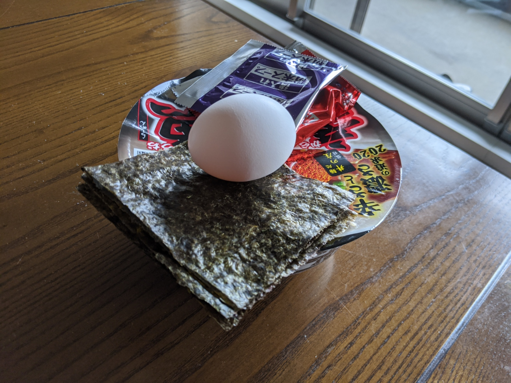
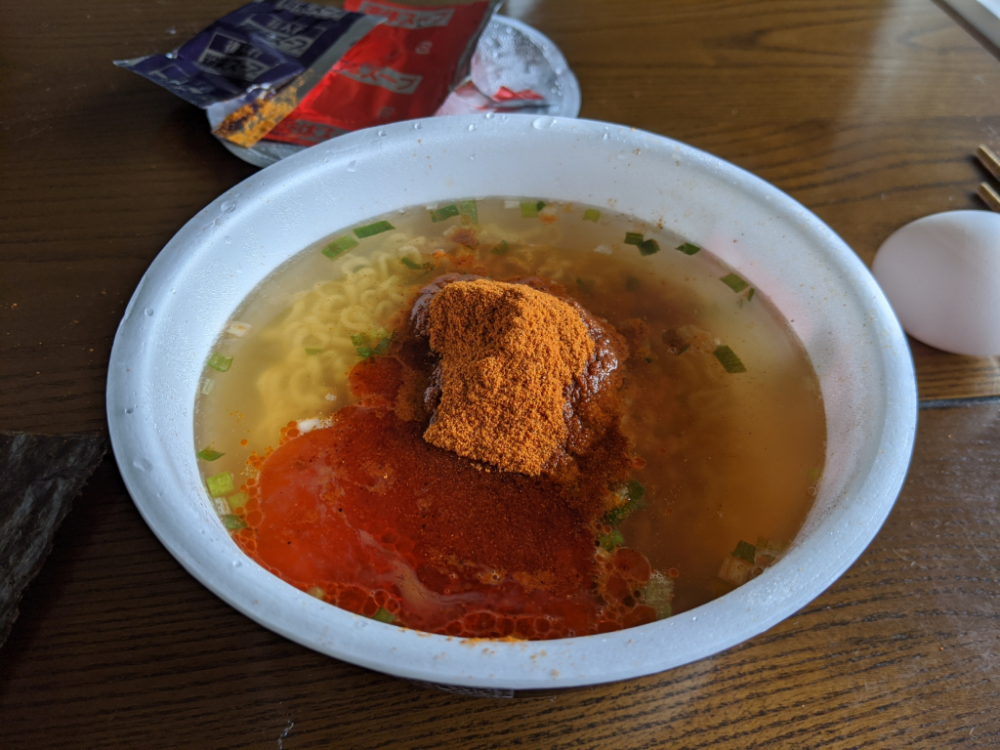
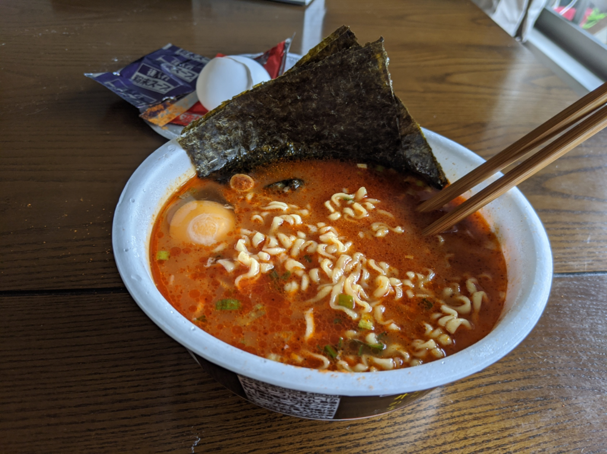

今年も「辛辛魚」がワンケース届いたので、早速食べてみました。

なお、この記事は <a href="http://blog.hatena.ne.jp/shibayan/">id:shibayan</a> の提供でお送りします。旧住所に送られたせいで、転送やら何やらで1週間ぐらいかかったみたい。

<blockquote cite="https://www.sugakiya.co.jp/products/cup/soku_n_8266.html?id=8266">

豚骨×魚介×激辛！！濃さと辛さの追求

東京石神井の人気店『麺処井の庄』監修の「辛辛魚らーめん」。毎年大変ご好評をいただいている、発売12年目の激辛ラーメンです。 
今年は「本物感」をテーマに、よりお店の味に近づけるよう、辛さと豚骨・魚介のバランス、スープの濃厚感を追求いたしました。 
「濃厚」かつ「ワイルド」、「激辛」をお楽しみいただける一杯です。

※大変辛いラーメンです。辛い物が苦手な方はご注意ください。

<cite><a href="https://www.sugakiya.co.jp/products/cup/soku_n_8266.html?id=8266">&#x9EBA;&#x51E6;&#x4E95;&#x306E;&#x5E84;&#x76E3;&#x4FEE; &#x8F9B;&#x8F9B;&#x9B5A;&#x3089;&#x30FC;&#x3081;&#x3093;&#xFF1A;&#x5546;&#x54C1;&#x60C5;&#x5831;&#xFF1A;&#x5BFF;&#x304C;&#x304D;&#x3084;&#x682A;&#x5F0F;&#x4F1A;&#x793E;</a></cite>
</blockquote>

辛辛魚はいわゆる「激辛ラーメン」にカテゴライズされるラーメンですが、個人的にはインスタントのわりに麺がおいしい点と、辛いだけでなく、豚骨・魚介のスープのうま味が感じられる点がお気に入りです。2020年は「本物感」がテーマだといいますが……自分は本物を食べたことがないのでわからない！　自分のカネでは食いたくないので、今度 <a href="http://blog.hatena.ne.jp/shibayan/">id:shibayan</a> におごってもらおうと思います。

内容物はかやく、液体スープ、後入れ粉末スープの3点。お湯入れから4分かかるのは、フツーのインスタントラーメンよりちょっと長めですね。かやくの袋の封を切り、容器にぶちまけるだけで軽く「目が辛い」気がする。「あぁ、俺は辛辛魚に帰ってきたんだ」と実感できる瞬間です。

今回は<s>冷蔵庫の中身が貧しかった</s>素の味を楽しみたかったので、トッピングは最小限です。ちょっと色の変わりかけた有明さんの手巻き海苔を1/4カットしたものと、生卵。ネギがあればよかったのだけど、あいにく切らしていて、買いに行くのも面倒だった。

後入れの粉末はすべて投入。部屋にヤバいにおいが充満する。

さっそく食べてみましたが――例年と違いは判らぬ。でも、ちょっとうま味が強く感じられる気がするかも。逆に辛さは少し後退気味に思われたけれど、それはまったくの油断で、スープを飲むとやっぱりからかったです。お腹がグルグルして、お尻の穴が嫌な予感にもにょもにょする。明日絶対、ケツが痛くなるパターンや。

それでもちゃんとスープは完飲。さいごの一口は、残しておいた卵の黄身と一緒にいただきました。あぁ、黄身がめっちゃ甘えぇ……。よい子のみんなは、残り数口を残した状態で捨てるとよいと思います。あまり体によくなさそうな味がする。

まだまだカップはいっぱい残っていますが、賞味期限は夏ぐらいまでなので、週に1個ペースを目標に消化しようと思います。そのうち、胃腸が死ぬかも。

<a href="https://www.amazon.co.jp/exec/obidos/ASIN/B082YKX5DY/bestylesnet-22/">寿がきや 麺処井の庄監修 辛辛魚らーめん 136g ×12箱</a>
<ul><li>発売日: 2020/02/03</li><li>メディア: 食品&amp;飲料</li></ul>

<h4>追記</h4>

<blockquote class="twitter-tweet" data-lang="ja">
うぐぅ、辛辛魚で腹いてえ
&mdash; ガイウス・だるやなぎウス・あぶれオス🍊 (@daruyanagi) <a href="https://twitter.com/daruyanagi/status/1227568593677643776?ref_src=twsrc%5Etfw">2020年2月12日</a></blockquote>

<blockquote class="twitter-tweet" data-lang="ja">
辛辛魚で腹痛くて眠れぬ
&mdash; ガイウス・だるやなぎウス・あぶれオス🍊 (@daruyanagi) <a href="https://twitter.com/daruyanagi/status/1227590814383013889?ref_src=twsrc%5Etfw">2020年2月12日</a></blockquote>

