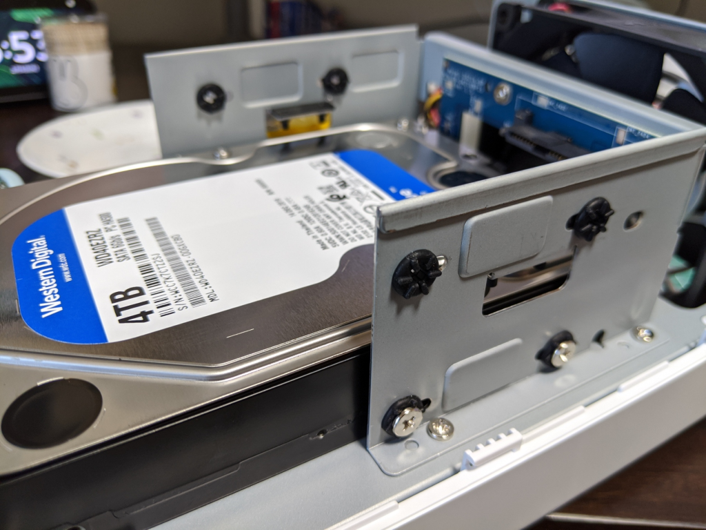

Synology DS216se に 3TB の HDD を入れて運用していたが、nasne で毎週の NHK 将棋とナショジオの番組を録画しまくってたら、空き領域が尽きた。TB 単位のストレージなんて何に使うのかと思っていたが、なるほど、動画を扱えば一瞬で枯渇するのだなぁ、などと今さらながらに納得した。

Synology の NAS は大変気に入っているので、同じモデルを購入しようとしたが、すでにディスコン。Amazon でパッと見る限り、DS218j というのが現行版らしい。正直スペックには興味がないので、値段を見て、まぁ、悪くないと思いそのまま購入した。今、ブログを書きながら改めてスペックの違いを調べてみたが――こんな感じみたい。

<table>
<tr>
<td></td>
<td>DS216se</td>
<td>DS218j </td>
</tr>
<tr>
<td>CPU</td>
<td>Marvell Armada 370 88F6707 @ 800 MHz</td>
<td>Marvell Armada 385 88F6820 @ 1.3GHz（Dual-Core）</td>
</tr>
<tr>
<td>RAM</td>
<td>256 MB</td>
<td>512MB DDR3</td>
</tr>
<tr>
<td>Operating system</td>
<td>Synology DSM</td>
<td>Synology DSM</td>
</tr>
</table>
お値段はそのまま、強さがマシマシになったみたい。

外見はほぼ一緒だけど、HDD の固定ネジにゴムのインシュレーターって付いてたっけ……覚えてないし、わざわざ分解して確認するのも面倒だけど、昔のやつにはついてなかったりする。どっちにしろ、防振は静音にもつながるし、よいことだと思う。

<a href="https://www.amazon.co.jp/exec/obidos/ASIN/B076G6YKWZ/bestylesnet-22/">【NASキット】Synology DiskStation DS218j [2ベイ /  デュアルコアCPU搭載 / 512MBメモリ搭載] 多用途な初心者向け</a>
<ul><li>発売日: 2018/09/01</li><li>メディア: Personal Computers</li></ul>

HDD は予算不足のため、NAS 向けの定番である WD Red 4TB（23,000円）は買えなかった。WD Blue 4TB （8,500円）我慢したけど、それだったら Seagate BarraCuda の 6TB（10,000円）や 8TB（15,000円）でもよかったかもしれない。評判は良くないけど、コスパは大変いい。実際、自分が使ってて壊したことはない。

<a href="https://www.amazon.co.jp/exec/obidos/ASIN/B01MRSPHIW/bestylesnet-22/">【Amazon.co.jp 限定】Western Digital HDD 4TB WD Blue PC 3.5インチ 内蔵HDD WD40EZRZ/AFP2 【国内正規代理店品】</a>
<ul><li>発売日: 2016/12/03</li><li>メディア: Personal Computers</li></ul>

でもねー、同じく予算不足のため、ディスクが1枚なんだよね。まぁ、同じロットの HDD 買っちゃっても、同じ時期に壊れられても困るし、当面の間1枚で運用するのはいいんだけど、それまでに壊れられたらすごく困るわけで……踏ん切りがつかなかった。財政に余裕ができたら早急にもう1枚買って、ミラーリングしようと思う。それまでは壊れないで頑張ってほしい！

