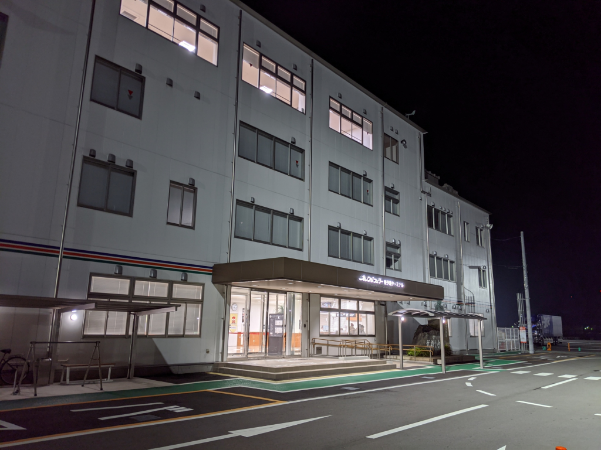
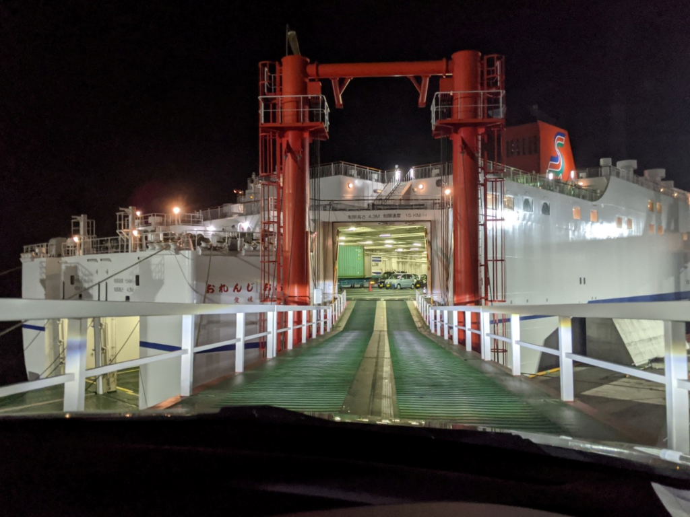
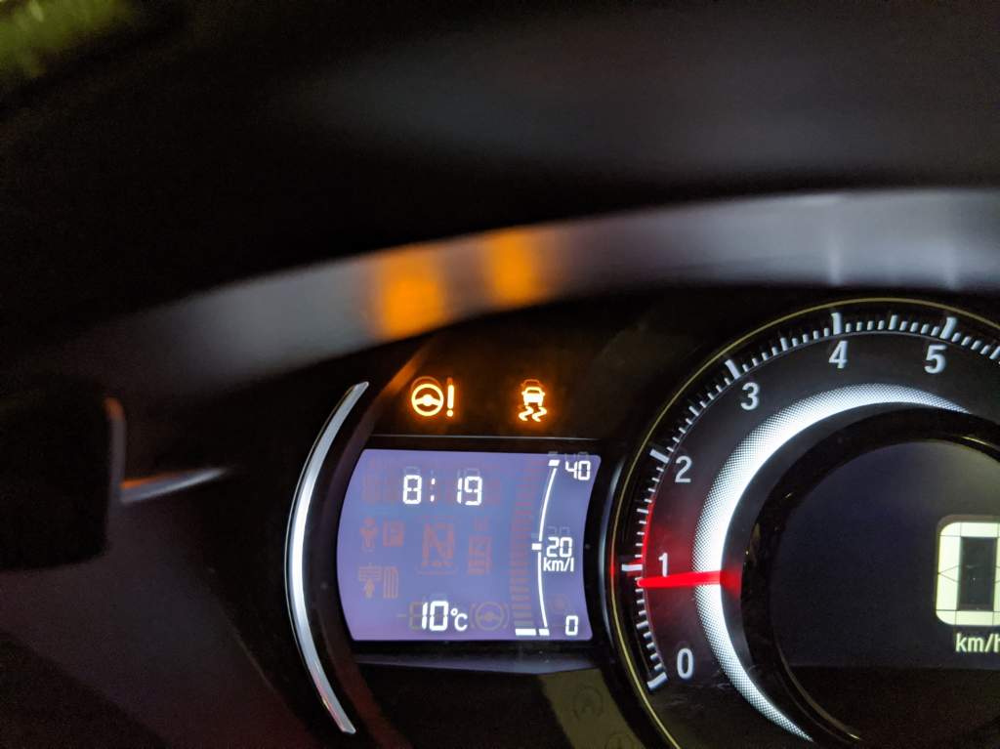

夕方6時過ぎに松山を出て、東予港へ。オレンジフェリーで大阪南港へ向かう。

Web 予約が一新されていて、クレジットカードでオンライン決済ができるようになっていたほか、乗船名簿の記入が不要になっていたのはうれしかった（受付で予約番号などを提示すればいいらしい）。とはいえ、そのことを知らずに乗船名簿を書いちゃったのだけど……紙を一枚無駄にしてしまった。

オレンジフェリーには何度も乗ったことがあるけれど、クルマで乗ったのは初めてだった。待機場所がわからなかったり、船内で U ターンしなきゃいけないのに指示がよく読み取れず直進しようとしてしまったり、うっかりさん全開で誘導員の人には迷惑をかけちゃったけど、手厚いサポートのよろしきを得て、無事駐車できた。

あんまり関係ないけど、乗船のとき、鉄板の上を走行していると「VSA（ビークルスタビリティアシスト）」と「EPS（電動パワーステアリング）」の警告灯が付いたけど、ほっといたら直った。鉄板の上はすごく滑るので、調子に乗るとあかんことになる。注意しましょう。

さて、オレンジフェリーは最近新造船になったらしく、船内はとてもキレイだった。部屋もスゴい。いつも二等寝台（二段ベッド×4の相部屋）をとっていたのだけど、新造船は最低ランクでもちゃんとシングルの部屋になっている。シングルとはいっても、14人定員の部屋を壁で仕切っただけ。それでも、ちゃんとパーソナルなスペースがあるのはいい。なんなら照明をつけっぱなしにして寝ても周りに迷惑が掛からないし、電源付きの小さなテーブルと椅子もある。LTE の繋がりはところどころ悪くなるので（船内 Wi-Fi はあるが、あまり認証のいる Web サイトには使いたくないものだ）、しっかり机に陣取ってブログを書こうって気分にはならないけれど、オフラインでメモを取るには十分だ。

<blockquote class="twitter-tweet" data-lang="ja">
ぇ……なにこれ……オレンジフェリー……しゅごい（語彙力無 <a href="https://t.co/9YdqvegkMX">pic.twitter.com/9YdqvegkMX</a>
&mdash; ガイウス・だるやなぎウス・あぶれオス🍊 (@daruyanagi) <a href="https://twitter.com/daruyanagi/status/1228278477398261765?ref_src=twsrc%5Etfw">2020年2月14日</a></blockquote>

<blockquote class="twitter-tweet" data-lang="ja">
my new 最安部屋…… <a href="https://t.co/PFJvLcrxWA">pic.twitter.com/PFJvLcrxWA</a>
&mdash; ガイウス・だるやなぎウス・あぶれオス🍊 (@daruyanagi) <a href="https://twitter.com/daruyanagi/status/1228278893246701568?ref_src=twsrc%5Etfw">2020年2月14日</a></blockquote>

ちなみに、部屋のランクと値段はこんな感じ。うちの場合、4m 以内のクルマ料金 15,500 円にシングル料金が含まれていた。

<table>
<tr>
<td>客室名・定員</td>
<td>Ｃ期間</td>
<td>Ｂ期間</td>
<td>Ａ期間</td>
</tr>
<tr>
<td>ロイヤル 2名（ツインorダブル）</td>
<td>15,600円</td>
<td>17,100円</td>
<td>17,600円</td>
</tr>
<tr>
<td>スイート 2名（洋室・和室・和洋室）</td>
<td>11,000円</td>
<td>12,000円</td>
<td>12,500円</td>
</tr>
<tr>
<td>デラックスシングル（1名）</td>
<td>8,500円</td>
<td>9,300円</td>
<td>9,700円</td>
</tr>
<tr>
<td>シングル（1名）、シングル＋（2名）</td>
<td>6,900円</td>
<td>7,400円</td>
<td>7,900円</td>
</tr>
</table>
“シングル＋”っていう等級が最初よくわからなかったのだけど、「シングルと同じサイズの部屋に2段ベッドが備わっていて2人泊まれる」ってことみたいやね。結構気に入ったので、今度はデラックスシングルにも乗ってみたい。

<blockquote class="twitter-tweet" data-lang="ja">
オレンジフェリーで船飯〜 <a href="https://t.co/R4cPTy3FDb">pic.twitter.com/R4cPTy3FDb</a>
&mdash; ガイウス・だるやなぎウス・あぶれオス🍊 (@daruyanagi) <a href="https://twitter.com/daruyanagi/status/1228282842863374336?ref_src=twsrc%5Etfw">2020年2月14日</a></blockquote>

晩ご飯はクエ鍋。卵焼きともつ煮込み、瓶ビールも加えて2,100円なり。ボリュームは十分、味もなかなかだったので満足――

<blockquote class="twitter-tweet" data-lang="ja">
主よ、鯛めしと缶ビールを追加した罪深き豚をお許しください <a href="https://t.co/QaeXlvMeoZ">pic.twitter.com/QaeXlvMeoZ</a>
&mdash; ガイウス・だるやなぎウス・あぶれオス🍊 (@daruyanagi) <a href="https://twitter.com/daruyanagi/status/1228290344552259586?ref_src=twsrc%5Etfw">2020年2月14日</a></blockquote>

したのだけど、テンションが高まっていたので、鯛めし＋缶ビールを追加。腹いっぱいで苦しくなった。

あとはスカイラウンジを探検したり、マッサージ器を堪能したり……

<blockquote class="twitter-tweet" data-lang="ja">
控えめに行って最高や……デラックスシングルにしてもよかった <a href="https://t.co/i45BPOXK1g">pic.twitter.com/i45BPOXK1g</a>
&mdash; ガイウス・だるやなぎウス・あぶれオス🍊 (@daruyanagi) <a href="https://twitter.com/daruyanagi/status/1228283314437382144?ref_src=twsrc%5Etfw">2020年2月14日</a></blockquote>

写真を撮るわけにはいかなかったけれど、お風呂もよかった。浴槽の大きさはそう変わらないかな？　でもシャワーの数が以前よりもだいぶ増えていて、混雑時も難なくさばけそう（自分は夜中の3時に入ったので独り占めだったけど！）。シャワーだけの部屋もあって、「湯船につからなくてもいいや」って人はそっちで済ましちゃってもいい。

生活リズムがくるってたのもあって、3時間ぐらいしか寝られなかったけど、すごく快適だった。また機会があれば乗りたい。

<h4>追伸</h4>

来週は松山・小倉フェリーに乗るんだけど、二等寝台が取れなくて、二等指定になった。快適シングル旅から雑魚寝旅へ……こっちのフェリーは携帯の充電もままならないし、耐えられるか心配。

