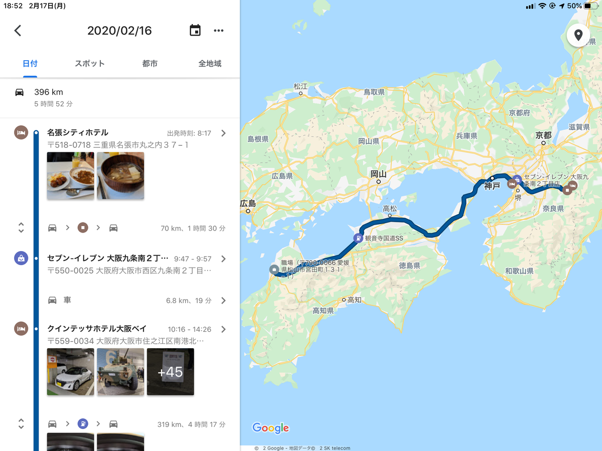
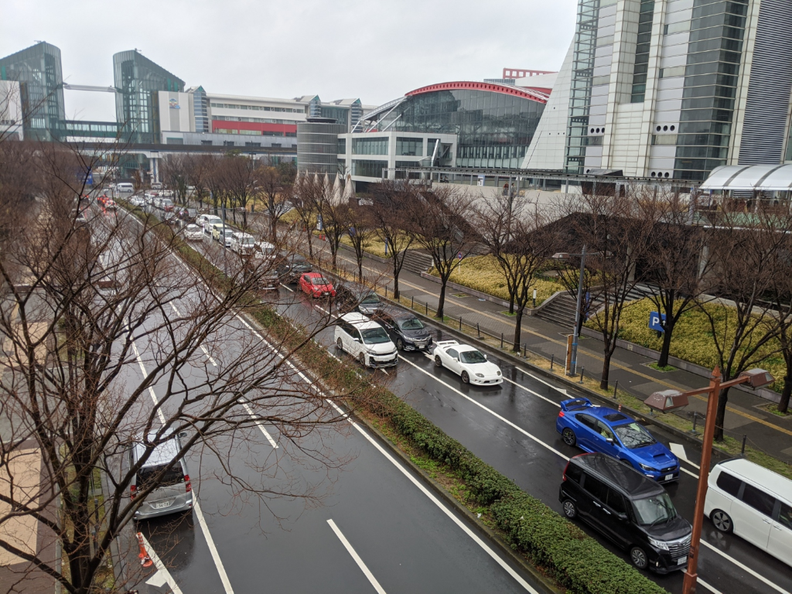

名張の宿で目を覚ます。本当は朝食の出る6:30きっかりに起きて、7:00 過ぎには出ようと思っていたのだが、なんとなく寝床から離れがたく、ぐずぐずと時を過ごしてしまった。結局、宿（名張シティホテル）名物の牛すじカレー・伊賀牛汁を堪能して宿を出たのは、8:00 をすっかり過ぎていた。

<blockquote class="twitter-tweet" data-lang="ja">
朝から牛すじカレー <a href="https://t.co/UUzfAKozO9">pic.twitter.com/UUzfAKozO9</a>
&mdash; ガイウス・だるやなぎウス・あぶれオス🍊 (@daruyanagi) <a href="https://twitter.com/daruyanagi/status/1228811835723284481?ref_src=twsrc%5Etfw">2020年2月15日</a></blockquote>

この日のメインイベントは大阪オートメッセ。

朝ご飯を張り切って食べすぎたのか、途中、何度か催して道の駅やコンビニへ寄った。そのせいもあり、大阪オートメッセの会場・インテックス大阪に着いたのは 10:00 頃に。そこから駐車場に居場所を確保するのに2時間半もかかった。築港かどこか、適当なところにクルマを止めて、ニュートラムで行くのが正解だとはわかっていたのだけど、iPad mini で Netflix 見れるし退屈はしまい……などと考えていたのが甘かった。これまでのトータル燃費が 19.0km/L から 16.0km/L にまで激減してしまったΣ(ﾟдﾟlll)

<blockquote class="twitter-tweet" data-lang="ja">
87式警戒偵察車らしい <a href="https://t.co/wcQuDdxCGV">pic.twitter.com/wcQuDdxCGV</a>
&mdash; ガイウス・だるやなぎウス・あぶれオス🍊 (@daruyanagi) <a href="https://twitter.com/daruyanagi/status/1228883230981361664?ref_src=twsrc%5Etfw">2020年2月16日</a></blockquote>

<blockquote class="twitter-tweet" data-lang="ja">
かっちょいい……ぱっと見、写真だけやとわからんかもやが、すげえ目立つ <a href="https://t.co/1jHMP62dOg">pic.twitter.com/1jHMP62dOg</a>
&mdash; ガイウス・だるやなぎウス・あぶれオス🍊 (@daruyanagi) <a href="https://twitter.com/daruyanagi/status/1228889760816488449?ref_src=twsrc%5Etfw">2020年2月16日</a></blockquote>

<blockquote class="twitter-tweet" data-lang="ja">
定期的に湧くスバル欲 <a href="https://t.co/eE1C4dZBoC">pic.twitter.com/eE1C4dZBoC</a>
&mdash; ガイウス・だるやなぎウス・あぶれオス🍊 (@daruyanagi) <a href="https://twitter.com/daruyanagi/status/1228889850264182785?ref_src=twsrc%5Etfw">2020年2月16日</a></blockquote>

<blockquote class="twitter-tweet" data-lang="ja">
いいね <a href="https://t.co/1tf2hFrIVX">pic.twitter.com/1tf2hFrIVX</a>
&mdash; ガイウス・だるやなぎウス・あぶれオス🍊 (@daruyanagi) <a href="https://twitter.com/daruyanagi/status/1228903288495435777?ref_src=twsrc%5Etfw">2020年2月16日</a></blockquote>

<blockquote class="twitter-tweet" data-lang="ja">
よみ…… <a href="https://t.co/F2mNZeTJOk">pic.twitter.com/F2mNZeTJOk</a>
&mdash; ガイウス・だるやなぎウス・あぶれオス🍊 (@daruyanagi) <a href="https://twitter.com/daruyanagi/status/1228893723263557632?ref_src=twsrc%5Etfw">2020年2月16日</a></blockquote>

人混みが嫌いなので、これまでこうした催しに参加したことはなかったのだけど、今回は K 氏が出品するというフェアレディをみたかったので、ご招待を受けたこともあり参戦。よくわからないなりに結構楽しめた。

なかでもやっぱり気になるのが、自分も乗ってるホンダのブース。NSX やら、マイナーチェンジした S660、ちょっとほしい type R なんかを見て回った。

<blockquote class="twitter-tweet" data-lang="ja">
お尻…… <a href="https://t.co/otBSNdCsue">pic.twitter.com/otBSNdCsue</a>
&mdash; ガイウス・だるやなぎウス・あぶれオス🍊 (@daruyanagi) <a href="https://twitter.com/daruyanagi/status/1228893044876775424?ref_src=twsrc%5Etfw">2020年2月16日</a></blockquote>

<blockquote class="twitter-tweet" data-lang="ja">
だるカーのマイナーチェンジ。ピラーの色がつくだけで随分印象変わるね <a href="https://t.co/p3l3cZ3Ifg">pic.twitter.com/p3l3cZ3Ifg</a>
&mdash; ガイウス・だるやなぎウス・あぶれオス🍊 (@daruyanagi) <a href="https://twitter.com/daruyanagi/status/1228893216277024769?ref_src=twsrc%5Etfw">2020年2月16日</a></blockquote>

<blockquote class="twitter-tweet" data-lang="ja">
この色、割といいな <a href="https://t.co/4bGd9WKYnY">pic.twitter.com/4bGd9WKYnY</a>
&mdash; ガイウス・だるやなぎウス・あぶれオス🍊 (@daruyanagi) <a href="https://twitter.com/daruyanagi/status/1228893342160699392?ref_src=twsrc%5Etfw">2020年2月16日</a></blockquote>

<blockquote class="twitter-tweet" data-lang="ja">
さすが、だるカーのお兄さん！ <a href="https://t.co/3SrqUEUsMw">pic.twitter.com/3SrqUEUsMw</a>
&mdash; ガイウス・だるやなぎウス・あぶれオス🍊 (@daruyanagi) <a href="https://twitter.com/daruyanagi/status/1228897673194786816?ref_src=twsrc%5Etfw">2020年2月16日</a></blockquote>

最近、うちの S660 に頭の悪そうなウィングを付けたいな、なんて思っていたのだけど、そういうものの展示はなかった。現地販売してたら買ったかもしれない（

カスタム系はあまり趣味が合わず、琴線に触れたものはなかったが、キャンプ系のカスタムはちょっと気になったかも。こういうのでちょっとぶらっと出てみたいよね～。

<blockquote class="twitter-tweet" data-lang="ja">
キャンプ系気になるマン <a href="https://t.co/r6z19pnuFf">pic.twitter.com/r6z19pnuFf</a>
&mdash; ガイウス・だるやなぎウス・あぶれオス🍊 (@daruyanagi) <a href="https://twitter.com/daruyanagi/status/1228898611259273216?ref_src=twsrc%5Etfw">2020年2月16日</a></blockquote>

今度2輪系のこういう催しがあれば、行ってもいいな。ちょうどバイクを買い替えたいところだしね。

<figure class="figure-image figure-image-fotolife" title="帰るときもまだ長々と続く、駐車場の列"><figcaption>帰るときもまだ長々と続く、駐車場の列</figcaption></figure>

帰りは明石海峡大橋の横風がすごく、かなり緊張を強いられた。実際、瀬戸大橋はこの後通行止めになったみたい。淡路島にわたってからも霧が出たり、大粒の雨が降ったりで、なかなかの悪コンディションだった。心なしか、渡れるうちに橋を2本とも渡ろうと急ぐ人が多い。こっちも釣られてエンジンをぶん回した成果、思ったより燃費が悪く、SA にたどり着けずに適当な IC で降りてガソリンスタンドを探し回る羽目になった。その日は何となく高松道をとおったのだけど、徳島道を取っていれば吉野川 SA で給油してスムーズに行けたはず。徳島道って1車線区間が多いし、リズムよく走れないかなーなんて思っちゃって、つい高松道にいっちゃったけど（所要時間はほぼ同じ、案内表示ではその日は高松道の方が10分早く着くはずだった）、今度からは徳島道にしようと思った。選ばなきゃいけないから迷い、選択を誤ったときに後悔するわけで、決め打ちにしてしまえば何も問題は起こらない。

松山についたのはちょうど19:00ごろ。ネコのトイレ掃除と餌・水補給だけして、その日は何もせずに寝た。

