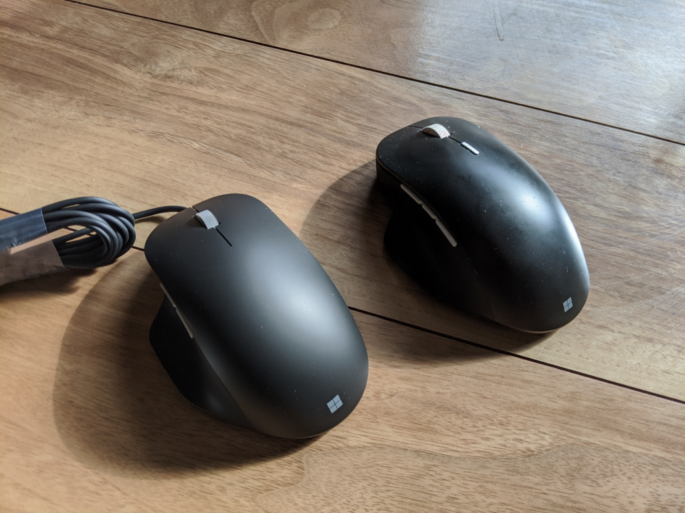

発表後、即予約。2月5日に到着。Amazon で 5,225 円だった。

<a href="https://www.amazon.co.jp/exec/obidos/ASIN/B083NWS4GC/bestylesnet-22/">【2020年最新版】マイクロソフトエルゴノミック マウス ブラック/有線/USB接続 RJG-00008</a>
<ul><li>発売日: 2020/02/03</li><li>メディア: Personal Computers</li></ul>

マウスは基本、Microsoft 製が好み。これまでも Microsoft Precision Mouse を使っていた。

<a href="https://www.amazon.co.jp/exec/obidos/ASIN/B07FF2KPMJ/bestylesnet-22/">マイクロソフト マウス Bluetooth/USB有線 両対応 プレシジョン マウス ブラック カスタマイズ可能ボタン 磁気スクロールホイール 高精度 GHV-00007</a>
<ul><li>発売日: 2018/07/26</li><li>メディア: Personal Computers</li></ul>

2つの違いは、接続方式。Precision Mouse は有線・無線（Bluetooth）両対応だが、Ergonomic Mouse は有線のみ。また、Precision Mouse は高級なだけあって、ホイールをふにゃふにゃ（滑らか）・カリカリ（段階的）で切り替えられる。違いを軽くまとめておこう。

<table>
<tr>
<td></td>
<td>Precision Mouse</td>
<td>Ergonomic Mouse</td>
</tr>
<tr>
<td>インターフェイス</td>
<td>USB 2.1、Bluetooth Low Energy 4.0/4.1/4.2</td>
<td>USB 2.0</td>
</tr>
<tr>
<td>重さ</td>
<td>135g（バッテリー込み）</td>
<td>104g（ケーブル込み）</td>
</tr>
<tr>
<td>価格</td>
<td>約12,000円</td>
<td>6,000円弱</td>
</tr>
</table>
Precision Mouse でまったく不満はなかったのだけど、デスクトップでは基本的に有線でしか使ってない。ホイールの切り替え機能もめったに使わないので、Ergonomic Mouse で十分だ。それに Precision Mouse は高い。Ergonomic Mouse が2個買える。――そんなわけで、Precision Mouse は Surface Book 2 なんかを持ち運ぶときに使うことにして、普段使いは Ergonomic Mouse にすることにした。こっちの方がランニングコスト的に優位だし、30g ほど軽いのも負担軽減につながる。

もう2週間ぐらい使ってるが、使い勝手は上々。そのうちスペアも確保しようと思う。Precision Mouse の値段だとさすがに躊躇するけど、Ergonomic Mouse の値段ならスペアの購入も不可能ではない。廃盤になって泣くより先に、確保しておくに限る。

