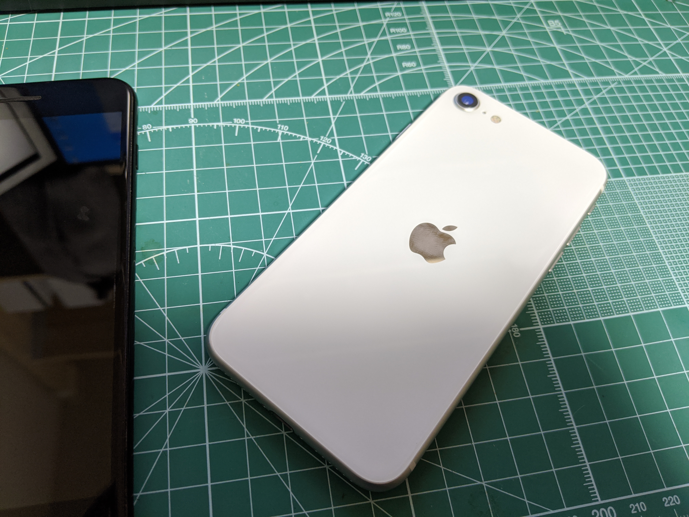

予約していた iPhone SE 2020 が到着。予約解禁日、午後9時に予約サイトをリロードしまくった甲斐があって、発売日に手に入れることができた。別にこの日に手に入れる必要はなかったのだが、なんとなく――こういうものは発売日を過ぎるとどんどん価値が下がっていく気がして、発売後半年も経とうものならもはや買う気が起きない。不思議なものだと思う。

<blockquote class="twitter-tweet">
my new gear…… <a href="https://t.co/2Bnjb9H6Qi">pic.twitter.com/2Bnjb9H6Qi</a>
&mdash; #だるやなぎ40 (@daruyanagi) <a href="https://twitter.com/daruyanagi/status/1253500211181150208?ref_src=twsrc%5Etfw">April 24, 2020</a></blockquote> 

買い替えたのは、今まで使っていた iPhone 7 Plus を水没で壊してしまったから。お風呂で Twitter をしていたら、手を滑らせて湯船に落としてしまったのだ。iPhone 7 Plus は防水仕様のはずだが、ディスプレイを割って一度修理した（[6月7日：道後温泉で iPhone 7 Plus の修理を待つ \- blog\.daruyanagi\.jp](https://blog.daruyanagi.jp/entry/2018/06/09/053535/)）のが祟ったのか、タッチパネルの下半分が反応しない。同時に入力が暴走しているようで、端末はロック状態になってしまっている。充電すれば起動はするものの、入力がダメでは手の施しようがない。古い端末に修理代数万円をかけるのももったいないので、思い切って新しい iPhone SE を購入したというわけだ。2020年モデルの iPhone SE は iPhone 8 相当の廉価版だそうで、iPhone 7 世代からみると1世代だけアップグレードした勘定になる。

<blockquote class="twitter-tweet">
こう見ると大した違いではない気もするが、手荷物と全然違う気がする <a href="https://t.co/ks795vYxDw">pic.twitter.com/ks795vYxDw</a>
&mdash; #だるやなぎ40 (@daruyanagi) <a href="https://twitter.com/daruyanagi/status/1253581007753641984?ref_src=twsrc%5Etfw">April 24, 2020</a></blockquote> 

到着した iPhone SE は、大変小さく感じた。iPhone 7 Plus と比べると縦、横が少し小さいぐらいに過ぎないが、面積比ではかなりの違いを感じる。自分は片手でフリック入力ができないので、両手で QWERTY 入力しているのだが、大変に窮屈だ。かつてはこのサイズがスタンダードだったはずで、そのときは苦にしていなかったのだが……なんとも、慣れというのは恐ろしいもので、メインの端末として活用する気にはならなかった。データ SIM 入れるが、Pixel 3 のバックアップ兼動作チェック用のテスト端末として使うことになるだろう。

<blockquote class="twitter-tweet">
iPhone 7 Plus と iPhone SE（第2世代）の比 <a href="https://t.co/HGYBdL0DUZ">pic.twitter.com/HGYBdL0DUZ</a>
&mdash; #だるやなぎ40 (@daruyanagi) <a href="https://twitter.com/daruyanagi/status/1253671585937895424?ref_src=twsrc%5Etfw">April 24, 2020</a></blockquote>  

機能面では、

- CPU の強化（Apple A10 Fusion → Apple A13 Bionic）
- デュアル SIM への対応（e-SIM）
- 無接点充電への対応
- カメラのポートレートモード

などが買い替えによるメリットといえるようだ。ポートレート撮影は Pixel 3 とたいして変わらないだろうが、デュアル SIM と無接点充電はなかなか便利そうだ。さっそく Pixel 3 の充電に使っていた Anker のスタンドに立てかけてみたが、あっさり充電された。無接点充電は有線より少し充電に時間を要するが、ケーブルを抜挿する手間がないのは気楽。Pixel 3 はもっぱら無接点充電（Qi）で充電するようになってしまったほどだ。iPhone SE が USB type-C 接続ではないのは残念だが、無接点充電が使えるならケーブルを持ち運ぶのは泊りがけの旅行ぐらいになるはずでだ。

それにしても、iPhone のデータ移行は大変簡単――新しい端末に映し出された模様を、古い端末のカメラで読み取るだけ――で、この点だけは毎回感心する。ここは他のベンダーにも見習ってもらいたいところだ。
