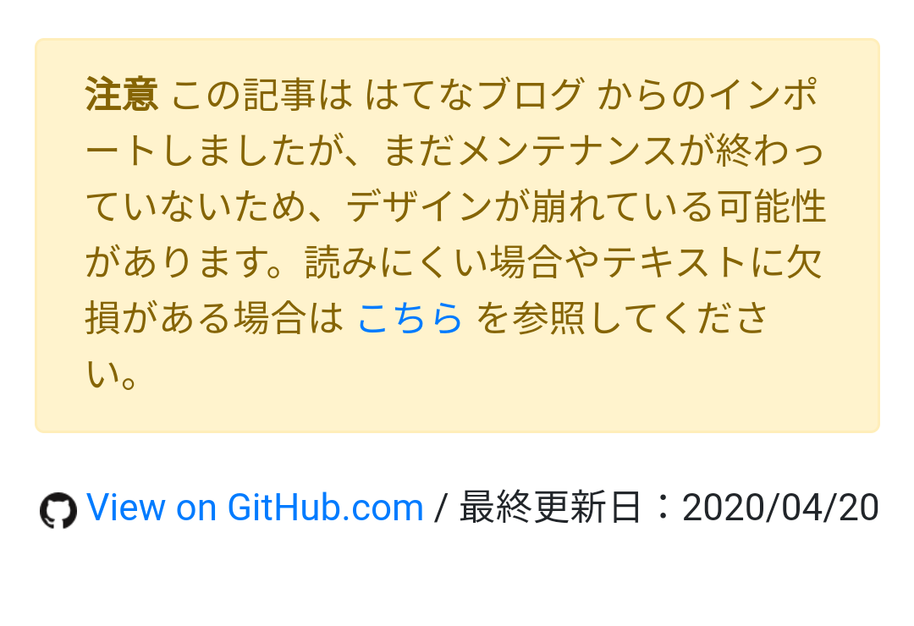

はてなブログから Hugo＋GitHub Pages へ移行した関係で、一部の記事で体裁の崩れやテキストの欠損が発生しています。なかでもかなり痛いのが、`more`（続きを読む）を利用した記事。移行ツールがこれを考慮に入れていなかったようで、`more` 以降のメインの部分が閲覧できなくなっているようです。

<blockquote class="twitter-tweet">
だるろぐ、はてなブログから移行したことで某アヘ顔ダブルピースが見られなくなっている<a href="https://t.co/MAkZHwnuIR">https://t.co/MAkZHwnuIR</a>
&mdash; Ovis＠🐑のひと (@Pandora_Ovis) <a href="https://twitter.com/Pandora_Ovis/status/1254302024046272513?ref_src=twsrc%5Etfw">April 26, 2020</a></blockquote>  

とりあえず PV のある≒よく読まれている記事から順に直していこうかな、と思っていたのですが、なんと @Pandora_Ovis 君がプルリクエストを送ってきてくれました！　プレビュー環境がないので適当とのことでしたが、細かい部分はともかく、おおむね大丈夫だったので即座にマージ。ビルドしなおして、ちゃんと記事を読めるようにしました。

<blockquote class="twitter-tweet" data-conversation="none">
P-r作りました！！！！！（<a href="https://t.co/Zbh2ATtFRN">https://t.co/Zbh2ATtFRN</a>
&mdash; Ovis＠🐑のひと (@Pandora_Ovis) <a href="https://twitter.com/Pandora_Ovis/status/1254314710981206016?ref_src=twsrc%5Etfw">April 26, 2020</a></blockquote> 

<blockquote class="twitter-tweet" data-conversation="none">
ようわからんけど、プルリクマージ童貞を捨てた <a href="https://t.co/JuMwmfWqmV">pic.twitter.com/JuMwmfWqmV</a>
&mdash; #だるやなぎ40 (@daruyanagi) <a href="https://twitter.com/daruyanagi/status/1254315547367374849?ref_src=twsrc%5Etfw">April 26, 2020</a></blockquote> 

<blockquote class="twitter-tweet" data-conversation="none">
私(のP-r)で童貞捨てないでください！！！（？
&mdash; Ovis＠🐑のひと (@Pandora_Ovis) <a href="https://twitter.com/Pandora_Ovis/status/1254317061607587841?ref_src=twsrc%5Etfw">April 26, 2020</a></blockquote> 

<blockquote class="twitter-tweet" data-conversation="none">
ヘヘッ、いい具合だったぜ
&mdash; #だるやなぎ40 (@daruyanagi) <a href="https://twitter.com/daruyanagi/status/1254317315883020288?ref_src=twsrc%5Etfw">April 26, 2020</a></blockquote> 

<blockquote class="twitter-tweet">
<a href="https://twitter.com/Pandora_Ovis?ref_src=twsrc%5Etfw">@Pandora_Ovis</a> のせいで、退職ブログの記事が復活してしまった（細かい修正ポイントはまだ残ってるけど
&mdash; #だるやなぎ40 (@daruyanagi) <a href="https://twitter.com/daruyanagi/status/1254364772511805441?ref_src=twsrc%5Etfw">April 26, 2020</a></blockquote>  

生まれて初めて GitHub でプルリクエストをもらったのですが（自分でプルリクエストはやったことがある）、ちょっとうれしかったです――っていうか、みんながプルリクエストを書いてくれたら、俺が何もしなくてもブログの記事が復活していくんじゃね……？

まぁ、それはともかく。

読めなくなっている記事が結構あるので、当面の手当として、Hugo のテーマをいじくって、メンテナンスがまだ終わっていない記事に関しては警告メッセージと、旧ブログへのリンクを追加することにしました。

あんまり格好はよくないけど、とりあえず用は足すのでこれでよし。すごく暇で死にそうなときに、少しずつメンテナンスしていこうと思います。

### プルリクエスト募集中！

ということで、みなさまのプルリクエストをお待ちしております。

<blockquote class="twitter-tweet">
だるろぐ、GitHubで公開されているし、PR送ったらだるろぐコントリビューターになれる可能性...？
&mdash; Yuki Igarashi (@bonprosoft) <a href="https://twitter.com/bonprosoft/status/1254305504261636096?ref_src=twsrc%5Etfw">April 26, 2020</a></blockquote>  
